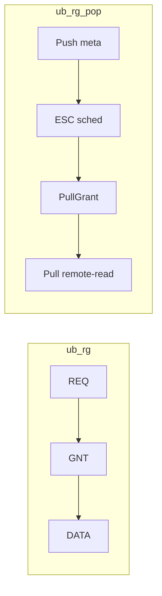

# Add ub_rg_pop (SHMEM-POP) as a peer scheme in UB_RG仿真报告

## Background / key finding
- `ub_rg_pop` does **not** exist in this workspace. It only appears in `docs/EXPERIMENT_REPORT_FULL_S123.html` + `docs/UB_RG实验设计0719.md`, which were generated by a *different* repo (supernode `UbRgPopEsc/UbRgPopIsc`, `ub_rg_dispatch_full_s123_report.py`) not present here.
- The target report `docs/UB_RG仿真报告.html` is generated by [analyze_ub_rg_experiments.py](analyze_ub_rg_experiments.py) from [run_ub_rg_experiments.py](run_ub_rg_experiments.py), which drives two C++ engines and today only knows `ub_rg` + `packet_spray`.
- Decision (confirmed): model `ub_rg_pop` per `docs/SHMEM-POP技术分档.md`, and carry it in **both** engines.

## POP modeling rules (dispatch/combine CCT)
SHMEM-POP data path = Push(metadata ≤1×RTT) → ESC schedule → PullGrant → remote-read Pull. Relative to `ub_rg` (destination-paced REQ/GNT):
- **Steady-state pacing = identical to ub_rg**: destination ESC issues ≤1 grain/τ_g per egress ⇒ same König asymptote (so at high load/skew `pop ≈ rg`, matching the reference report).
- **Extra control latency**: the Pull adds one extra one-way vs REQ/GNT/DATA. Model startup offset `rtt_pop = RttRgUs(scenario) + oneWayUs(scenario)` (≈1.5× RG RTT). This makes POP slightly slower at small batch (few grains) and converge to RG at large batch; the longer 2-tier RTT reproduces the reference `pop/rg>1` at high skew on scenario 2.
- **PushBudget = RTT×C_port** and **PullCredit window** `C_pop = ⌈rtt_pop/τ_g⌉ + margin` so steady state stays fully pipelined (no extra steady-state penalty). Expose as constants for calibration.
- **Barrier**: reuse `BarrierUs(scenario, ...)` (BSP), same as ub_rg.

## Changes by file

### 1. Behavioral engine — `ns-3-ub/scratch/ub_rg-dispatch-experiment.cc`
- Add `Scheme::UbRgPop` to the enum; extend `ParseScheme` to map `"ub_rg_pop"` / `"pop"` → `UbRgPop`.
- In `SimulatePhase`: treat `UbRgPop` like the `UbRg` grant-paced branch (same per-egress RR + `srcPortFree` serialization + König calc), but with `res.rttUs = rtt_pop` and the PullCredit window applied to the in-flight injection. Add helper `RttRgUs`-style `PushRttUs(scenario)`.
- `BarrierUs`: return the RG barrier for `UbRgPop`.
- Keep `max_egress_load`/`konig_us` identical to RG (same pacing).

### 2. Packet engine — `ns-3-ub/scratch/ub_rg-packet-experiment.cc`
- Extend CLI `--scheme` help + parsing to accept `ub_rg_pop`.
- Realize POP on top of the existing RG transport (UsePacketSpray=false) by injecting an extra Push-RTT startup + PullCredit window via the app/scheduler config. If a knob does not exist on `UbApp`/`UbRgScheduler`, add the overlay in [prepare_ns3_system_overlay.py](prepare_ns3_system_overlay.py) (the established source-patch mechanism). Note: this is an approximate POP overlay, not a full supernode POP module.

### 3. Runner — `run_ub_rg_experiments.py`
- `SCHEMES = ["ub_rg", "ub_rg_pop", "packet_spray"]` (used by `build_jobs` and `build_exp3_pdf_jobs`). Run-id/`run_job` already scheme-generic.

### 4. Analyzer — `analyze_ub_rg_experiments.py`
- Replace the hardcoded 2-scheme loops with a 3-scheme list + style/color map: `{"ub_rg":"-", "ub_rg_pop":"-.", "packet_spray":"--"}` in `plot_exp12` (3 spots), `plot_exp3`, and `plot_exp3_pdf` (`scheme_ls`, the two `("ub_rg","packet_spray")` loops, and the cross-scenario compare).
- `table_for` pivots `columns="scheme"` already ⇒ 3 columns automatically.
- Section 5 summary + dual-engine section: add `pop/rg` alongside `spray/rg` and include `ub_rg_pop` in the CCT/König list.
- Update the exp3 narrative text to mention the three schemes.

### 5. Rebuild, re-simulate, regenerate
- Build both binaries: `ub_rg-dispatch-experiment` and `ub_rg-packet-experiment`.
- Behavioral: full matrix + `--exp3-pdf` sweep (only new `ub_rg_pop` jobs run; existing skip).
- Packet: add `ub_rg_pop` to the packet matrix (slower; runs in background).
- `python3 analyze_ub_rg_experiments.py --engine behavioral` then regenerate; verify `docs/UB_RG仿真报告.md/.html` show three peer series and that `ub_rg_pop ≈ ub_rg` at high skew, slightly higher at low batch.

### 6. Housekeeping
- Stop the stale dynamic loop from the previous task (watcher PID 673999, heartbeat 674000) so it does not fire mid-work.

## Verification
- `python3 -m py_compile run_ub_rg_experiments.py analyze_ub_rg_experiments.py`.
- Sanity query on `results/ub_rg/all_summaries.csv`: `ub_rg_pop` present for scenarios 1/2/3; `pop/rg` mean near 1.0–1.2 (S1/S3) and >1 at high skew on S2, consistent with `EXPERIMENT_REPORT_FULL_S123.html` trends.