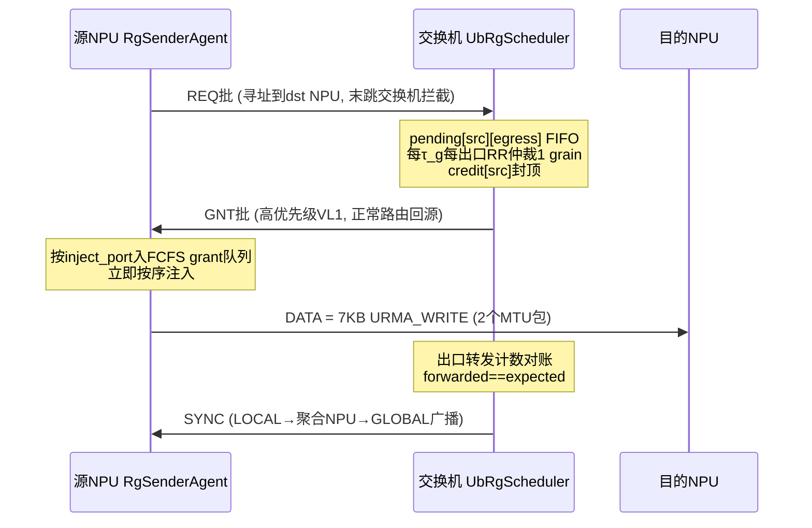

# 逐包 UB Request/Grant 仿真实现计划

## 已确认的取舍

- **保真度 = 核心机制**：真实 REQ/GNT/SYNC 报文 + 目的侧调度器（1 grain/τ_g 授权节奏、credit window、RR 仲裁）+ 源侧 FCFS grant 队列 + cursor 屏障（单世代）。省略：可靠性重传（REQ_ACK/GNT_NACK）、预补偿测量、多世代超前窗口 W_c、PHASE 管理面。
- **规模 = 全 216 组矩阵**，接受过夜运行，启用 MTP。
- 基线 = UB 栈现有 packet spray（`UsePacketSpray` + ECMP 多路径），自由注入。

## 协议流程

关键设计决策（基于探索结论）：

- **REQ 寻址**：REQ 报文以某个目的 NPU 为地址正常路由；**直连该 NPU 的最后一跳交换机拦截**（识别新报文类型 + 路由查表命中本地下行口）——单层/两层统一规则，无需交换机可寻址。
- **报文类型**：新增 `UbRgHeader`（type ∈ {REQ, GNT, SYNC} + 批条目），走新的 `UbPacketType_t` 分支；在 `UbSwitch::GetPacketType`/`SwitchHandlePacket` 增加识别与本机上送逻辑（仿 CBFC 控制帧先例）。控制报文用 VL1（最高合法数据 VL，SP 优先于数据的 VL7）。
- **GNT/SYNC 到达 NPU**：在宿主接收路径（`SinkTpDataPacket` 之前）按类型分流到 `RgSenderAgent`。
- **SYNC 汇聚（简化）**：各调度器 LOCAL SYNC → 聚合 NPU（member 0）→ GLOBAL SYNC 广播到全体成员（与文档 §4.9 的差异是聚合点在 NPU 侧，报告中注明）。
- **grain**：1 grain = 1 token = 7KB（授权按 token 粒度；线上为 4KB+3KB 两个 MTU 包）；τ_g = 143.36 ns。GNT 支持批量签发（≤8 条/批，批间隔 = 批大小 × τ_g，符合 §2.7(5)）以控制控制面报文数。
- **DATA 注入端口钉扎**：grant 指定 inject_port（单层=平面）；源侧按 (src, port, dst) 惰性建 TP/Jetty 绑定实现端口选择（经 `UbTpConnectionManager`；若绑定成本过高退化为 per-plane 预建 8 组 TP）。
- **基线屏障**：与上轮口径一致——仿真测 CCT，软件屏障常量在分析阶段叠加。

## 实现步骤

### 1. 协议报文与收发路径（`src/unified-bus/model/protocol/`）

- 新增 `ub-rg-header.{h,cc}`：`UbRgHeader`（type、src/dst node、cursor_id、entry_count + REQ 条目 8B / GNT 条目 4B / SYNC 8B，格式对齐 ub_request_grant.md §2.3–2.4、§2.9(3)）。
- [ub-switch.cc](ns-3-ub/src/unified-bus/model/ub-switch.cc)：`GetPacketType` 识别 RG 报文；`SwitchHandlePacket` 中：REQ 且本机是末跳 → 上送本机 `UbRgScheduler`；否则按 dst 正常转发（GNT/SYNC 直达 NPU）。

### 2. 交换机侧调度器 `ub-rg-scheduler.{h,cc}`

- `Object` 子类，仿 `UbCongestionControl::OnSwitchAttached` 聚合到交换机节点（仅拥有 NPU 直连下行口的交换机激活：单层 SW / 两层 Leaf）。
- 状态：`pending[src][localEgress]` FIFO、`credit[src]`（C：单层 4、两层 8）、`rr_ptr[egress]`、cursor 账本（declared/expected/forwarded，§6.5 算法四）。
- 每 τ_g 一轮：每下行口 RR 选一个有 credit 的源 → 生成 GNT 条目 → 按源聚批签发；出口转发 DATA 时归账（hook 出口 enqueue 路径，`FinalizeForwardedPacketEnqueue`/`OnSwitchPostEnqueue` 附近）+ credit 归还。
- 份额完成 → SYNC(LOCAL) 发聚合 NPU。

### 3. NPU 侧 `ub-rg-sender-agent.{h,cc}` + 实验 App `ub-rg-experiment-app.{h,cc}`

- SenderAgent：token 描述表；打包 REQ（按调度器分桶，含 cursor_count_expected、空 REQ 表态）；收 GNT → 按 inject_port 入 FCFS 队列 → 立即按序以 7KB URMA_WRITE 注入（create-on-grant，避免 WQE 门控复杂度）；收 GLOBAL SYNC → 推进 cursor / 触发 combine。
- ExperimentApp：Zipf/TopK token 生成（与行为级同一模型与种子）、`dispatch|combine|roundtrip` 模式、`ub_rg|packet_spray` 两 scheme（spray 模式绕过 R/G 直接全量注入 `UsePacketSpray=true`）；统计 per-token 时延（相位起点→末包送达）、CCT、step、热/冷专家分组、直方图，输出与行为级**相同格式**的 summary.json/hist.csv（复用现有分析管线）。

### 4. 拓扑生成 `gen_ub_rg_topo.py`（dyn_latency 根目录）

- 生成三场景 node/topology/routing CSV：场景1（128 NPU×8 口 → 8×SW128）、场景2（1024+128 Leaf+64 Spine，压缩路由）、场景3（8 独立平面）；链路 400G、delay 与行为级一致（传播 50ns，`forwardDelay` 150ns，`allocationDelay` 10ns）。

### 5. 入口程序 `scratch/ub_rg-packet-experiment.cc`

- CommandLine 与行为级程序**同参数面**（--scenario/--scheme/--mode/--batch/--zipf-s/--topk/--ep-size/--seed/--out-dir + --mtp-threads），用 `UbUtils` 装载拓扑，安装 ExperimentApp，跑完写结果。

### 6. 构建与正确性验证

- `--enable-modules=unified-bus --enable-mtp` 构建。
- 微型拓扑（4 NPU × 1 SW16）单步跟踪：REQ 拦截、grant 节奏（出口 grant 间隔 ≥ τ_g）、credit 封顶、SYNC 时序。
- 场景1 batch=16/256、S=0/0.9 与 König 下界及行为级结果对标（CCT 偏差应 ≈ 静态时延项；出口排队深度应有界 σ 级——开 `UB_QUEUE_TRACE` 抽查）。

### 7. 全矩阵运行（长时间）

- 扩展 [run_ub_rg_experiments.py](run_ub_rg_experiments.py)：`--engine=packet`，按规模调度——小场景（场景1）单线程 ×14 并发；大场景（场景2/3 batch≥1024）MTP 8 线程 ×2 并发；结果落 `results/ub_rg_packet/`。traces 全关。
- 预估：场景1 全矩阵数小时；场景2/3 大批量单次 30–90 分钟，总计约 1–2 天分批后台跑（会用后台任务 + 完成通知推进）。

### 8. 报告更新

- [analyze_ub_rg_experiments.py](analyze_ub_rg_experiments.py) 支持双引擎对比（逐包 vs 行为级差异一节）；同时修复上轮遗留：直方图动态 bin 上限、实验3 逐 token dispatch+combine 端到端配对时延、每 EP × 每 S 的 CDF/PDF。
- 重新生成 `docs/UB_RG仿真报告.md` 与 `.html`（图内嵌）。

## 风险与备用路径

- **端口钉扎**若 TP 绑定不支持指定本地口：退化为每 NPU 预建 8 个 per-plane TP（对单层足够；两层 spine 钉扎则退化为 GNT 指定 + ECMP 哈希盐替代，报告注明）。
- **两层 REQ 控制面延迟**在 spine 拥塞时可能拉长 RTT：核心机制下可接受（credit window 掩盖），不做预补偿。
- **运行时长超预算**：若单次远超预估，先交付场景1 全矩阵 + 场景2/3 batch≤256 子集，剩余后台续跑。

