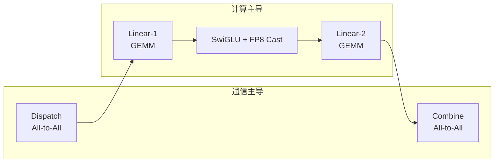
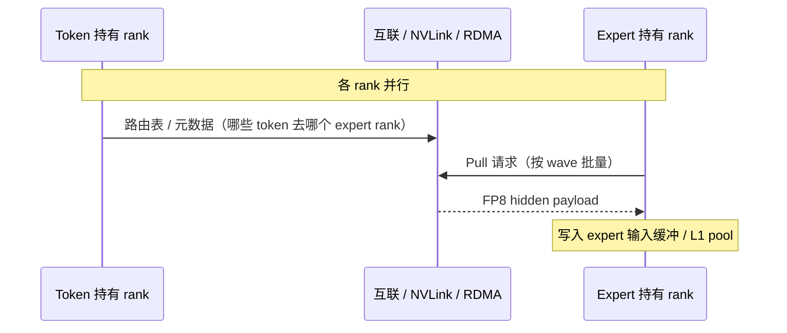
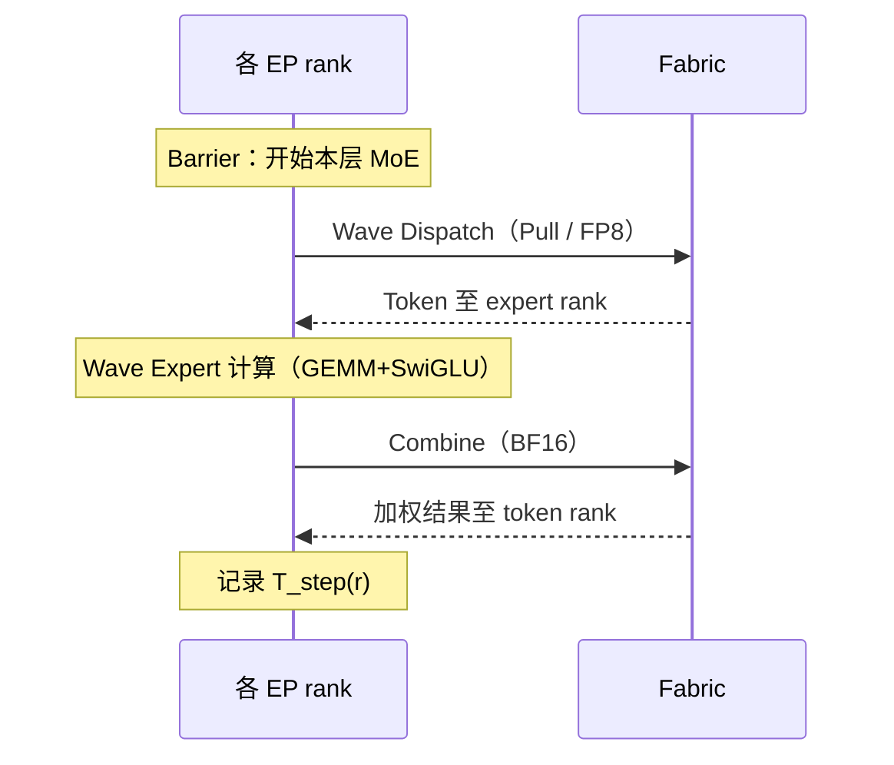

# DeepSeek-V4 MoE 通信完整流程

> **来源**：[DeepSeek_V4.pdf](./DeepSeek_V4.pdf) §3.1 *Fine-Grained Communication-Computation Overlap in Expert Parallelism*，及 §2.1 MoE、§3.3 MoE Backward、§4.2.3 Anticipatory Routing 等相关章节  
> **目的**：从单层 MoE 的算子分解到 wave 流水线、数据精度与硬件共设计建议，给出可对接系统仿真与互联方案的端到端流程说明。

---

## 1. 问题背景

MoE 通过 **Expert Parallelism（EP）** 将 routed experts 分布到多张 GPU/NPU 上，从而扩展专家容量。但 EP 引入：

- 跨节点 **All-to-All** 类通信（Dispatch / Combine）
- 对互联 **带宽与延迟** 的高要求
- 小 batch、RL rollout、Agent 服务等场景下的 **长尾延迟**

DeepSeek-V4 的应对策略：把通信与计算 **融合进单一流水线 mega-kernel**，用 **wave 级细粒度调度** 持续掩盖通信延迟，并在带宽低于「计算-通信平衡点」时仍保持较高端到端性能。

---

## 2. 单层 MoE 的四阶段分解

报告将每个 MoE 层拆为 **四个主要阶段**（图 5）：



| 阶段 | 类型 | 主要操作 | 数据形态（报告隐含） |
|------|------|----------|----------------------|
| **Dispatch** | 通信 | 按路由将 token 激活 **发往** 持有对应专家的 rank | **FP8** 激活（\(h\) 维 hidden） |
| **Linear-1** | 计算 | 专家侧 gate/up 投影 GEMM | 计算域 |
| **Activation** | 计算 | SwiGLU + **FP8 Cast** | 计算域 |
| **Linear-2** | 计算 | down 投影 GEMM | 计算域 |
| **Combine** | 通信 | 将各专家输出 **按 token 聚合回** 源 rank | **BF16** 结果（\(h\) 维） |

**关键洞察**：Profiling 表明单层内 **通信总时间 < 计算总时间**。因此把通信插入计算流水线后，**计算仍是瓶颈**，系统可容忍 **更低的互联带宽** 而不显著损失端到端性能——前提是重叠做得足够细。

---

## 3. 路由与 EP 域划分（推理/训练共性）

### 3.1 专家配置（V4-Pro 为例）

| 参数 | 值 |
|------|-----|
| 每层 routed experts | 384（+ 1 shared expert，shared 通常不走 EP 远端路由） |
| 每 token 激活 | top-6 routed |
| Hidden \(h\) | 7168 |
| Hash routing | **前 3 层** MoE 按 token ID 哈希选专家，其余层为正常 learned routing |
| 亲和度 | `Sqrt(Softplus(score))`，无辅助 loss + sequence-wise balance |

### 3.2 EP 域内 rank 职责

设 EP 规模为 \(R\)（如 8/16/32/64）：

- 每个 rank **本地持有** \(384/R\) 个 routed experts 的权重  
- 每个 token 在 **当前 rank** 上产生 hidden 激活与 **6 个 expert id**  
- **Dispatch**：把 token 激活送到「拥有目标专家」的 rank（同一 token 可能拆成最多 6 条目的地）  
- **Expert 计算**：rank 汇总 **所有路由到本地专家的 token**，执行 Linear-1 → SwiGLU → Linear-2  
- **Combine**：把专家输出送回 **token 最初所在的 rank**，按 top-6 权重加权合并  

Shared expert 在本地或与 routed 路径并行处理（报告未展开 EP 细节，实现上常与 routed 路径融合在同一 mega-kernel）。

---

## 4. 端到端时序：朴素方案 → Comet → V4 Wave

### 4.1 朴素方案（无重叠）

```
Dispatch ──► Linear-1 ──► SwiGLU ──► Linear-2 ──► Combine
   (等待)      (等待)       (等待)       (等待)
```

通信与计算完全串行，EP 扩展收益被通信开销严重侵蚀。

### 4.2 Comet（相关 work）

Comet 将 **Dispatch 与 Linear-1** 重叠，**Linear-2 与 Combine** 重叠，两段式流水线，理论加速约 **1.42×**（V4-Flash 配置下评估）。

### 4.3 DeepSeek-V4：Wave 细粒度流水线（报告方案）

将 **全部 routed experts 划分为多个 wave**（每 wave 只含一小部分专家）：

```
时间 ─────────────────────────────────────────────────────────────►

Wave 1:  [Dispatch W1]──►[L1/L2/Act W1]──►[Combine W1]
Wave 2:       [Dispatch W2]──►[L1/L2/Act W2]──►[Combine W2]
Wave 3:            [Dispatch W3]──►[L1/L2/Act W3]──►[Combine W3]
         └─ 稳态：当前 wave 计算 ∥ 下一 wave Dispatch ∥ 已完成 wave Combine
```

**稳态行为**（报告原文要点）：

1. 当前 wave 内专家 **Dispatch 完成后立即开始计算**，无需等待其他 wave  
2. 当前 wave **计算**、下一 wave **token 传输（Dispatch）**、已完成 wave **结果发送（Combine）** 三者并发  
3. 计算与通信在 wave 粒度上 **持续占满**，缓解 RL rollout 等 **长尾小 batch** 场景  

理论加速（V4-Flash 配置）：约 **1.92×**；实测相对强非融合基线 **1.50–1.73×**（通用推理），延迟敏感场景最高 **1.96×**。

实现载体：开源 **MegaMoE2** CUDA mega-kernel（[DeepGEMM #304](https://github.com/deepseek-ai/DeepGEMM/pull/304)），在 NVIDIA GPU 与华为 Ascend NPU 上验证。

---

## 5. 通信原语与数据量

### 5.1 Pull-based Dispatch

报告明确采用 **Pull 模型**：

- **目的 GPU 主动从远端 GPU 读取** token 数据  
- 动机：细粒度 **Push + Notify** 通知延迟高；Pull 更适配 wave 级「收齐一段再算」  

对比本仓库 SHMEM-POP 语义：Push（元数据/notify）+ Pull（payload）与报告 Pull 主导思想一致；notify 用于 **收齐判定** 而非大块 payload 推送。

### 5.2 每 token-expert 字节量

对 **DeepSeek-V4-Pro**（\(h=7168, d=7168\)）：

| 方向 | 精度 | 每 token-expert 数据量 |
|------|------|------------------------|
| Dispatch（激活） | FP8 | \(h\) bytes ≈ **7 KB**（单 expert）；top-6 时单 token 最多约 **6×7 KB** 出站/入站视路由而定 |
| Combine（输出） | BF16 | \(2h\) bytes ≈ **14 KB** / token-expert 路径 |

报告在 **计算-通信比** 推导中使用：每 token-expert **通信量 \(V_{comm} = 3h\) bytes**（FP8 Dispatch + BF16 Combine 的等效合计），每 token-expert **计算量 \(V_{comp} = 6hd\) FLOPs**（SwiGLU gate、up、down 三次投影）。

### 5.3 计算-通信平衡条件

记峰值算力 \(C\)（FLOP/s）、互联带宽 \(B\)（Byte/s）。通信可被计算完全掩盖的条件：

\[
\frac{C}{B} \le \frac{V_{comp}}{V_{comm}} = 2d = 6144\ \text{FLOPs/Byte}
\]

对 V4-Pro（\(d=7168\)）：**每 1 GB/s 带宽可掩盖约 6.1 TFLOP/s 算力**。带宽达到该平衡点后，继续堆带宽收益递减；硬件设计应瞄准此类 **算力-带宽配比** 而非无限扩带宽。

---

## 6. 单层 MoE 完整流程（逐步）

以下以 **一个 EP 域、一层 MoE、一次前向** 为例，所有 rank 在层入口同步（barrier）。

### 阶段 0：路由（Router）

**输入**：本 rank 上 batch 内各 token 的 hidden \(x \in \mathbb{R}^{h}\)

1. 计算 routed expert 亲和度（`Sqrt(Softplus)`）  
2. **Top-6** 选专家（Hash 层用 token ID 哈希）  
3. 负载均衡偏置（auxiliary-loss-free + sequence-wise balance）  
4. 输出：每个 token 的 **6 个 (expert_id, weight)**  

训练时可选 **Anticipatory Routing**（§4.2.3）：索引用 \(\theta_{t-\Delta t}\) 计算，与 EP 通信流水线重叠，降低 spike 风险。

### 阶段 1：Dispatch（All-to-All，通信）

**目标**：让每个 rank 收齐 **路由到本地专家** 的全部 token 激活。



**逻辑步骤**：

1. 各 rank 根据 top-6 列表生成 **(src_rank → dst_rank, token_id, expert_id)** 调度表  
2. 按 **wave** 划分专家集合；对当前 wave 涉及的远端 rank 发起 **Pull**  
3. 目的 rank 将收到的 FP8 激活放入 **wave 输入队列**  
4. **判定**：当前 wave 所需 token **全部到齐** → 触发该 wave 计算（无需等其他 wave）  

**流量特征**：

- 多对多 **All-to-All**，热点专家导致 **many-to-one incast**（单 rank ESC/Inbound 拥塞）  
- 小 batch 时消息数少但 **wave 未填满**，需第二套多 SM kernel 缓解 wave-quantization（§3.3）

### 阶段 2：Expert 计算（按 wave）

对每个已 Dispatch 完成的 wave，本地专家执行：

1. **Linear-1 GEMM**：gate + up（FP8/混合精度实现）  
2. **SwiGLU** + **FP8 Cast**（训练时 clamp：linear ∈ [-10,10]，gate 上界 10）  
3. **Linear-2 GEMM**：down 投影  

**与通信重叠**：下一 wave 的 Dispatch、上一 wave 的 Combine 与此 wave 的 GEMM **并行**（mega-kernel 内调度）。

**仿真黑盒**（对齐 [`SHMEM-POP技术分档.md`](./SHMEM-POP技术分档.md) §1.12.2.3）：

\[
T_{\text{expert}} = N_{\text{token,local}} \times \tau_{\text{wave}}
\]

\(N_{\text{token,local}}\)：本 rank 本地专家需处理的 token 总数；\(\tau_{\text{wave}}\)：每 token 专家计算常数时延。

### 阶段 3：Combine（All-to-All，通信）

**目标**：将专家输出按 **源 token rank** 送回并加权聚合。

1. 每个 expert rank 将 BF16 专家输出 **发往** token 原始 rank  
2. 源 rank 对同一 token 的 **最多 6 路** 专家输出做 **加权求和**（路由权重）  
3. 与 **shared expert** 输出相加（若尚未融合）  
4. 得到 MoE 层输出 hidden，进入下一 Transformer 层（经 mHC 等）  

Combine 与 **下一 wave 的 Dispatch / 当前 wave 后续计算** 在稳态下重叠。

### 阶段 4：层出口

MoE 输出经 **mHC Post-Block Mixing** 等进入下一层 Attention 或下一 MoE。

---

## 7. 训练期特有：反向与确定性

### 7.1 MoE Backward 中的 EP 通信

反向传播镜像前向：Combine 梯度 ↔ Dispatch 梯度，专家权重梯度在本地累积。

**非确定性来源**：多 rank 的 SM 并发 **atomicAdd** 到同一接收缓冲。

**V4 对策**（§3.3）：

- 单 rank 内 **token 顺序预处理**，固定写入位置协商  
- 跨 rank **buffer 隔离**  
- 保证 EP **发送结果** 与 **梯度累加顺序** 确定性（利于调试 loss spike）

### 7.2 数据并行 + MoE 梯度

- MoE 专家参数：**按专家独立** ZeRO 分片；down/up/gate 矩阵展平后均匀切分  
- 梯度同步：**BF16 随机舍入** + 两阶段（all-to-all 交换 + 本地 FP32 sum），减半通信量  

### 7.3 Anticipatory Routing 与 EP 重叠

训练 step \(t\)：

- 前向用 \(\theta_t\)，路由索引用 **缓存的** \(\theta_{t-\Delta t}\) 结果  
- 在 \(t-\Delta t\) 预取 step \(t\) 数据并 **预计算路由索引**  
- 与 EP 通信流水线编排，使额外开销约 **20%** 墙钟时间；spike 时短期启用，稳定后恢复常规定轨  

---

## 8. 推理部署要点

| 主题 | 建议 |
|------|------|
| **Kernel 融合** | 使用 MegaMoE2，避免 PyTorch 算子级 Dispatch/Combine 边界 |
| **带宽规划** | 按 \(C/B \le 6144\) FLOPs/Byte 评估是否可掩盖 EP 通信 |
| **功耗** | 融合 kernel 使算力/内存/网络同时高负载，需预留 **功耗余量** 避免降频 |
| **激活函数** | 报告建议未来可换更低成本逐元素激活，增大中间维 \(d\)，进一步放松带宽需求 |
| **Push 硬件** | 若未来跨 GPU 信令延迟降低，Push 模式可能更自然；当前 Pull 更优 |

---

## 9. 与系统仿真的对接参数（V4-Pro 默认）

可与 [`SHMEM-POP技术分档.md`](./SHMEM-POP技术分档.md) §1.12 联合使用：

| 参数 | 建议值 |
|------|--------|
| \(R\) | 8（可扫 16/32/64） |
| \(B\) | 32（Decode 微批） |
| top-k | 6 |
| \(B_{\text{moe}}\) | ≈ 32.2 KB / token（dispatch+combine 等效，含 ~15% 协议开销） |
| 热点 | Zipf \(s \in [1.0,1.5]\) 或显式热点专家 |
| \(\tau_{\text{wave}}\) | 2–10 μs/token（实现相关，可配置） |
| 性能口径 | \(T_{\text{slow}} = \max_r T_{\text{step}}(r)\) |

**单步流水线**：



---

## 10. 方案对比小结

| 方案 | Dispatch–Compute | Compute–Combine | Wave 内流水线 | 理论加速（Flash 配置） |
|------|------------------|-----------------|----------------|------------------------|
| Naive | ✗ | ✗ | ✗ | 1.0× |
| Comet | ✓（段 1） | ✓（段 2） | ✗ | ~1.42× |
| **DeepSeek-V4** | ✓（连续 wave） | ✓（连续 wave） | ✓ | ~1.92× |

---

## 11. 开放问题与报告建议

1. **Shared expert** 与 routed EP 在 mega-kernel 内的精确调度顺序（报告未逐指令展开）  
2. **Combine 加权** 与 FP8 cast 的数值路径对 bitwise 确定性的影响（推理通常不要求训练级确定性）  
3. **跨节点 vs 机内 NVLink** 的 wave 划分粒度是否自适应（报告强调 wave 思想，未给固定 wave 数公式）  
4. 硬件：**更低延迟 GPU 间信令**、**算力-带宽共设计**、**全负载功耗预算**  

---

*文档版本：基于 DeepSeek-V4 技术报告 preview 版 §3.1 及关联章节整理；量化参数以 V4-Pro 为主，Flash 仅规模不同。*
