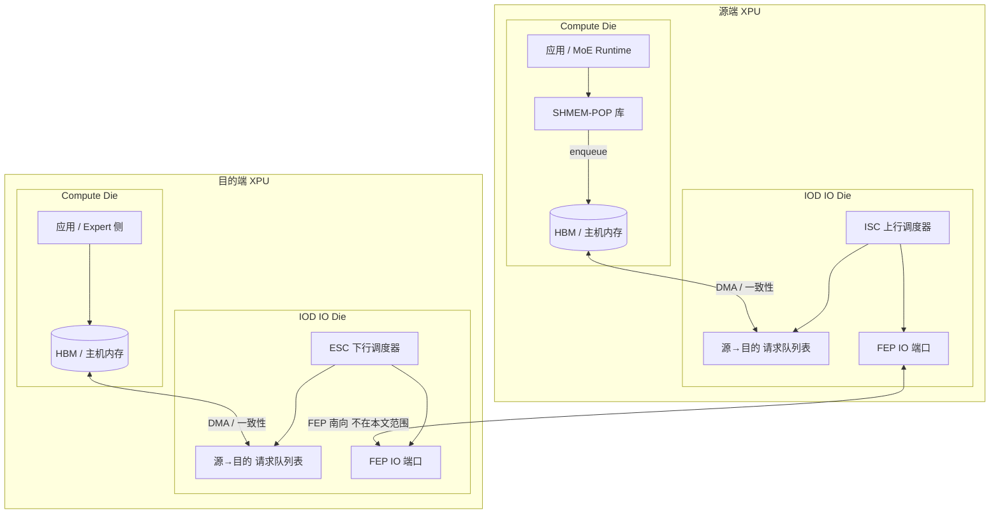
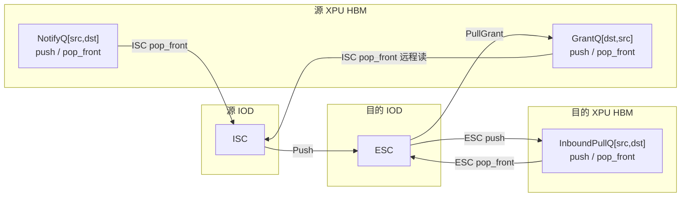
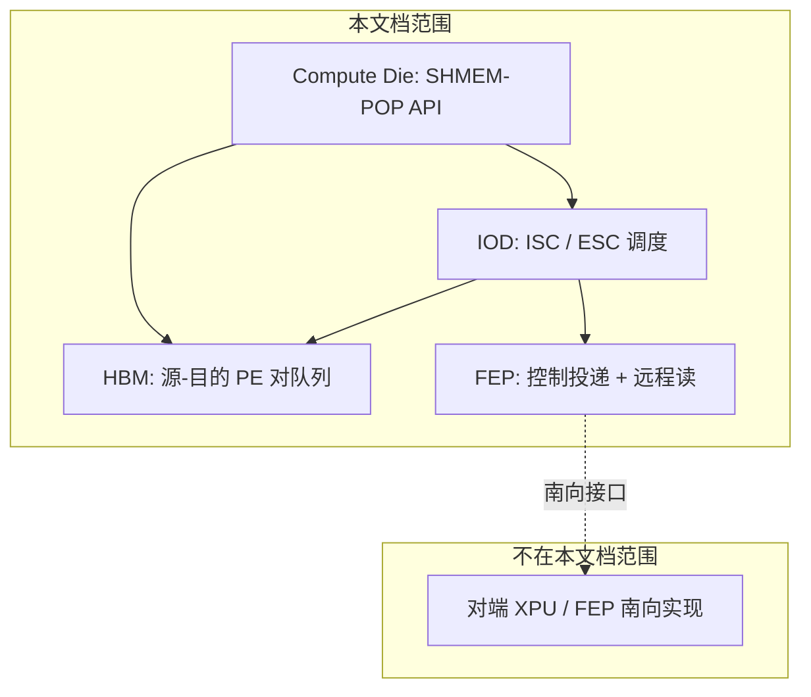
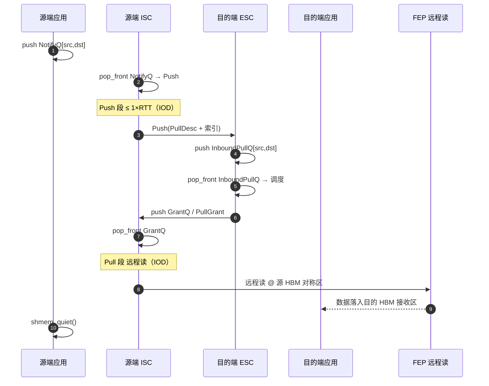
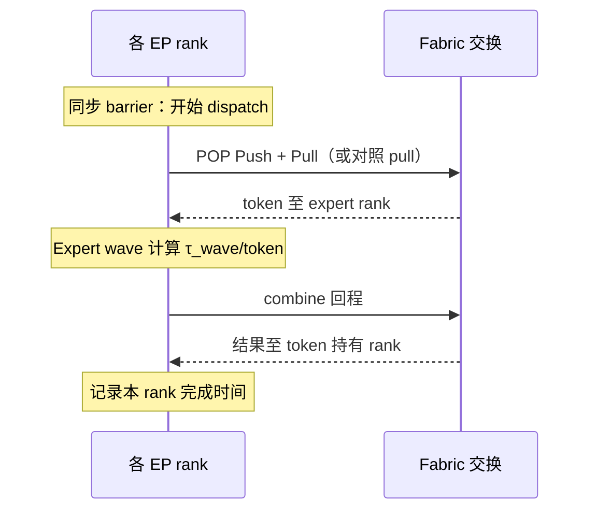

# 1 SHMEM-POP 技术分档

> **技术名称**：SHMEM-POP（Shared-Memory style API + **P**ull **o**n **P**ush）  
> **目录**：动态低时延  
> **版本**：v0.5  
> **日期**：2026-06-05  
> **范围**：**仅 XPU 端侧**（Compute Die + IOD）；**不包含** 互连、交换、网络协议等下层设计  
> **关联**：超节点 ISC–ESC 协同（[`异构超节点：方案2.1.md`](../../netsim/desgin-doc/supernode/异构超节点：方案2.1.md)）；典型 MoE EP **pull-on-notify** 工作负载语义（实现无关）  
> **评估**：§1.12 给出 **DeepSeek-V4-Pro EP** 系统仿真与 **Oracle Fabric** 理论上限对比方法

---

## 1.1 概述

### 1.1.1 定义

**SHMEM-POP** 是定义在 **XPU 芯片内** 的一种 **跨 PE 数据搬运与协同调度** 机制，由 **Compute Die 软件 + IOD（ISC/ESC/FEP）** 共同实现：

| 缩写 | 含义 |
|------|------|
| **SHMEM** | 软件面采用 **类 OpenSHMEM / 对称内存** 的 put 风格 API；对应用隐藏 IOD 队列与 FEP 事务细节 |
| **POP** | **Pull on Push** — 先 **Push** 约 **1×RTT** 的控制与描述数据，再由目的端 **ESC 调度** 触发源端 **远程读（Pull）** 拉取主体数据 |

**设计目标**：在 MoE EP、专家并行等 **many-to-one 汇聚 + 小包元数据 / 大块 payload** 场景下，将 **动态 tail（p99）** 纳入 **IOD 可调度、可契约** 的能力，并 **降低 Compute Die SM 在数据路径上的占用**。

### 1.1.2 与「内核直驱 pull」工作负载的对应（实现无关）

以下对照 **仅描述语义**，不绑定任何互连或厂商实现：

| 典型 EP dispatch 阶段 | SHMEM-POP 映射 |
|----------------------|----------------|
| 发布专家命中计数、远端路由索引 | **Push 段**（≤ 1×RTT 描述子 + 索引） |
| 专家侧拉取主体 token 数据 | **Pull 段**（远程读，由 ESC 调度结果触发） |
| 专家侧汇聚 slot | 目的 **ESC** 汇聚 Pull 请求并调度 |
| 对称发送缓冲 | **SHMEM 对称堆**（XPU HBM 内，PE 间可寻址） |

差异：内核直驱 pull 由 **Compute Die** 发起读写；SHMEM-POP 将 **调度权下沉到 IOD（目的 ESC + 源 ISC）**，应用仅 **`push` 通知队列**。

---

## 1.2 系统角色与模块

### 1.2.1 XPU 侧模块（术语统一：GPU → XPU）



| 模块 | 物理位置 | 职责 |
|------|----------|------|
| **SHMEM-POP 库** | Compute Die | 类 SHMEM API；构造 `PullDesc`；向 **IOD 可见的队列** 写入请求条目 |
| **ISC**（Ingress Scheduler） | **源端 IOD** | 调度 **源→目的** 队列：`push` 待发项、`pop_front` 出队并执行 **Push**；收 **PullGrant** 后触发 **远程读 Pull** |
| **ESC**（Egress Scheduler） | **目的端 IOD** | 调度 **源→目的** 队列：`push` 入站 Pull 请求、`pop_front` 出队并生成 **PullGrant** |
| **FEP** | IOD | **南向边界**：投递控制通知、发起远程读；地址翻译在 IOD 内完成（下层实现 **不在本文档范围**） |
| **请求队列** | **XPU HBM 或 DDR/LPDDR 等** | 按 **(src_pe, dst_pe)** 对的 **FIFO 队列** 存 `PullDesc` / `PullGrant`；IOD 逻辑 **不** 在片上实现大深度队列存储 |

> **命名约定**：全文 **XPU** 统称加速卡；**ISC/ESC** 逻辑在 **IOD（IO Die）** 实现，与超节点方案 2.1 调度语义对齐，SHMEM-POP 扩展载荷为 **Pull 请求 / PullGrant**。Compute Die 上的 SM **不** 参与队列 push/pop，仅写描述符或轮询完成态。

### 1.2.2 IOD 实现与「源–目的 XPU 对」队列

#### 1.2.2.1 实现归属

| 组件 | 实现位置 | 说明 |
|------|----------|------|
| **ISC** | **源 XPU 的 IOD** | 上行 POP 调度、Push 发送、远程读 Pull 发起 |
| **ESC** | **目的 XPU 的 IOD** | 下行 POP 调度、Pull 请求汇聚、PullGrant 下发 |
| **队列存储** | **XPU 可访问存储器** | 默认 **HBM**；亦可配置为 **DDR / CXL 挂载内存** 等 |
| **FEP / 地址翻译** | IOD | 将队列条目中的槽位地址译为 **远程读** 所需的源/目的物理地址 |

IOD 与 Compute Die 通过 **IO 一致性通道 / DMA 引擎** 访问队列内存；队列深度与基址由 `shmem_pop_init` 注册到 IOD 配置寄存器。

#### 1.2.2.2 队列组织：按 (src_pe, dst_pe) 分桶

系统为每一对 **源 XPU — 目的 XPU** 维护 **独立 FIFO 队列**（逻辑上为二维表 `Q[src_pe][dst_pe]`，物理上可按稀疏表或哈希分配）。

| 队列 | 所在 XPU | 方向 | 元素类型 | 典型生产者 / 消费者 |
|------|----------|------|----------|-------------------|
| **NotifyQ** | **源** HBM | 源 → 目的（待发 Push） | `shmem_pop_pull_desc_t` | 软件 **push**；**ISC `pop_front`** 出队发 Push |
| **InboundPullQ** | **目的** HBM | 源 → 目的（已到站请求） | `PullNotify` 展开项 | **ESC `push`**（收到 Push 后）；**ESC `pop_front`** 调度 |
| **GrantQ**（可选） | **源** HBM | 目的 → 源 | `PullGrant` | **ISC `push`**（收 Grant）；**ISC `pop_front`** 触发远程读 |

**键规则**：

- 软件 `shmem_pop_put_notify(dst_pe, desc)` 等价于向 **`Q[my_pe][dst_pe]`（NotifyQ）** 做 **`push` 队尾`**。
- **ISC** 在本端 IOD 内周期调度：对每条活跃的 `(my_pe, dst_pe)` 队列 **`pop_front`**，将队首条目作为 **Push 段** 载荷发往目的 **ESC**（累计 ≤ 1×RTT）。
- 目的 **ESC** 将 Push 解析后的请求 **`push`** 到 **`Q[src_pe][my_pe]`（InboundPullQ，存放在目的 XPU 的 HBM）**；调度时再 **`pop_front`**，生成 **PullGrant** 并 **`push`** 到源端 **GrantQ**（或经 FEP 投递等效写入源 HBM）。
- 源 **ISC** 从 **GrantQ `pop_front`** 取得 Grant，经 **FEP** 发起 **远程读 Pull** 搬运主体数据。



#### 1.2.2.3 IOD 调度原语

ISC/ESC 内部状态机统一采用 **队列 push / pop_front**（FIFO），与软件侧 STL 语义一致，便于仿真与 RTL 对拍：

| 原语 | 执行方 | 语义 |
|------|--------|------|
| **`queue_push(q, entry)`** | 软件或對端 IOD | 队尾入队；满则反压（`shmem_put_notify` 阻塞或返回 `EAGAIN`） |
| **`queue_pop_front(q)`** | 本端 ISC 或 ESC | 队首出队；空则跳过本轮调度 |
| **`queue_peek_front(q)`** | ISC/ESC（可选） | 窥视队首不出队，用于合并 Push |

**与方案 2.1 IQM/EQM 的关系**：方案 2.1 在 **设备内** 用 VoQ 承载报文队列；SHMEM-POP 将 **同类 FIFO 语义** 落在 **HBM 上的 POP 描述符队列**，由 **IOD 的 ISC/ESC** 消费，避免 Compute Die 上深度缓冲。

### 1.2.3 规范范围与 FEP 边界

本文档 **仅规范 XPU 芯片内部** 行为；**互连、交换芯片、网络协议、机柜拓扑等一律不在范围内**。



| 层次 | 是否在范围内 | 说明 |
|------|--------------|------|
| **SHMEM-POP API** | **是** | `put_notify`、`quiet`、队列注册 |
| **HBM 队列** | **是** | `(src_pe, dst_pe)` FIFO；`push` / `pop_front` |
| **IOD ISC / ESC** | **是** | POP 状态机、调度树、PullCredit |
| **FEP** | **是（仅行为定义）** | 向对端 **投递控制通知**；按 Grant 发起 **远程读** |
| **FEP 以南** | **否** | 对端 XPU 如何相连、经何介质传输 **另文定义** |

**FEP 对外的两类原语**（仅定义语义，不规定下层实现）：

| 原语 | POP 阶段 | IOD 调用方 |
|------|----------|------------|
| **`fep_notify(peer, buf, len)`** | Push | 源 ISC |
| **`fep_remote_read(peer, src, dst, len)`** | Pull | 源 ISC |

**配置参数** `RTT`、`C_port` 表示 **一次 POP 往返时间与对端 PE 间有效带宽** 的 **平台标定值**，由集成方写入 IOD 寄存器；**本文不规定** 其测量方法或物理来源。

**不在 XPU 外实现的需求**（重申）：

- 队列与调度 **仅** 在 HBM + IOD；
- `PullDesc` / `PullGrant` **不** 要求链路中间设备解析；
- **combine** 等其它 EP 阶段 **不在** SHMEM-POP 规范内。

---

## 1.3 POP 机制：先 Push，再 Pull

### 1.3.1 两阶段语义



| 阶段 | 名称 | 数据量（典型） | 执行方 | 作用 |
|------|------|----------------|--------|------|
| **①** | **Push** | **≤ PushBudget**（$RTT \times C_{\text{port}}$，见 §1.3.2） | 源 **ISC** → 目的 **ESC** | 送达 Pull 描述符、topk 索引、`expert_send_count` 类元数据，使目的 **无需反向查表** 即可调度 |
| **②** | **Schedule** | 控制面（数十～数百 B） | 目的 **ESC** | 多请求间 **SP/WDRR/TDM**；生成 **PullGrant** |
| **③** | **Pull** | 主体 payload（如 MoE token **~H×element_size**） | 源 **ISC** 经 **FEP 远程读** | 按 Grant 从源对称堆 **拉取** 到目的 HBM 接收区 |

**POP 含义**：若没有 Push 段，目的端不知道「拉什么、从哪拉」；Push 用 **约 1×RTT 可承载的元数据** 完成 **通知 + 预置索引**，Pull 段再在 **ESC 许可的带宽与时间窗** 内做 **大块远程读**，避免汇聚侧同时触发大量盲目读。

### 1.3.2 为何 Push 上限为「1×RTT」

与 ISC 信用模型（方案 2.1）一致：

$$
\text{PushBudget}_{\max} = RTT \times C_{\text{port}}
$$

其中 $RTT$ 为 **平台标定的 POP 往返时延**，$C_{\text{port}}$ 为 **源 PE–目的 PE** 间有效带宽（均由集成配置写入 IOD，**非本文定义**）。

**含义**：单次 `shmem_put_notify` 携带的 Push 载荷 **不应超过** 目的端在 1 RTT 内可消化/缓存的描述信息量，从而：

1. 保证 ESC 能在 **下一调度周期** 前收齐调度输入；
2. 与 **CreditAllocation** 粒度（如 4KB）对齐时可设 $\text{PushBudget} = \min(RTT \times C, \text{CreditSize})$。

---

## 1.4 软件接口：类 SHMEM

### 1.4.1 编程模型

- **SPMD**：各 XPU 持有相同对称堆布局（按 **PE id = XPU 全局编号**）。
- **单边通信为主**：源调用 `put` 类接口；目的可选 `quiet` / 回调。
- **远程 PE**：`pe` 为对端 XPU 的 **全局端点 id**（编号规则由 **平台配置**，不在本文档范围）。

### 1.4.2 核心类型（示意）

```c
/* 全局 XPU / PE 编号 */
typedef uint16_t shmem_pop_pe_t;

/* Pull 请求：应用填充，Push 段仅传送本结构及必要索引 */
typedef struct {
    uint32_t pull_seq;       /* 源端单调序号，用于匹配 Grant */
    uint16_t dst_pe;         /* 目的 XPU（专家所在） */
    uint16_t cos;            /* 优先级 / 队列类 */
    uint32_t local_slot;     /* 源对称堆内 token 槽 */
    uint32_t byte_len;       /* Pull 段期望读取长度 */
    uint32_t expert_id;      /* MoE 专家 id（可选） */
    uint64_t meta[4];        /* 扩展：topk 权重偏移、SF 句柄等 */
} shmem_pop_pull_desc_t;

/* 单条 (src_pe, dst_pe) 队列布局（位于 HBM 或指定内存） */
typedef struct {
    uint32_t capacity;       /* 队列深度（条目数） */
    uint64_t base_addr;      /* 物理/设备地址，IOD 可 DMA */
    uint32_t entry_stride;   /* 通常 sizeof(shmem_pop_pull_desc_t) */
} shmem_pop_pair_queue_t;

/* Push 配置 */
typedef struct {
    size_t   push_max_bytes;     /* 默认 RTT*C，见 §1.3.2 */
    uint32_t flags;              /* SHMEM_POP_FENCE, SHMEM_POP_ASYNC */
    shmem_pop_mem_t mem;         /* SHMEM_POP_MEM_HBM | DDR | ... */
    uint32_t max_pairs;          /* 最大 (src,dst) 对数 */
    shmem_pop_pair_queue_t *notify_q;  /* 每对队列注册 */
} shmem_pop_config_t;
```

### 1.4.3 API 列表

| API | 语义 | 硬件行为 |
|-----|------|----------|
| `shmem_pop_init(config)` | 初始化对称堆、**注册 (src,dst) 队列基址/深度**（HBM 等） | 配置 **IOD** 内 ISC/ESC 与 FEP |
| `shmem_pop_my_pe()` | 返回本 XPU 的 `pe` | 读平台 PE 配置 |
| `shmem_pop_put_notify(pe, desc)` | **核心**：`push` 入 `NotifyQ[my_pe, pe]` | **IOD ISC** 后续 `pop_front` 并 Push 至目的 **ESC** |
| `shmem_pop_put_notify_n(pe, desc, n)` | 连续 `push` n 条 | 受队列容量与 PushBudget 限制 |
| `shmem_pop_quiet()` | 等待本 PE 发出的 notify 对应 Pull 完成 | GrantQ 排空 + 远程读完成 |
| `shmem_pop_wait_until(seq)` | 等待指定 `pull_seq` 完成 | 与 quiet 类似，细粒度 |
| `shmem_pop_bind_recv(buf, len)` | 目的端注册 Pull 数据落点（**HBM 地址**） | **IOD ESC** 远程读结果写入 `buf` |
| `shmem_pop_fence()` | 前序 `push` 对 IOD 可见后再发后续 | NotifyQ 栅栏 |
| `shmem_pop_queue_info(src, dst, ...)` | 查询指定 **源–目的对** 队列深度/反压 | 读 IOD 统计寄存器 |

**不提供** 标准 `shmem_put(mem, nbytes)` 直接推主体大块；主体走 **POP 的 Pull 段**，避免与 POP 调度冲突。若需兼容传统 put，应走 **独立 SHMEM 通道**（非 POP 队列）。

### 1.4.4 MoE Dispatch 映射示例

```c
/* 源 rank：token 持有方，专家在 dst_pe */
shmem_pop_pull_desc_t d = {
    .pull_seq     = seq++,
    .dst_pe       = expert_pe,
    .cos          = cos,
    .local_slot   = token_idx,
    .byte_len     = hidden * sizeof(fp8),  /* 按模型 hidden 维配置 */
    .expert_id    = expert_id,
};
/* 软件 push → NotifyQ[my_pe, expert_pe]；IOD ISC pop_front 后 Push */
shmem_pop_put_notify(expert_pe, &d);
/* 计算重叠：继续本地计算；quiet 前由 ISC 完成远程读 Pull */
```

目的端专家 runtime：

```c
shmem_pop_bind_recv(expert_l1_pool, pool_bytes);
/* ESC 调度后，数据经远程读进入 expert_l1_pool */
shmem_pop_quiet();  /* 或 wait_until(seq) */
/* 接后续专家计算 kernel */
```

---

## 1.5 控制面与调度协议

### 1.5.1 消息定义

在方案 2.1 的 `QueueStatusChange` / `CreditAllocation` 之外，SHMEM-POP 增加：

| 消息 | 方向 | 载荷 | 作用 |
|------|------|------|------|
| **PullNotify**（Push 段载体） | 源 ISC → 目的 ESC | `PullDesc` + 可选 `topk_idx[]` 片段 | 注册一次 POP 事务 |
| **PullGrant** | 目的 ESC → 源 ISC | `(pull_seq, src_addr, dst_addr, len, credit)` | 授权 **远程读 Pull**；`credit` 限制在途字节 |
| **PullComplete** | 源 FEP → 目的 ESC（可选） | `pull_seq` | 释放目的侧调度状态 |
| **PullCancel** | 双向 | `pull_seq`, `reason` | 超时 / 反压 |

`src_addr` / `dst_addr` 为 **FEP 翻译后的物理地址**（通常位于源/目的 XPU HBM），非应用虚拟地址。

### 1.5.2 源端 ISC 行为（IOD）

ISC 在 **源 XPU 的 IOD** 上以 **队列 push / pop_front** 驱动状态机（队列主体在 **HBM 等**，见 §1.2.2）：

1. **软件入队**：`shmem_pop_put_notify` → **`queue_push(NotifyQ[my_pe, dst_pe], desc)`**（Compute Die 写 HBM，或经 MMIO 触发 IOD DMA push）。
2. **Push 调度**：ISC 调度树选中 `(dst_pe, cos)` 后，对对应 NotifyQ **`pop_front`**，取队首 `PullDesc`；若累计 Push 字节 **≤ PushBudget** 且 **CrdtBal > 0**，经 FEP 向目的 **ESC** 发送 **PullNotify**（Push 段）。
3. **Grant 入队**：收到 **PullGrant** 后，**`queue_push(GrantQ[dst_pe, my_pe], grant)`**（或 FEP 通知等效写入 HBM）。
4. **Pull 执行**：ISC 对 GrantQ **`pop_front`**，FEP 发起 **远程读**（读源 XPU **HBM** `src_addr`，写入目的 `dst_addr`）。
5. **完成**：递减在途计数；可选 **`queue_push`** 完成事件到软件可见区，或发 **PullComplete** 至目的 ESC。

**ISC 调度树**（建议）：`Root(WDRR) → DstPe → Cos → NotifyQ`；叶子节点对应一条 **`Q[my_pe, dst_pe]`** FIFO。

| 步骤 | 队列操作 | 执行单元 |
|------|----------|----------|
| 软件提交 | **push** NotifyQ | Compute Die → HBM |
| 发 Push | **pop_front** NotifyQ | **IOD ISC** |
| 收 Grant | **push** GrantQ | **IOD ISC** |
| 发远程读 | **pop_front** GrantQ | **IOD ISC** + FEP |

### 1.5.3 目的端 ESC 行为（IOD）

ESC 在 **目的 XPU 的 IOD** 上同样以 **push / pop_front** 管理 **InboundPullQ**（存于 **目的 XPU HBM**，按 **(src_pe, my_pe)** 分桶）：

1. **入站 Push**：FEP 收到 **PullNotify** 后，ESC 解析并 **`queue_push(InboundPullQ[src_pe, my_pe], entry)`**。
2. **调度**：**EscSchFreq** 周期内，按调度树对活跃 **InboundPullQ** 执行 **`pop_front`**，每次出队一条或多条（受 credit 限制），生成 **PullGrant**。
3. **下发 Grant**：**`push`** 至源端 **GrantQ**（HBM 直写或 FEP 通知）；**Σ len** 受目的接收缓冲与 PullCredit 约束。
4. **反压**：InboundPullQ 或接收缓冲达 **high watermark** 时暂停 **`pop_front` 发 Grant**；通过对源 **ISC** 停发 **PullCredit** 使源端 NotifyQ **push** 反压（**<1 RTT**）。

**ESC 调度树**（建议）：`Root(TDM) → SrcPe → Cos → ExpertId`；叶子对应 **`Q[src_pe, my_pe]`**。

| 步骤 | 队列操作 | 执行单元 |
|------|----------|----------|
| 收 Push | **push** InboundPullQ | **IOD ESC** |
| 调度 | **pop_front** InboundPullQ | **IOD ESC** |
| 发 Grant | **push** 源端 GrantQ（跨 XPU） | **IOD ESC** + FEP |

### 1.5.4 远程读（Pull）语义

| 属性 | 要求 |
|------|------|
| **操作类型** | **远程读**（由 FEP 执行；下层如何送达对端 **不在本文档范围**） |
| **粒度** | 建议 **64B–256B 对齐** 起读；MoE 整 token 可多 Read 合并 |
| **顺序** | 同一 `pull_seq` 内有序；不同 `pull_seq` 可由 ESC 重排（目的端 Reorder 模块可选） |
| **一致性** | Push 段写入的索引 **happens-before** Pull 段读；由 **PullGrant** 栅栏保证 |

---

## 1.6 端到端流程（MoE EP Dispatch）


**与典型 EP dispatch 步骤对照**（语义级，与互连无关）：

| 步骤 | 典型内核直驱 dispatch | SHMEM-POP |
|------|------------------------|-----------|
| 1 | 统计 expert hit | 源应用构造 `PullDesc` |
| 2 | 写远端路由索引 | **Push 段**（源 ISC） |
| 3 | 专家侧拉取主体数据 | **Pull 段**（远程读，ESC 授权后） |
| 4 | 写入专家输入池 | 目的 `shmem_pop_bind_recv` 缓冲 |
| 5 | 专家计算 | 不变 |

**Combine 等其它 EP 阶段**：由应用或其它模块完成；SHMEM-POP **仅规范 dispatch 段** 的 POP 语义。

---

## 1.7 时延与调度目标（XPU 端侧）

| 目标项 | SHMEM-POP 实现手段 |
|--------|-------------------|
| **静态延迟** | Push 仅描述子；主体走单次 **远程读** |
| **动态 p99** | 目的 **ESC** 统一调度 Pull，避免同时盲目发起大量远程读 |
| **<1 RTT 反压** | PullGrant / PullCredit；Push ≤1 RTT |
| **负载感知** | ESC 可按 `src_pe` / `expert_id` 权重暂停 Grant |
| **逻辑分区** | 按 `(src_pe, dst_pe)` 队列隔离，缩小调度汇聚域 |

**建议验收指标**（`RTT` 为平台标定值）：

| 指标 | 目标 |
|------|------|
| Push 段 | 载荷 **≤ 1×RTT×C_port**（§1.3.2） |
| Pull 段 | 以平台标定 **RTT** 与 payload 大小在集成环境实测 |
| p99 / median | **≤ 2–3×**（高负载 MoE dispatch，IOD 内可配置） |
| Compute Die SM | **趋近 0**（队列与远程读由 **IOD** 完成） |

---

## 1.8 配置参数

| 参数 | 符号 | 默认值（示意） | 说明 |
|------|------|----------------|------|
| POP 往返时延 | $RTT$ | 平台标定 | 写入 IOD，用于 PushBudget |
| 对端 PE 有效带宽 | $C$ | 平台标定 | 源 PE–目的 PE 逻辑通道 |
| Push 预算上限 | `push_max_bytes` | $RTT \times C$ | §1.3.2 |
| Pull Credit 粒度 | `pull_credit_size` | 4 KB | 与方案 2.1 CreditSize 对齐 |
| ESC 调度频率 | `EscSchFreq` | $B_{\text{XPU}} / (2 \times \text{pull\_credit\_size} \times 8)$ | 同方案 2.1 |
| 最大在途 Pull | `max_inflight_pull` | 256（decode）/ 更大（prefill） | 与工作负载 batch 上限对齐 |
| 每对队列深度 | `pair_queue_depth` | 512–4096 条 | HBM 占用 = depth × 对数 × entry_size |
| 队列内存类型 | `mem` | HBM | 见 §1.2.2.1 |
| 超时 | `pull_timeout_us` | 10× RTT | 触发 PullCancel |

---

## 1.9 异常、RAS 与限制

| 场景                      | 行为                                                            |
| ----------------------- | ------------------------------------------------------------- |
| Push 超 `push_max_bytes` | 返回 `EINVAL`；或拆分为多次 notify                                     |
| ESC 缓冲溢出                | InboundPullQ 满则暂停 **pop_front** 发 Grant；源 NotifyQ **push** 反压 |
| NotifyQ 满               | `shmem_put_notify` 返回 `EAGAIN` 或阻塞                            |
| IOD–HBM 一致性             | 软件 **push** 后需 `fence` 方可被 ISC **pop_front** 可见               |
| 远程读失败 | PullCancel + 应用重试；重试策略由平台/FEP 实现定义 |
| `pull_seq` 乱序 | 目的 **Reorder**（可选模块，同方案 2.1） |

---

## 1.10 实现路线

| 阶段 | 内容 | 依赖 |
|------|------|------|
| **P0** | SHMEM-POP API + HBM 队列模型 + IOD push/pop_front 仿真 | 平台仿真 / 超节点控制面 |
| **P1** | **IOD** 内 ISC/ESC 对 `(src,dst)` 队列调度（仿真远程读） | 方案 2.1 ISC/ESC 语义 |
| **P2** | FEP `notify` / `remote_read` + MoE dispatch 对接 | 平台 FEP 驱动、对称堆 |
| **P3** | 与参考 EP 索引布局互操作；p99 SLA 实测 | 工作负载集成 |
| **P4** | **§1.12 系统仿真**：V4-Pro EP 基线 vs Oracle Fabric 差距评估 | ns-3-ub / 离散事件仿真 |

---

## 1.11 相关文档

- [`netsim/desgin-doc/supernode/异构超节点：方案2.1.md`](../../netsim/desgin-doc/supernode/异构超节点：方案2.1.md) — ISC/ESC 调度与 credit 基线（同构参考）
- [`业务分析/DeepSeek-V4_Prefill-Decode池内通讯与AFD定量分析.md`](../业务分析/DeepSeek-V4_Prefill-Decode池内通讯与AFD定量分析.md) — V4-Pro EP 流量与突发模型
- [`Refrence/DeepSeek_V4.pdf`](../Refrence/DeepSeek_V4.pdf) — V4 技术报告（wave 专家计算等）
- [`OIO_16x50G_PHY时延与SUE_RTT分析.md`](../OIO_16x50G_PHY时延与SUE_RTT分析.md) — RTT 预算与仿真标定

> 互连、交换、RTT 物理测量等见各 **平台/互连** 分册；**§1.12 仿真** 为评估方法学，不扩展 SHMEM-POP 芯片规范范围。

---

## 1.12 系统仿真建议

本节定义 **如何用系统级仿真评估 SHMEM-POP（及对照方案）相对理论上限的性能差距**。仿真覆盖 **XPU IOD 队列调度 + Fabric 交换 + MoE 工作负载时序**；互联物理实现仍用 **平台标定 RTT / 带宽**，不在此重复规范。

### 1.12.1 仿真目标

**核心问题**：在当前方案（有限 HBM 队列、PullCredit、ESC/ISC 调度周期、有限交换缓存与 CBFC/反压）下，DeepSeek-V4-Pro 类 **EP 域内 dispatch → 专家计算 → combine** 的端到端性能，与 **理论上限 Fabric** 相比 **差距有多大、瓶颈在哪一段**。

| 产出 | 说明 |
|------|------|
| **$T_{\text{slow}}$** | 各 rank 完成一轮 EP 的耗时；取 **最慢 rank** 作为系统性能（见 §1.12.3） |
| **Gap vs Oracle** | $\Delta = T_{\text{slow}}^{\text{curr}} - T_{\text{slow}}^{\text{oracle}}$；相对差距 $G = \Delta / T_{\text{slow}}^{\text{oracle}}$ |
| **分段归因** | dispatch 网络 / 专家计算 / combine 网络各自贡献；热点专家导致的 **M2N 排队** 占比 |
| **敏感性** | 热点强度、$RTT$、$C_{\text{port}}$、队列深度、ESC 频率、plane 数 |

**验收判据（示例）**：

- 在 **Chat Decode、EP=8、batch=32、含热点专家** 基线下，$G \leq 20\%$ 为「接近上限」；$G > 50\%$ 需优化 ESC/credit 或 Fabric 平面数。
- **p99(rank 完成时间)** 与 $T_{\text{slow}}$ 的比值反映 tail 是否由 **单点热点 expert** 主导。

### 1.12.2 基线业务模型：DeepSeek-V4-Pro EP 域

以 **EP 域内所有 rank 同步执行一层 MoE 的 dispatch → Expert 计算 → combine** 为 **最小仿真步**（可外扩为多 layer 循环，层间依赖相同）。

#### 1.12.2.1 模型与并行参数（默认）

引用 [`业务分析/DeepSeek-V4_Prefill-Decode池内通讯与AFD定量分析.md`](../业务分析/DeepSeek-V4_Prefill-Decode池内通讯与AFD定量分析.md) 与 [`Refrence/DeepSeek_V4.pdf`](../Refrence/DeepSeek_V4.pdf)：

| 参数 | 默认值 | 说明 |
|------|--------|------|
| 模型 | **DeepSeek-V4-Pro** | 61 层；本步仿真 **单层 MoE** 或可配置 $L_{\text{moe}}=58$ 循环 |
| Hidden $H$ | **7168** | FP8 激活 |
| Experts / top-k | **384 / 6** | Hash-MoE 引导层除外 |
| **EP 规模** $R$ | **8**（可扩 **16 / 32 / 64**） | 域内 rank 数 = EP 宽度；每 rank 本地 **$384/R$** 个专家 |
| **batch** $B$ | **32**（Decode Chat 基线） | 每 rank 持有 token 微批 |
| 每 token MoE 字节 | $B_{\text{moe}} \approx 32.2\ \text{KB}$ | dispatch + combine 等效（含 ~15% 协议开销） |
| dispatch 语义 | **SHMEM-POP**：Push（元数据）+ Pull（token payload） | combine 走 **独立 put/AR 通道**（非 POP） |

#### 1.12.2.2 热点专家（Hotspot）

在均匀 top-k 路由之上叠加 **非均匀命中**，模拟 **M2N incast**：

| 模式 | 参数 | 效果 |
|------|------|------|
| **Zipf 偏斜** | 系数 $s \in [1.0, 1.5]$ | 少数专家吸收多数 token |
| **显式热点** | 热点专家集合大小 $K_h$，份额 $\rho_h$ | 例：$K_h=4$ 专家承担 $\rho_h=50\%$ 流量 |
| **跨 rank 热点** | 热点落在 **单一 expert rank** | 该 rank 的 **ESC InboundPullQ** 与 combine 出口最易拥塞 |

路由生成（每层、每步）：

1. 各 rank 对本地 $B$ 个 token 独立采样 top-6 expert id（带热点权重）。
2. 生成 **dispatch 表**：对每个 $(src\_rank, dst\_rank)$ 统计 token 数与字节数。
3. **dispatch 阶段**：源 rank 对每个远端 expert rank 发 `shmem_pop_put_notify`（POP）或对照 **内核直驱 pull**。
4. **专家计算阶段**：目的 rank 收齐本地专家所需 token 后启动计算（见下）。
5. **combine 阶段**：各 expert rank 将结果 **all-to-all / incast 反向** 送回 token 持有 rank（字节量与 dispatch 对称）。

#### 1.12.2.3 专家计算：Wave 模型（固定每 token 时延）

对齐 DeepSeek V4 技术报告中的 **基于 wave 的专家计算**：将专家 GEMM 视为 **按 wave 推进的流水线**，仿真中 **不展开矩阵乘微架构**，而采用 **每 token 固定计算时延**：

$$
T_{\text{expert}} = N_{\text{token,local}} \times \tau_{\text{wave}}
$$

| 符号 | 含义 | 标定 |
|------|------|------|
| $N_{\text{token,local}}$ | 本 rank 本地专家需处理的 token 总数（含热点汇聚） | 由路由统计 |
| $\tau_{\text{wave}}$ | **每个 token 的专家计算时间**（常数） | 由算力/实现给定，如 **2–10 μs/token**（可配置）；与 wave 宽度、GEMM 实现无关的 **黑盒 SLA** |

**时序规则**：

- dispatch **Pull 完成**（数据进入 `expert_l1_pool`）后，token 进入 **wave 输入队列**。
- 专家 kernel **按 wave 批量** 消费；仿真只需保证：**计算不早于该 token 对应 Pull 完成时刻**。
- 整 rank 专家阶段结束时刻：$T_{\text{expert,end}} = T_{\text{dispatch,end,local}} + T_{\text{expert}}$（无与网络重叠时）；可选开启 **计算-通信重叠** 作为扩展实验。

#### 1.12.2.4 单步流水线（每层）



### 1.12.3 性能度量

**系统性能指标**（与用户指定口径一致）：

$$
T_{\text{slow}} = \max_{r \in [0,R)} \ T_{\text{step}}(r)
$$

其中 $T_{\text{step}}(r)$ 为 rank $r$ 完成 **该层 dispatch → 专家计算 → combine** 的 **墙钟时间**（从同步 barrier 到 combine 写回本地可消费）。

| 辅助指标 | 定义 |
|----------|------|
| $T_{\text{dispatch}}(r)$ | rank $r$ 发出/收齐 dispatch 所需时间（含 POP 三阶段） |
| $T_{\text{expert}}(r)$ | 本地专家 wave 计算时间 |
| $T_{\text{combine}}(r)$ | combine 网络阶段时间 |
| $T_{\text{p99}}$ | 所有 rank 完成时间的 **p99** |
| **热点 rank 标记** | $\arg\max_r T_{\text{step}}(r)$ 是否对应 **热点 expert 所在 rank** |

**不以平均带宽或平均 RTT 作为主 KPI**；平均指标仅用于 **标定负载**（见业务分析 §2.6 突发 vs 平均）。

### 1.12.4 理论上限方案：Oracle Fabric（单层多平面 CLOS 大平层）

作为 **性能理论上界**，定义理想 Fabric 如下（仅用于 **dispatch + combine 网络阶段**；专家计算仍用 §1.12.2 的 $\tau_{\text{wave}}$，不假设无限算力）：

| 属性 | Oracle 假设 |
|------|-------------|
| **拓扑** | **单层、多平面 CLOS 大平层**；任意 XPU–XPU **1 hop**；$P$ 个 **等价平面**（multi-rail） |
| **交换能力** | **无阻塞** crossbar（bisection 不成为瓶颈）；各平面独立无阻塞 |
| **缓存** | 交换机 **无限缓存**（队列长度不受限） |
| **调度** | 每端口 **VoQ** + 理想调度器（如 SP/WDRR，无饥饿）；见方案 2.1 IngressSwitch/EgressSwitch 语义 |
| **丢包** | **零丢包** |
| **反压** | dispatch / combine 过程中 **不向通知发送端降速**：无 PullCredit 停发、无 CBFC 反压、无 NotifyQ `EAGAIN`；报文仅在交换机 **排队等待服务** |
| **IOD（Oracle 变体）** | ESC/ISC **无队列深度限制**；Grant **即时签发**；FEP 远程读以 **$C_{\text{port}}$ 满带宽** 连续服务 |
| **时延** | 每包交换贡献 **固定最小 pipeline**（如单程 $L_{\text{sw}}^{\min}$）；排队仅增加 **等待时间** $W$，不触发重传 |

**Oracle 下单 rank 网络时间（示意）**：

$$
T_{\text{net}}^{\text{oracle}}(r) = \sum_{p \in \text{packets}(r)} \left( L_{\text{prop}} + L_{\text{sw}}^{\min} + W_p^{\text{VoQ}} \right)
$$

其中 $W_p^{\text{VoQ}}$ 由 **多平面 VoQ 最优调度** 决定，在无限缓存下 **仅反映链路服务顺序**，无丢包重传项。

**Oracle 不包含的“无限”**：

- **不** 假设无限算力：$T_{\text{expert}}$ 仍由 $\tau_{\text{wave}}$ 决定。
- **不** 假设零物理时延：$RTT$、$L_{\text{sw}}^{\min}$ 仍取 **平台最小标定值**（否则 $T_{\text{slow}}^{\text{oracle}}$ 无意义）。

### 1.12.5 待评方案（Current）与对比矩阵

| 方案 | IOD / 队列 | Fabric | 说明 |
|------|------------|--------|------|
| **S0：Oracle** | §1.12.4 | 无限 VoQ、无反压 | **理论上界** |
| **S1：SHMEM-POP** | 本文 ISC/ESC、PullCredit、PushBudget、有限 HBM 队列 | 有限缓存、CBFC/可选路径通告 | **主评方案** |
| **S2：内核直驱 pull** | 无 IOD 调度；Compute Die 发起读写 | 同 S1 Fabric | **对照基线** |
| **S3：SHMEM-POP + 理想 ESC** | 无限队列、即时 Grant；Fabric 仍 realistic | 折中：隔离 **IOD vs Fabric** 贡献 |

**必做实验组**：

1. **S1 vs S0**：总差距 $G$ 及 dispatch / combine 分段差距。  
2. **S1 vs S2**：IOD 下沉调度相对内核直驱的 **收益或代价**（在热点下）。  
3. **S3 vs S1**：量化 **有限队列 + credit** 单独贡献。  
4. **热点扫描**：$\rho_h \in \{0, 0.3, 0.5, 0.7\}$ 下 $G$ 曲线。  
5. **平面数** $P \in \{1,2,4,8\}$：multi-plane 对缩小 $G$ 的作用（Current 方案）；Oracle 中 $P$ 仅影响 $W_p$ 摊分。

### 1.12.6 仿真实现建议

| 层次 | 建议 | 工具 / 模块 |
|------|------|-------------|
| **工作负载发生器** | 按 §1.12.2 生成 per-step 路由与消息表 | Python / C++ trace gen |
| **IOD 模型** | 离散事件：`push/pop_front`、EscSchFreq、PullCredit、PushBudget | 对齐 §1.5 状态机；可对接方案 2.1 |
| **Fabric 模型（Current）** | 多平面 CLOS；有限端口队列；CBFC 或 credit 反压 | ns-3-ub / 自研 flit 级仿真 |
| **Fabric 模型（Oracle）** | 同拓扑；**∞ 队列**；VoQ 最优服务；**禁用反压到源** | 与 Current 共用拓扑代码，开关 `oracle_mode` |
| **专家计算** | 固定 $\tau_{\text{wave}}$ 延迟插入 | 不仿真 GEMM |
| **时间同步** | EP 域 **barrier** 启动 dispatch；事件驱动至全员 combine 完成 |  |

**标定输入**（来自 Reference / 仓库文档）：

| 量 | 来源 |
|----|------|
| $B_{\text{moe}}$、$B$、EP=$R$ | 业务分析 §2.2–§2.3 |
| $RTT$、$C_{\text{port}}$、$L_{\text{sw}}$ | `OIO_16x50G_PHY时延与SUE_RTT分析.md` |
| VoQ / ISC–ESC 周期 | 方案 2.1 |
| $\tau_{\text{wave}}$ | V4 技术报告 wave 专家实现 + 平台算力标定 |

**SHMEM-POP 在仿真中的映射**：

| 阶段 | 事件 |
|------|------|
| dispatch | `put_notify` → NotifyQ → ISC Push → ESC InboundPullQ → Grant → 远程读 Pull |
| combine | **非 POP**；建模为对称 all-to-all 或 put 流（字节量 $\approx B_{\text{moe}}/2$ 每方向，按实现拆分） |

### 1.12.7 预期产出与解读

| 图表 / 表 | 内容 |
|-----------|------|
| **CDF** | 各 rank $T_{\text{step}}$；标 $T_{\text{slow}}$、$T_{\text{p99}}$ |
| **Gap 瀑布图** | $T_{\text{slow}}^{\text{curr}} - T_{\text{slow}}^{\text{oracle}}$ 拆为：dispatch 排队、credit 等待、combine 排队、专家计算 |
| **热点敏感性** | $\rho_h$ vs $G$ |
| **结论模板** | 「在 V4-Pro EP=$R$、热点 $\rho_h$ 下，SHMEM-POP 距 Oracle **$G$%**；主瓶颈为 **ESC 汇聚 / 交换 VoQ / credit**」 |

**仿真目标（重申）**：用 **Oracle CLOS + 无限 VoQ + 无反压** 给出 **网络+IOD 调度理论上界**，再测量 **当前 SHMEM-POP 方案** 的 $T_{\text{slow}}$ 与之差距，指导 **队列深度、ESC 频率、PullCredit、平面数** 等参数选型，而非替代 §1.7 的 median RTT 微基准。

---

*SHMEM-POP · 动态低时延 · v0.5*
