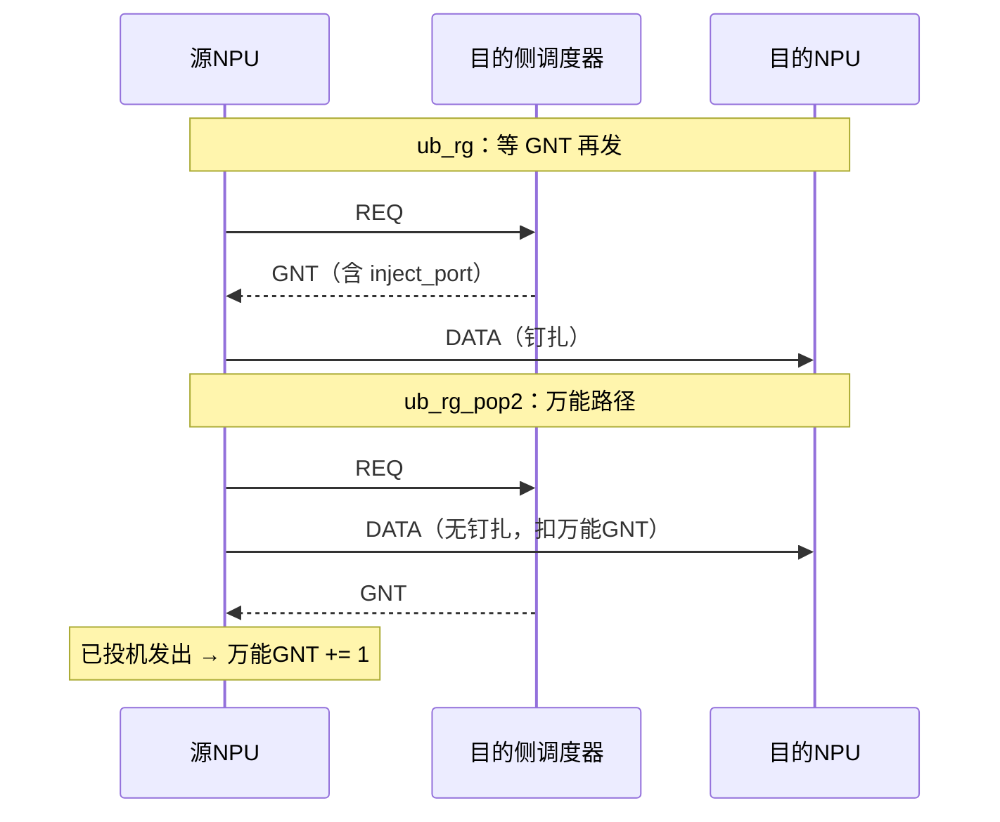

# UB_RG_POP2 方案设计

本文档基于规范 [ub_request_grant.md](./ub_request_grant.md) 与 [UB_RG方案设计.md](./UB_RG方案设计.md)（仿真 scheme `ub_rg`），描述 **UB_RG_POP2**：在 Request/Grant 之上于源侧增加 **每 Plane 万能 GNT 预授权（Push）**，以掩盖源→调度器控制面 RTT 的启动等待。

| 角色 | 说明 |
|---|---|
| 基线规范 | `docs/ub_request_grant.md`：目的侧 request/grant、grain、钉扎、credit |
| 基线方案 | `docs/UB_RG方案设计.md` / scheme `ub_rg` |
| 本方案 | scheme 名建议 `ub_rg_pop2`：ub_rg + 源侧万能 GNT 预授权 Push |
| 范围外 | 其它对照 scheme（不在本文展开） |

**约定**

- 「万能 GNT」是源 NPU **每 Plane 本地预授权计数池**，**不是**新的线上报文类型。
- 线上控制面仍为：REQ → 目的侧调度器 GNT → DATA（与 ub_rg 相同报文族：REQ / GNT / DATA / SYNC）。
- 用万能 GNT 发出的 DATA **不给定 `inject_port` 钉扎**，由交换机按既有转发策略选路。
- 真实调度器 GNT：若对应 grain **已**用万能 GNT 发出 → 仅归还万能池；若 **尚未**发出 → 走 ub_rg 经典钉扎发送。

---

## 1. 定位与关系（相对 ub_rg）

### 1.1 继承自 ub_rg / 规范

与 [UB_RG方案设计.md](./UB_RG方案设计.md) 完全一致的部分：

- 批量需求矩阵、grain 量化、König 下界叙事；
- 目的侧每 \(\tau_g\)、每个本地下行 egress **最多授权 1 grain**；
- 报文类型 REQ / GNT / DATA / SYNC；末跳调度器；Spine 透明转发；
- 真实 GNT 路径：源侧 FCFS grant 队列 + **inject_port 钉扎**；
- cursor / SYNC 屏障语义（仿真可继续用 ub_rg 的简化汇聚）。

### 1.2 相对 ub_rg 要解决的问题

严格 ub_rg 下，每个 grain 的 DATA 必须等真实 GNT 到达后才能注入。阶段启动时，源必须先支付一次 **源→调度器→源** 的控制往返 \(RTT_{\text{src}\to\text{scheduler}}\)（仿真中记为 \(RTT_{rg}\)），之后才靠调度器 credit 窗口维持稳态流水。

POP2 的目标：在 **不改变目的侧调度不变式** 的前提下，用约 **1×BDP（以 grain 计）** 的源侧预授权，让本 Plane 上靠前的 grain **在真实 GNT 返回前即可发出 DATA**，从而掩盖该启动 RTT。

### 1.3 相对 ub_rg 的差异一览

| 维度 | ub_rg | ub_rg_pop2 |
|---|---|---|
| 目的侧调度 | 每 \(\tau_g\) 每 egress ≤1 | **同左**（不感知万能池） |
| 源侧发 DATA 前置条件 | 必须收到真实 GNT | 可用万能 GNT **或** 真实 GNT |
| 万能池 | 无 | 每 Plane 深度 \(N \approx\) BDP/grain |
| 投机 DATA 钉扎 | — | **无** inject_port 钉扎 |
| 真实 GNT DATA 钉扎 | 有 | **有**（与规范一致） |
| 线上新报文 | — | **无** |

---

## 2. 核心机制：每 Plane 万能 GNT

### 2.1 池深度

源 NPU 为每个上行 Plane \(p\) 维护计数 `universal_gnt[p]`，初值：

\[
N = \Big\lceil \frac{RTT_{\text{src}\to\text{scheduler}}\times C_{\text{port}}}{G} \Big\rceil
\]

其中：

- \(RTT_{\text{src}\to\text{scheduler}}\)：本源到目的侧调度器再回到源的控制往返（与 ub_rg 的 \(RTT_{rg}\) 同构）；
- \(C_{\text{port}}\)：端口有效带宽（仿真对齐 **50 GB/s** @400G）；
- \(G\)：grain 尺寸（**7168 B**）。

**示例数值**（与 [UB_RG方案设计.md](./UB_RG方案设计.md) §8 一致）

| 场景 | \(RTT_{rg}\) | \(N = \lceil RTT_{rg}\cdot 50\,\mathrm{GB/s}/7168\rceil\) |
|---|---|---|
| 场景1（单层） | 0.6 µs | \(\lceil 30000/7168\rceil = 5\) |
| 场景4 / 两层量级 | 1.1 µs | \(\lceil 55000/7168\rceil = 8\) |

（规范单层 \(RTT_{rg}\approx 0.5\sim0.6\,\mu\mathrm{s}\) 时 \(N\approx 4\sim5\)，与 credit \(C=4\) 同量级；两层 \(RTT_{rg}\approx 1.0\sim1.2\,\mu\mathrm{s}\) 时 \(N\approx 7\sim9\)，与 credit \(C=8\) 同量级。万能池与调度器 credit **正交**：前者掩盖「首批 DATA 前的等待」，后者限制「已授未落地」在途。）

### 2.2 自授与扣减

对本 Plane 上已发出 REQ、且仍有未发送 grain 的 token：

1. 若 `universal_gnt[plane] > 0`：
   - 立即「自授」该 grain；
   - **立刻发送 DATA**（不等真实 GNT）；
   - `universal_gnt[plane] -= 1`；
   - 将该 `(tokenId, grainIndex)` / `tokenId` 记入 `speculative_inflight`，供后续真实 GNT 匹配归还。
2. 若池为 0：行为退化为 ub_rg——等待真实 GNT。

REQ 本身仍按 ub_rg 发出（批量登记、空 REQ 表态等不变）；万能池只改变 **DATA 是否可在 GNT 前注入**。

### 2.3 真实 GNT 到达时的分支

收到调度器签发的真实 GNT（含 `token_buffer_id` 与 `inject_port`）：

| 条件 | 动作 |
|---|---|
| 该 grain / token **已**用万能 GNT 发出 | **不**再发 DATA；`universal_gnt[plane] += 1`（归还预授权）；从 `speculative_inflight` 清除 |
| 该 grain / token **尚未**发出 | 入对应 `inject_port` 的 FCFS grant 队列，按 ub_rg **钉扎发送**；**不**扣减万能池 |

长期节奏：真实 GNT 仍由目的侧按 \(\tau_g\) 签发；每消耗一次真实授权（无论走归还还是经典发送），源侧才「确认」一单位调度配额。万能池只是把 **前 \(N\) 个 grain 的发送时刻前移**，稳态吞吐仍受真实 GNT 节拍约束。

### 2.4 钉扎策略

| DATA 路径 | inject_port | 选路 |
|---|---|---|
| 万能 GNT（投机） | **不给定 / 不服从钉扎** | 交换机自行选路（既有转发 / 喷洒策略） |
| 真实 GNT（经典） | GNT 指定端口 | 与 ub_request_grant / ub_rg 一致，路径钉扎 |

---

## 3. 协议与状态机

### 3.1 源侧新增状态

在 ub_rg 源端状态（`m_tokens`、`m_grantQ[injectPort]` 等）之上增加：

| 状态 | 含义 |
|---|---|
| `universal_gnt[plane]` | 本 Plane 剩余万能预授权（初值 \(N\)，范围 \(0\sim N\)） |
| `speculative_inflight` | 已用万能 GNT 发出、 awaiting 真实 GNT 归还的 token/grain 集合（需能映射到 plane） |

目的侧调度器状态机 **不变**，不读、不写万能池。

### 3.2 源侧逻辑伪码

```
OnPhaseStart / OnPlaneReady(plane):
  universal_gnt[plane] = N

OnReqSentOrPending(token, plane):  // grain 待发
  while has_unsent_grain(token) and universal_gnt[plane] > 0:
    send_DATA(token, pinned=false)
    universal_gnt[plane] -= 1
    speculative_inflight.add(token_or_grain, plane)

OnGnt(entry):  // 真实 GNT
  if speculative_inflight.contains(entry.token):
    speculative_inflight.remove(entry.token)
    universal_gnt[plane_of(entry)] += 1
  else:
    enqueue m_grantQ[entry.inject_port]
    ServiceGrantQueues()  // 钉扎 InjectToken，同 ub_rg
```

### 3.3 时序对照



### 3.4 目的侧

完全沿用 [ub_request_grant.md](./ub_request_grant.md) / ub_rg：

- pending + RR（或规范匹配）、每 \(\tau_g\) 每 egress ≤1；
- credit 窗口限制已授未落地；
- DATA 下行归账、cursor、LOCAL/GLOBAL SYNC。

调度器只需 **正确签发 GNT**，以便源侧完成池归还或经典发送；无需知道某 grain 是否已投机发出。

---

## 4. 正确性与风险

### 4.1 在途上界

- 每个 Plane：同时处于「已投机发出、尚未被真实 GNT 归还」的 DATA ≤ \(N\) grain；
- 单源总投机在途 ≤ \(N \times P\)（\(P\) 为平面数，仿真默认 8）；
- 长期注入速率：真实 GNT 节拍仍保证每个目的 egress 流体意义 ≤ 线速；万能池只引入 **有界启动突发**，不永久抬高配额。

### 4.2 相对严格 ub_rg 的超额到达

投机 DATA 在真实 GNT 节奏之前到达目的侧，可能造成相对 ub_rg 的 **短暂超额到达**。缓解与规范一致的思路：

- 调度器 **credit 窗口** 仍限制已授未确认规模；
- 链路级 / 交换 **CBFC 或弹性缓冲** 吸收有界突发（规范 §2.10、§3.4 的 \(\sigma\) 论证框架仍适用，突发项增大一个与 \(N\) 相关的有界加项）；
- 长期完成时间下界仍由最忙端口负载 \(\times \tau_g\) 主导；POP2 主要优化 **启动段**，而非改写 König 稳态。

### 4.3 无钉扎对无冲突路径保证的削弱

ub_rg / 规范用 GNT 的 `inject_port`（及两层路径钉扎字段）保证授权与注入路径一致，从而配合目的侧节拍实现近零排队。

POP2 的投机段 **故意放弃钉扎**，选路由交换机决定：

- 可能削弱「整条交付路径无冲突」的硬保证；
- 这是相对 ub_rg 的 **有意折中**：用路径确定性换取启动时延；
- 真实 GNT 路径仍钉扎，阶段中后段可回到与 ub_rg 相同的路径纪律。

实现与评估时应分别统计投机 DATA 与钉扎 DATA 的排队/路径指标。

---

## 5. 仿真落地指引（设计层，本文不实现）

### 5.1 Scheme 名

CLI / runner：`--scheme=ub_rg_pop2`。

### 5.2 行为级

在 `scratch/ub_rg-dispatch-experiment.cc` 的 **ub_rg grant-paced** 分支上扩展（而非另起无关模型）：

1. 每源每 Plane 维护万能计数，初值 \(N=\lceil RTT_{rg}\cdot C/G\rceil\)；
2. 前最多 \(N\) 个本 Plane grain：**零等待**注入（相对 `grantTime` 可取 `inject = max(0, srcPortFree)` 一类），且 **不按 AssignRgPlane 钉扎**（改交换机侧既有选路 / spray）；
3. 真实授权序 \(g\) 到达时：若该 grain 已投机发出，则只归还池（行为级可简化为「不重复注入」）；否则按原 `grantTime` + 钉扎注入。

### 5.3 逐包

在 ub_rg 路径的 `UbRgSenderAgent` 上落地（`--scheme=ub_rg_pop2`）：

- `SetPop2Enabled` / `universal_gnt[plane]` / `speculative_inflight`；
- `StartPhase` 发 REQ 后 `TrySpeculate`：池非空则立即按 REQ plane 上联 `InjectToken`（不等真实 GNT）；
- `HandleGnt`：已投机 → 归还池；未发 → 入 `m_grantQ[port]` 钉扎发送；
- `UbRgScheduler`：支持 DATA 早于 GNT 到达的 `m_earlyData` 匹配记账（SYNC/credit 仍正确）。

目的侧调度节拍、末跳拦截、SYNC 报文族与 ub_rg 相同。

### 5.4 批跑

`dyn_latency/run_ub_rg_experiments.py` 增加 scheme 枚举即可；KPI 仍用 CCT、step、hot/cold p99、CCT/König，并可加「投机 DATA 占比」。

---

## 6. 关键参数表

| 参数 | 场景1 | 场景4 / 两层量级 | 说明 |
|---|---|---|---|
| \(G\) / \(\tau_g\) | 7168 B / ≈143.36 ns | 同左 | 同 ub_rg |
| \(C_{\text{port}}\) | 50 GB/s | 同左 | 同 ub_rg |
| \(RTT_{rg}\) | 0.6 µs | 0.8 / 1.1 µs | 同 ub_rg |
| 万能池 \(N\) | 5 | 6 / 8 | \(\lceil RTT_{rg}\cdot C/G\rceil\) |
| 调度器 credit \(C\) | 4 | 8 | 同 ub_rg；与万能池正交 |
| 平面数 \(P\) | 8 | 8 | 同 ub_rg |
| 投机 DATA 钉扎 | 无 | 无 | POP2 |
| 真实 GNT DATA 钉扎 | 有 | 有 | 同 ub_rg |

---

## 7. 源码与文档索引

**文档（仅基线）**

```
规范:     dyn_latency/docs/ub_request_grant.md
基线方案: dyn_latency/docs/UB_RG方案设计.md
本文:     dyn_latency/docs/UB_RG_POP2方案设计.md
```

**实现入口（ub_rg，供后续落地对照）**

```
行为级:   ns-3-ub/scratch/ub_rg-dispatch-experiment.cc
逐包入口: ns-3-ub/scratch/ub_rg-packet-experiment.cc
端侧:     ns-3-ub/src/unified-bus/model/protocol/ub-rg-sender-agent.*
调度器:   ns-3-ub/src/unified-bus/model/protocol/ub-rg-scheduler.*
头格式:   ns-3-ub/src/unified-bus/model/protocol/ub-rg-header.*
编排:     ns-3-ub/src/unified-bus/model/ub-rg-experiment-app.*
拦截:     ns-3-ub/src/unified-bus/model/ub-switch.cc  (HandleRgPacket)
批跑:     dyn_latency/run_ub_rg_experiments.py
```

---

## 8. 小结

**UB_RG_POP2** 在 ub_rg 的 Request/Grant 骨架上，为每个源 Plane 预置深度约为控制面 BDP 的 **万能 GNT 本地池**：用其自授并立即发送 **无钉扎** DATA，真实 GNT 到达后归还池或走经典钉扎路径。目的侧调度不变式与线上报文族保持不变；代价是投机段削弱路径钉扎带来的无冲突硬保证，换取启动 RTT 的掩盖。

本文仅设计文档；行为级 / 逐包实现按 §5 另行落地。

---

*文档版本：仅对齐 `ub_request_grant.md` 与 `UB_RG方案设计.md`（ub_rg）。*
