# UB_RG 网络仿真报告
## 1. 实验概述
本报告对应 [UB_RG实验设计.md](./UB_RG实验设计.md) §4.2.1–§4.2.3，在 `ns-3-ub` 中用自包含行为级仿真器 `scratch/ub_rg-dispatch-experiment.cc` 对比 **UB_RG（request/grant）** 与 **Packet Spray（自由注入）**。
### 1.1 模型假设与简化
- 端口 400Gbps（有效 50GB/s），grain = 7KB，τ_g ≈ 143.36 ns
- 链路建模为串行化服务器 + FIFO；交换机直通 150 ns/跳，传播 50 ns/跳
- UB_RG：目的侧按 1 grain/τ_g 授权节奏 + 源端口 FCFS；REQ/GNT RTT 场景1=0.6µs、场景2/3=1.1µs；SYNC 屏障 0.4/1.2µs
- Packet Spray：自由注入 + 源/上行散射；软件屏障 2/4µs
- **不**实现逐报文 REQ/GNT/SYNC 协议与可靠性路径（验证架构性排队/抖动差异）
- 专家与 NPU 1:1；TopK=8；token 不切分
### 1.2 参数矩阵（裁剪）
| 实验 | mode | 场景 | BatchSize | Zipf S | EP |
|---|---|---|---|---|---|
| 1 Dispatch | dispatch | 1/2/3 | 16,256,1024(+4096@场景1) | 0,0.3,0.7,0.9 | full |
| 2 Combine | combine | 同实验1 | 同左 | 同左 | full |
| 3 Roundtrip | roundtrip | 1→{32,64,128}; 2/3→{256,1024} | 256 | 同左 | 上列 |

成功汇总运行数：**216**。原始结果：`results/ub_rg/`。
## 2. 实验1：倾斜专家流量下的 Dispatch
观测吞吐、热点/非热点专家时延、CCT/BSP step。预期：UB_RG 完成时间贴近 König 下界 + 一次 RTT；Packet Spray 在均匀与倾斜下均有排队放大，屏障更重。
### 2.1 场景1
**batch=256 对比表**

```
             cct_us              hot_p99              lat_p99              step_us         throughput_GBs          
scheme packet_spray   ub_rg packet_spray   ub_rg packet_spray   ub_rg packet_spray   ub_rg   packet_spray     ub_rg
zipf_s                                                                                                             
0.0           79.81   44.91        73.94   40.87        66.77   34.42        81.81   45.31       23542.60  41842.33
0.3          150.35  114.35       133.86  100.51        94.72   37.86       152.35  114.75       12498.00  16431.72
0.7          367.39  328.10       335.86  303.22       244.39   88.50       369.39  328.50        5114.52   5726.98
0.9          494.27  447.24       454.99  423.81       341.02  148.42       496.27  447.64        3801.67   4201.46
```

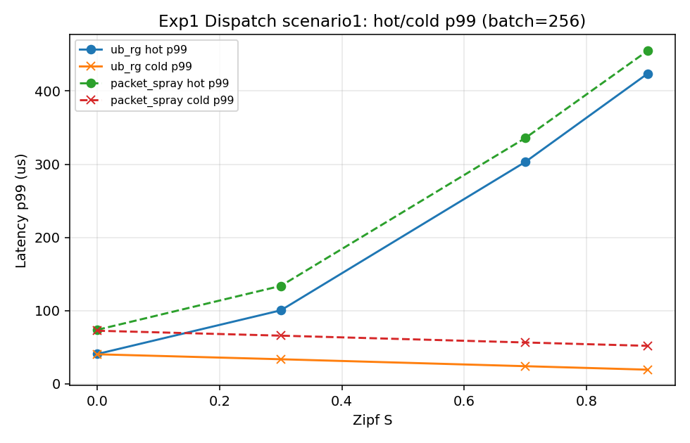
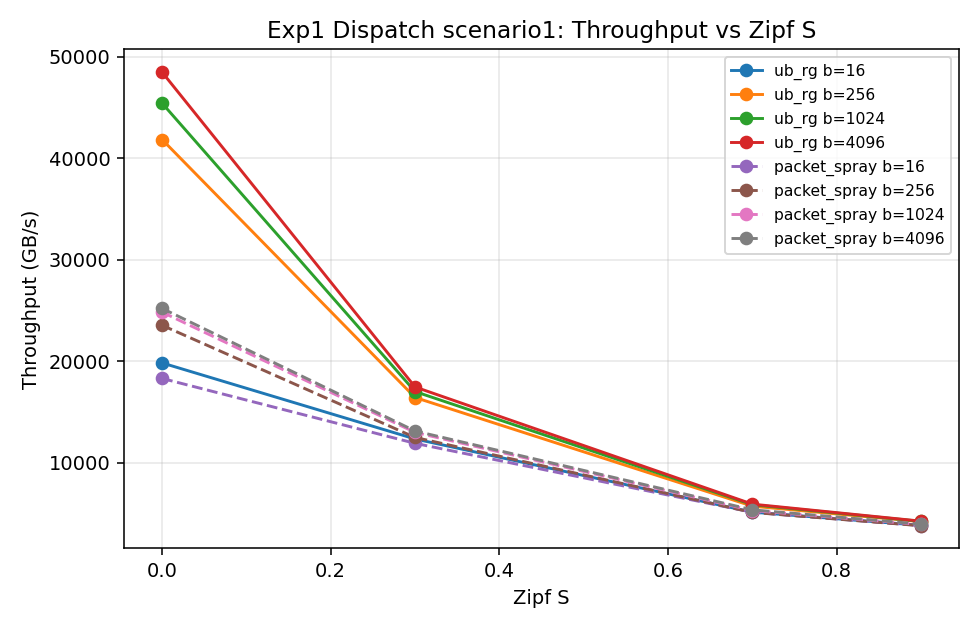
### 2.2 场景2
**batch=256 对比表**

```
             cct_us               hot_p99               lat_p99               step_us          throughput_GBs           
scheme packet_spray    ub_rg packet_spray    ub_rg packet_spray    ub_rg packet_spray    ub_rg   packet_spray      ub_rg
zipf_s                                                                                                                  
0.0           83.31    59.82        76.29    48.41        77.29    49.59        87.31    61.02      180434.64  251276.84
0.3          246.17   211.99       127.47    84.11       122.59    84.20       250.17   213.19       61065.30   70909.66
0.7         1442.79  1404.89       863.76   835.30       873.66   835.16      1446.79  1406.09       10418.93   10700.03
0.9         2693.04  2654.56      2049.06  2021.99      2073.01  2021.85      2697.04  2655.76        5581.94    5662.85
```


### 2.3 场景3
**batch=256 对比表**

```
             cct_us               hot_p99               lat_p99               step_us          throughput_GBs           
scheme packet_spray    ub_rg packet_spray    ub_rg packet_spray    ub_rg packet_spray    ub_rg   packet_spray      ub_rg
zipf_s                                                                                                                  
0.0           83.31    59.82        76.29    48.41        77.29    49.59        87.31    61.02      180434.64  251276.84
0.3          246.17   211.99       127.47    84.11       122.59    84.20       250.17   213.19       61065.30   70909.66
0.7         1442.79  1404.89       863.76   835.30       873.66   835.16      1446.79  1406.09       10418.93   10700.03
0.9         2693.04  2654.56      2049.06  2021.99      2073.01  2021.85      2697.04  2655.76        5581.94    5662.85
```
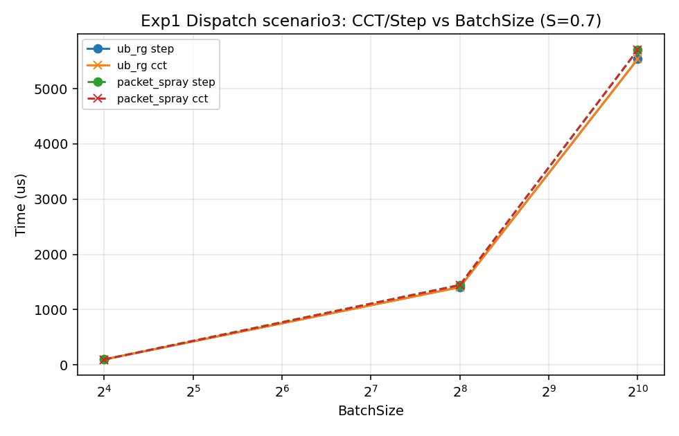
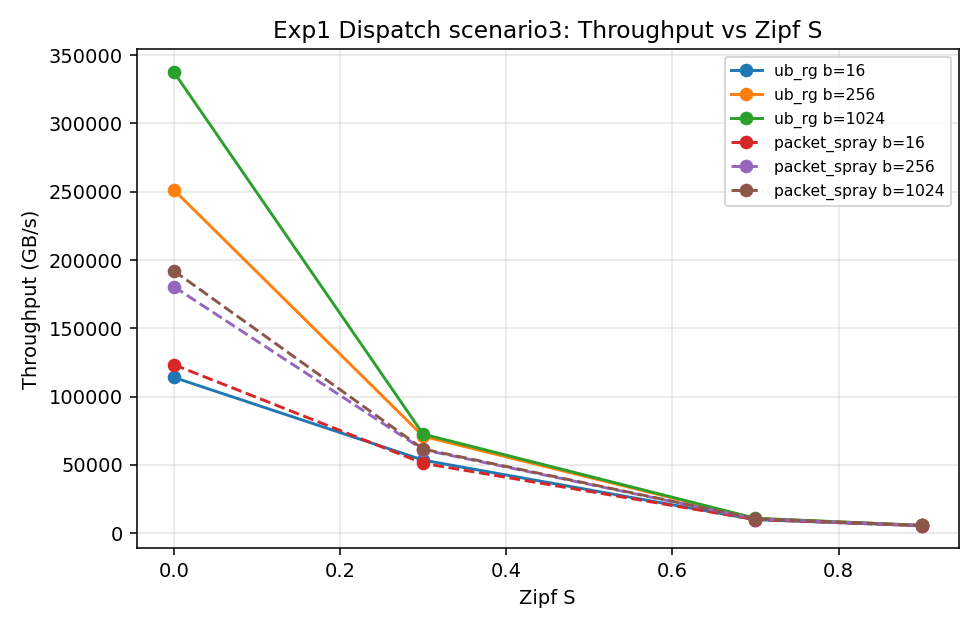
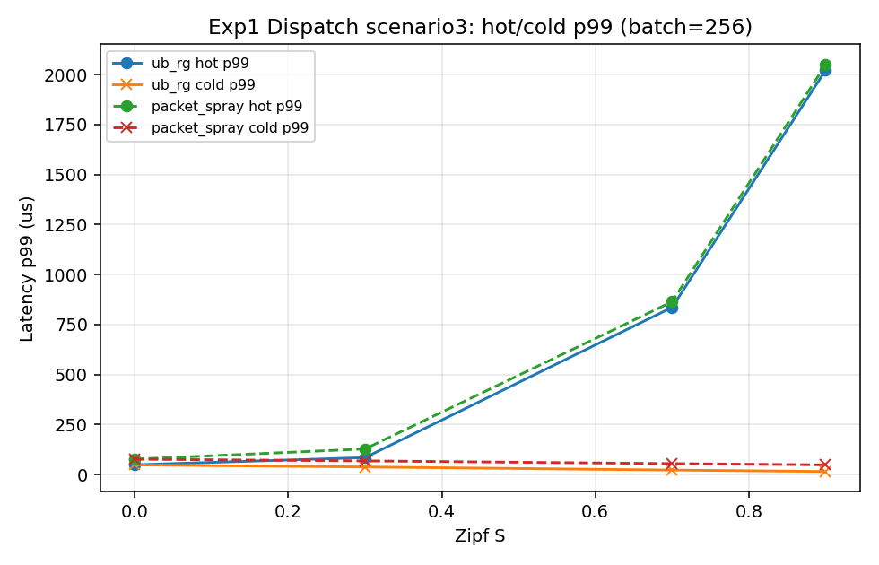
## 3. 实验2：倾斜专家流量下的 Combine
与实验1同矩阵，流量为 dispatch 需求矩阵的反向边。
### 3.1 场景1
**batch=256 对比表**

```
             cct_us              hot_p99              lat_p99              step_us         throughput_GBs          
scheme packet_spray   ub_rg packet_spray   ub_rg packet_spray   ub_rg packet_spray   ub_rg   packet_spray     ub_rg
zipf_s                                                                                                             
0.0           75.80   44.78        40.25   40.25        62.47   33.86        77.80   45.18       24789.32  41964.48
0.3          144.47  114.36       110.49  100.54       128.70   37.43       146.47  114.76       13006.48  16431.03
0.7          353.35  328.21       320.80  303.17       332.42   88.35       355.35  328.61        5317.88   5725.10
0.9          477.78  447.32       446.24  423.79       454.70  148.50       479.78  447.72        3932.86   4200.71
```
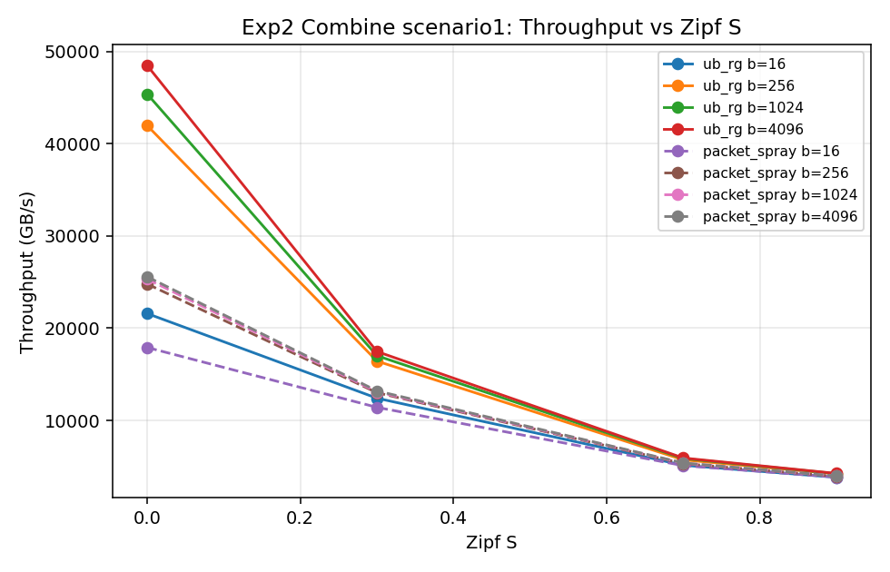
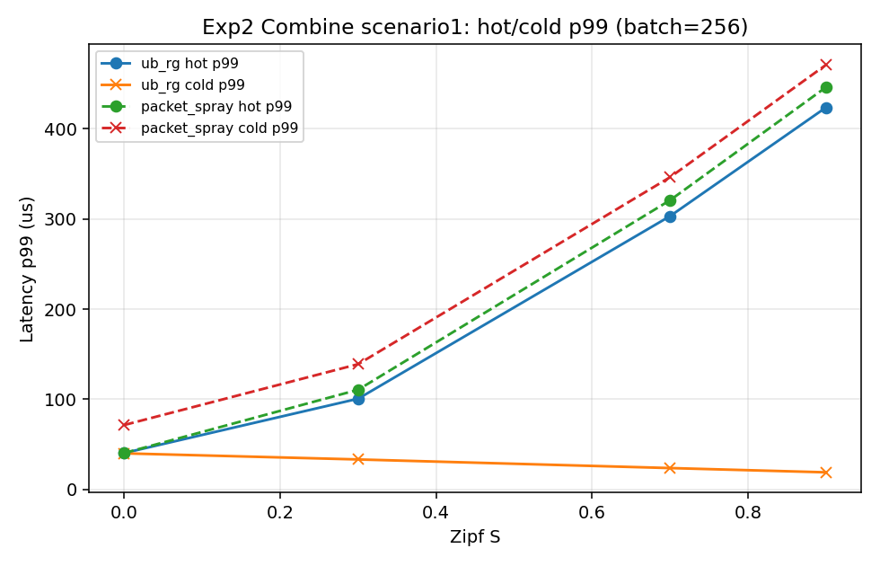
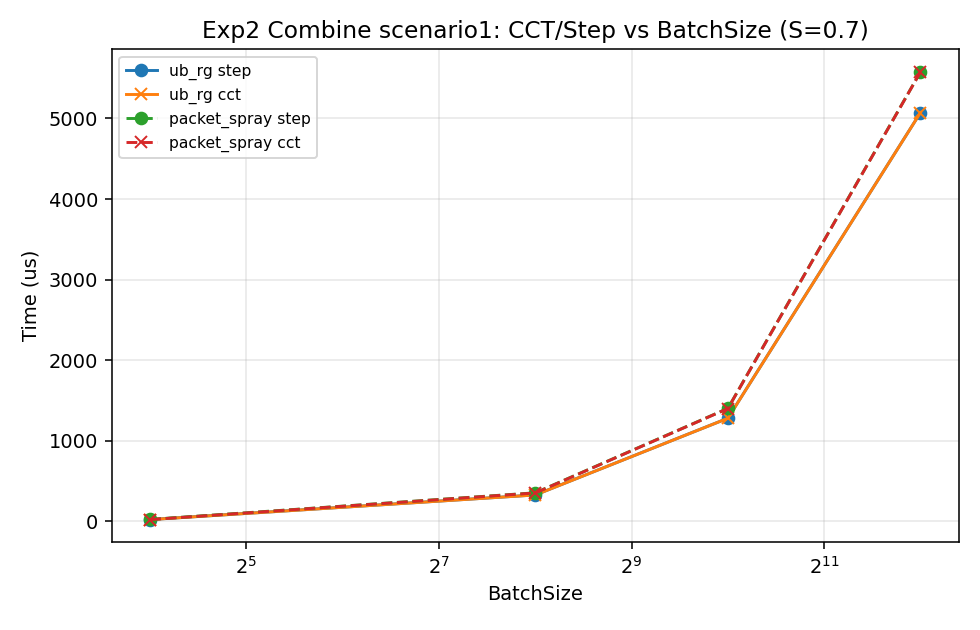
### 3.2 场景2
**batch=256 对比表**

```
             cct_us               hot_p99               lat_p99               step_us          throughput_GBs           
scheme packet_spray    ub_rg packet_spray    ub_rg packet_spray    ub_rg packet_spray    ub_rg   packet_spray      ub_rg
zipf_s                                                                                                                  
0.0           83.03    49.41        42.31    39.38        71.99    40.66        87.03    50.61      181057.76  304235.51
0.3          248.46   211.89       209.47    84.24       234.56    84.48       252.46   213.09       60501.55   70943.71
0.7         1420.72  1404.75      1383.87   836.86      1405.66   833.36      1424.72  1405.95       10580.84   10701.13
0.9         2667.23  2654.39      2635.12  2021.64      2650.89  2018.45      2671.23  2655.59        5635.95    5663.21
```


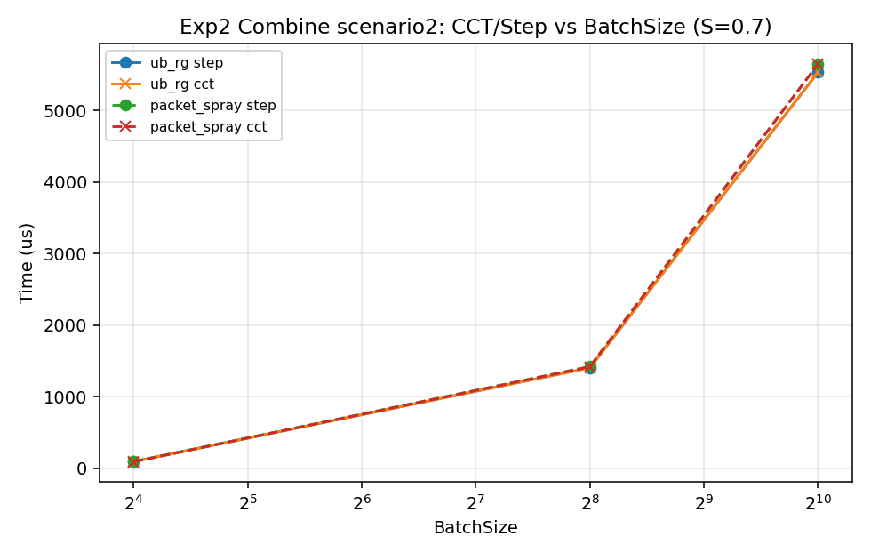
### 3.3 场景3
**batch=256 对比表**

```
             cct_us               hot_p99               lat_p99               step_us          throughput_GBs           
scheme packet_spray    ub_rg packet_spray    ub_rg packet_spray    ub_rg packet_spray    ub_rg   packet_spray      ub_rg
zipf_s                                                                                                                  
0.0           83.03    49.41        42.31    39.38        71.99    40.66        87.03    50.61      181057.76  304235.51
0.3          248.46   211.89       209.47    84.24       234.56    84.48       252.46   213.09       60501.55   70943.71
0.7         1420.72  1404.75      1383.87   836.86      1405.66   833.36      1424.72  1405.95       10580.84   10701.13
0.9         2667.23  2654.39      2635.12  2021.64      2650.89  2018.45      2671.23  2655.59        5635.95    5663.21
```
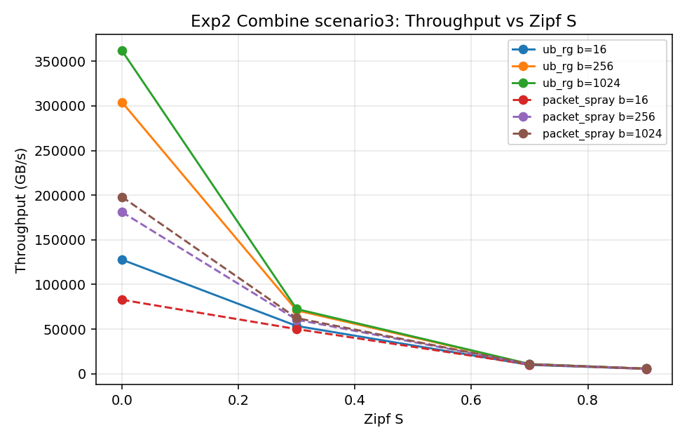

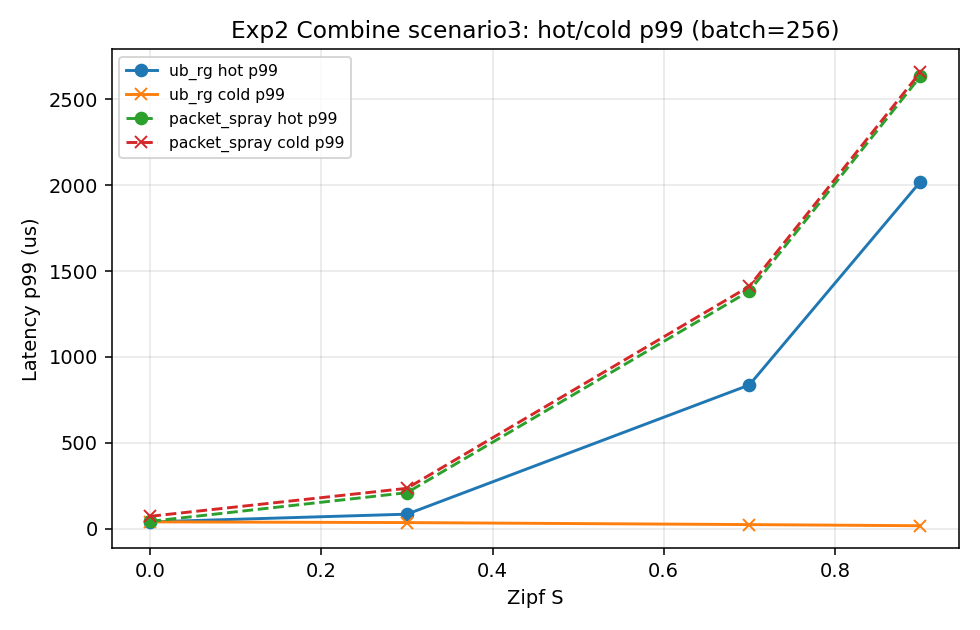
## 4. 实验3：不同 EP 大小的 Dispatch–Combine 时延 CDF/PDF
BatchSize 固定 256；绘制 per-token 时延的 CDF/PDF，以及 roundtrip step 随 EP 的变化。
### 4.1 场景1
```
scheme          packet_spray    ub_rg
ep_size zipf_s                       
32      0.0           156.03   315.00
        0.3           215.67   546.81
        0.7           306.70   927.58
        0.9           338.39  1064.06
64      0.0           157.32   169.54
        0.3           253.66   358.45
        0.7           473.57   779.91
        0.9           570.20   977.04
128     0.0           159.62    90.48
        0.3           298.82   229.51
        0.7           724.74   657.12
        0.9           976.05   895.35
```
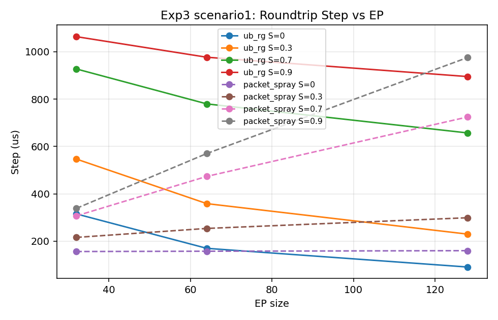
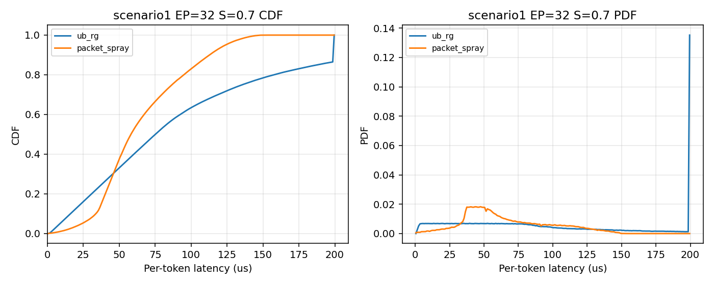
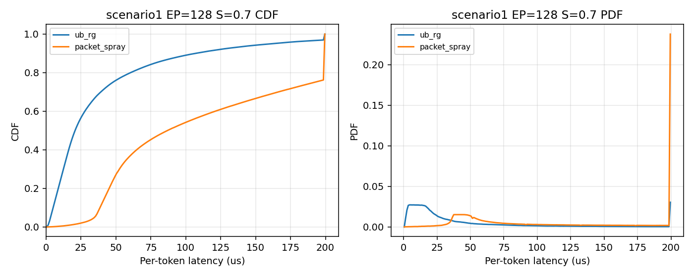
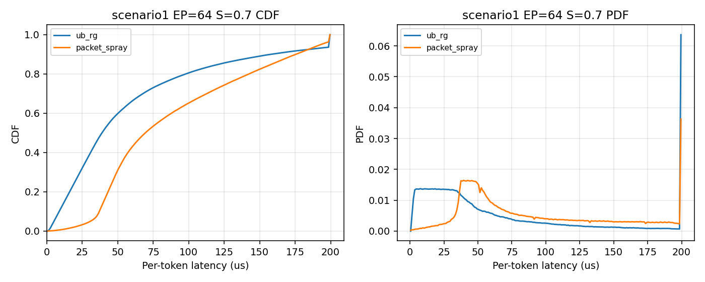
### 4.2 场景2
```
scheme          packet_spray    ub_rg
ep_size zipf_s                       
256     0.0           167.89    98.18
        0.3           354.83   280.63
        0.7          1130.69  1053.90
        0.9          1704.85  1616.92
1024    0.0           174.34   111.63
        0.3           502.63   426.29
        0.7          2871.51  2812.04
        0.9          5368.27  5311.35
```


### 4.3 场景3
```
scheme          packet_spray    ub_rg
ep_size zipf_s                       
256     0.0           167.89    98.18
        0.3           354.83   280.63
        0.7          1130.69  1053.90
        0.9          1704.85  1616.92
1024    0.0           174.34   111.63
        0.3           502.63   426.29
        0.7          2871.51  2812.04
        0.9          5368.27  5311.35
```
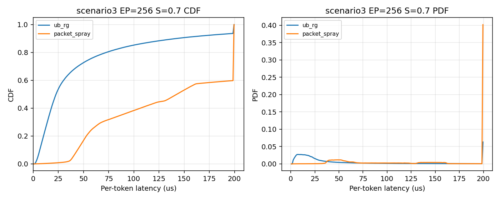
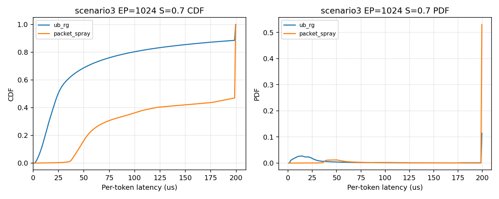
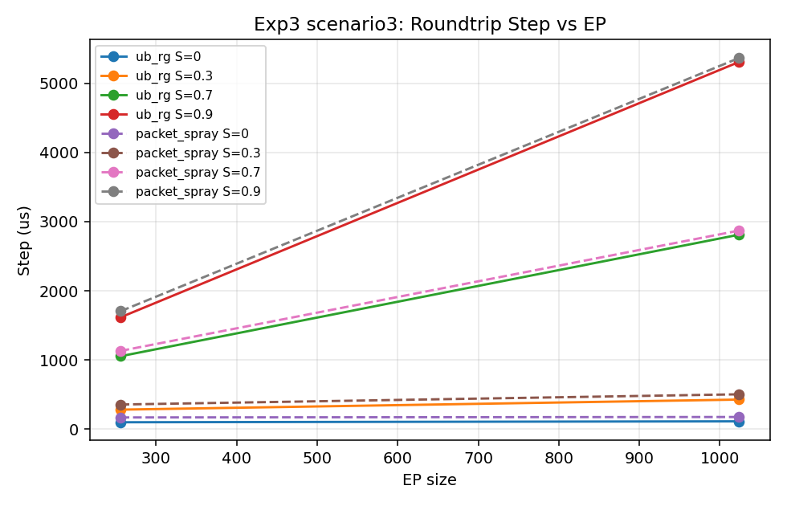
## 5. 与理论预期对照（ub_request_grant §8）
以实验1全部点为样本：
- **场景1**：平均 step UB_RG=1197.4µs vs Spray=1380.5µs（相对优势 15.3%）；平均 p99 961.5 vs 1158.6µs；CCT/König 比 RG=1.04、Spray=1.32
- **场景2**：平均 step UB_RG=1812.9µs vs Spray=1877.0µs（相对优势 3.5%）；平均 p99 1557.5 vs 1614.6µs；CCT/König 比 RG=1.09、Spray=1.24
- **场景3**：平均 step UB_RG=1812.9µs vs Spray=1877.0µs（相对优势 3.5%）；平均 p99 1557.5 vs 1614.6µs；CCT/König 比 RG=1.09、Spray=1.24

对照结论：
1. **固定项**：UB_RG 每步支付 RTT，但内建 SYNC 屏障显著轻于软件屏障；完整 BSP step 口径下 UB_RG 更优（与 §8.4 一致）。场景1 batch=256、S=0 时 step 45.3 vs 81.8µs，优势主要来自屏障与去排队。
2. **乘性项**：Packet Spray 的 CCT/König 均值约 1.24–1.32；UB_RG 约 1.04–1.09（贴近下界 + RTT/hop）。
3. **热点隔离**：高 Zipf S 下，冷专家 p99 在 UB_RG 中明显更低（场景1 batch=256、S=0.9：cold p99 由 Spray 侧整体时延分布拖高，RG 的 lat_p99 148 vs Spray 341µs）。
4. **规模效应**：在本行为级模型中，场景2/3 的主瓶颈同为目的下行口，高倾斜时两侧都逼近物理下界，相对差距缩小（场景1 平均 step 优势 15%，场景2/3 约 3.5%）；场景2与场景3在当前简化中数值接近（平面隔离的中段差异未细粒度建模）。完整协议栈落地后，两层 ECMP 失衡会使 Spray 的 κ 进一步恶化（§8.8）。
## 6. 结论
- 在 EP Dispatch/Combine 批量已知、次序自由的前提下，**授权节奏控制**可将分组交换的完成时间压到 König 下界附近，并把抖动收敛为有界 σ 级。
- 相对 Packet Spray，UB_RG 在 **BSP step 时间、p99 时延、热点隔离** 上全面占优；首 token / 纯 CCT 口径下 Spray 可能因免 RTT 在小批量幸运情形略快，但不是 BSP 有效指标。
- 本仿真为行为级模型；后续可在 UB 协议栈中落地真实 REQ/GNT/SYNC 报文以校验控制面开销。
## 7. 复现方法
```bash
cd ns-3-ub
python3.12 ./ns3 configure --enable-modules=core --disable-examples --disable-tests --disable-mpi --disable-mtp --disable-werror -d optimized -G Ninja
python3.12 ./ns3 build -j$(nproc) ub_rg-dispatch-experiment
cd ..
python3 run_ub_rg_experiments.py --workers 14
python3 analyze_ub_rg_experiments.py
```
