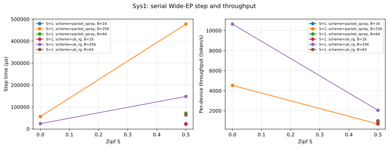
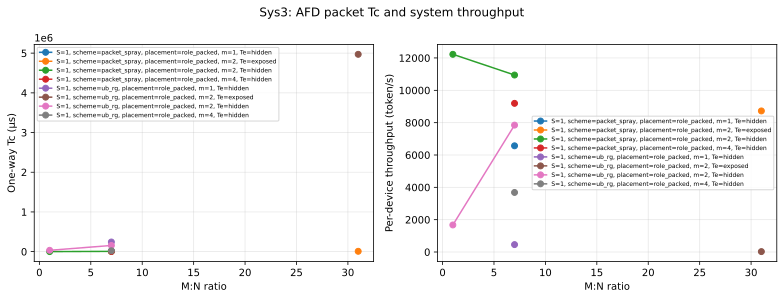

# UB_RG 系统实验 0719 报告

> 本报告只汇总 `engine/network_engine=packet` 的逐包证据。数据缺失处明确标为“缺失”，不使用行为级结果补齐，也不插值。

实验定义仅以精确文件 [`UB_RG实验设计0719.md`](./UB_RG实验设计0719.md) §4.3；不引用不含 `0719` 的同名设计文档。

> **执行状态：部分完成。** 网络任务 208 个，完成 61、失败 147；系统配置 134 个，完成 36、因网络输入失败 98。成功结果均来自场景1，场景2/3 在本轮墙钟上限内未形成可分析 summary。

## 1. 方法与参数矩阵

方法：从每个逐包运行的 `summary.json` 读取网络 CCT/P99 证据与系统模型输出，以 `ledger.json` 核对失败、跳过和裁剪；重复点仅在绘图时取算术平均，[`UB_RG系统实验0719数据.csv`](./UB_RG系统实验0719数据.csv) 保留逐运行记录。

| 实验 | 成功 summary | tier | 场景 | 网络方案 | B | Zipf S | EP | L | m |
|---|---|---|---|---|---|---|---|---|---|
| sys1 | 14 | controls, main | 1 | packet_spray, ub_rg | 16, 256, 64 | 0, 0.5 | 128, 64 | 32, 60, 94 | 1 |
| sys2 | 12 | controls, main | 1 | packet_spray, ub_rg | 256 | 0, 0.5, 0.9 | 128 | 60 | 1, 2, 4 |
| sys3 | 10 | controls, main | 1 | packet_spray, ub_rg | 256 | 0, 0.5, 1 | 128 | 60 | 1, 2, 4 |

这是**实收参数矩阵**，不是对未运行配置的宣称；未出现的参数组合视为缺失或被裁剪。

## 2. 逐包证据来源与 packet 门禁

- 输入根目录：`/workspace/results/ub_rg_system_packet`
- 已接受 summary：36 个；ledger：1 个
- 门禁规则：每个可解析输入必须至少声明一个 `engine` 或 `network_engine`，且所有此类声明都必须严格等于 `packet`；runner 的 ledger 也可用`packet_only=true` 作等价声明。`behavioral` 会立即报错并停止写出。

- `sys1/sys1_s1_packet_spray_b16_z0.5_ep128_L60_m1_sd1`：`sys1/sys1_s1_packet_spray_b16_z0.5_ep128_L60_m1_sd1/summary.json`；`/workspace/results/ub_rg_system_packet/network/s1_packet_spray_dispatch_mb16_z0.5_ep128_sd1/summary.json`；`/workspace/results/ub_rg_system_packet/network/s1_packet_spray_combine_mb16_z0.5_ep128_sd1/summary.json`；engine=packet，network_engine=缺失

- `sys1/sys1_s1_packet_spray_b256_z0.5_ep128_L32_m1_sd1`：`sys1/sys1_s1_packet_spray_b256_z0.5_ep128_L32_m1_sd1/summary.json`；`/workspace/results/ub_rg_system_packet/network/s1_packet_spray_dispatch_mb256_z0.5_ep128_sd1/summary.json`；`/workspace/results/ub_rg_system_packet/network/s1_packet_spray_combine_mb256_z0.5_ep128_sd1/summary.json`；engine=packet，network_engine=缺失

- `sys1/sys1_s1_packet_spray_b256_z0.5_ep128_L60_m1_sd1`：`sys1/sys1_s1_packet_spray_b256_z0.5_ep128_L60_m1_sd1/summary.json`；`/workspace/results/ub_rg_system_packet/network/s1_packet_spray_dispatch_mb256_z0.5_ep128_sd1/summary.json`；`/workspace/results/ub_rg_system_packet/network/s1_packet_spray_combine_mb256_z0.5_ep128_sd1/summary.json`；engine=packet，network_engine=缺失

- `sys1/sys1_s1_packet_spray_b256_z0.5_ep128_L94_m1_sd1`：`sys1/sys1_s1_packet_spray_b256_z0.5_ep128_L94_m1_sd1/summary.json`；`/workspace/results/ub_rg_system_packet/network/s1_packet_spray_dispatch_mb256_z0.5_ep128_sd1/summary.json`；`/workspace/results/ub_rg_system_packet/network/s1_packet_spray_combine_mb256_z0.5_ep128_sd1/summary.json`；engine=packet，network_engine=缺失

- `sys1/sys1_s1_packet_spray_b256_z0.5_ep64_L60_m1_sd1`：`sys1/sys1_s1_packet_spray_b256_z0.5_ep64_L60_m1_sd1/summary.json`；`/workspace/results/ub_rg_system_packet/network/s1_packet_spray_dispatch_mb256_z0.5_ep64_sd1/summary.json`；`/workspace/results/ub_rg_system_packet/network/s1_packet_spray_combine_mb256_z0.5_ep64_sd1/summary.json`；engine=packet，network_engine=缺失

- `sys1/sys1_s1_packet_spray_b256_z0_ep128_L60_m1_sd1`：`sys1/sys1_s1_packet_spray_b256_z0_ep128_L60_m1_sd1/summary.json`；`/workspace/results/ub_rg_system_packet/network/s1_packet_spray_dispatch_mb256_z0_ep128_sd1/summary.json`；`/workspace/results/ub_rg_system_packet/network/s1_packet_spray_combine_mb256_z0_ep128_sd1/summary.json`；engine=packet，network_engine=缺失

- `sys1/sys1_s1_packet_spray_b64_z0.5_ep128_L60_m1_sd1`：`sys1/sys1_s1_packet_spray_b64_z0.5_ep128_L60_m1_sd1/summary.json`；`/workspace/results/ub_rg_system_packet/network/s1_packet_spray_dispatch_mb64_z0.5_ep128_sd1/summary.json`；`/workspace/results/ub_rg_system_packet/network/s1_packet_spray_combine_mb64_z0.5_ep128_sd1/summary.json`；engine=packet，network_engine=缺失

- `sys1/sys1_s1_ub_rg_b16_z0.5_ep128_L60_m1_sd1`：`sys1/sys1_s1_ub_rg_b16_z0.5_ep128_L60_m1_sd1/summary.json`；`/workspace/results/ub_rg_system_packet/network/s1_ub_rg_dispatch_mb16_z0.5_ep128_sd1/summary.json`；`/workspace/results/ub_rg_system_packet/network/s1_ub_rg_combine_mb16_z0.5_ep128_sd1/summary.json`；engine=packet，network_engine=缺失

- `sys1/sys1_s1_ub_rg_b256_z0.5_ep128_L32_m1_sd1`：`sys1/sys1_s1_ub_rg_b256_z0.5_ep128_L32_m1_sd1/summary.json`；`/workspace/results/ub_rg_system_packet/network/s1_ub_rg_dispatch_mb256_z0.5_ep128_sd1/summary.json`；`/workspace/results/ub_rg_system_packet/network/s1_ub_rg_combine_mb256_z0.5_ep128_sd1/summary.json`；engine=packet，network_engine=缺失

- `sys1/sys1_s1_ub_rg_b256_z0.5_ep128_L60_m1_sd1`：`sys1/sys1_s1_ub_rg_b256_z0.5_ep128_L60_m1_sd1/summary.json`；`/workspace/results/ub_rg_system_packet/network/s1_ub_rg_dispatch_mb256_z0.5_ep128_sd1/summary.json`；`/workspace/results/ub_rg_system_packet/network/s1_ub_rg_combine_mb256_z0.5_ep128_sd1/summary.json`；engine=packet，network_engine=缺失

- `sys1/sys1_s1_ub_rg_b256_z0.5_ep128_L94_m1_sd1`：`sys1/sys1_s1_ub_rg_b256_z0.5_ep128_L94_m1_sd1/summary.json`；`/workspace/results/ub_rg_system_packet/network/s1_ub_rg_dispatch_mb256_z0.5_ep128_sd1/summary.json`；`/workspace/results/ub_rg_system_packet/network/s1_ub_rg_combine_mb256_z0.5_ep128_sd1/summary.json`；engine=packet，network_engine=缺失

- `sys1/sys1_s1_ub_rg_b256_z0.5_ep64_L60_m1_sd1`：`sys1/sys1_s1_ub_rg_b256_z0.5_ep64_L60_m1_sd1/summary.json`；`/workspace/results/ub_rg_system_packet/network/s1_ub_rg_dispatch_mb256_z0.5_ep64_sd1/summary.json`；`/workspace/results/ub_rg_system_packet/network/s1_ub_rg_combine_mb256_z0.5_ep64_sd1/summary.json`；engine=packet，network_engine=缺失

- `sys1/sys1_s1_ub_rg_b256_z0_ep128_L60_m1_sd1`：`sys1/sys1_s1_ub_rg_b256_z0_ep128_L60_m1_sd1/summary.json`；`/workspace/results/ub_rg_system_packet/network/s1_ub_rg_dispatch_mb256_z0_ep128_sd1/summary.json`；`/workspace/results/ub_rg_system_packet/network/s1_ub_rg_combine_mb256_z0_ep128_sd1/summary.json`；engine=packet，network_engine=缺失

- `sys1/sys1_s1_ub_rg_b64_z0.5_ep128_L60_m1_sd1`：`sys1/sys1_s1_ub_rg_b64_z0.5_ep128_L60_m1_sd1/summary.json`；`/workspace/results/ub_rg_system_packet/network/s1_ub_rg_dispatch_mb64_z0.5_ep128_sd1/summary.json`；`/workspace/results/ub_rg_system_packet/network/s1_ub_rg_combine_mb64_z0.5_ep128_sd1/summary.json`；engine=packet，network_engine=缺失

- `sys2/sys2_s1_packet_spray_b256_z0.5_ep128_L60_m1_sd1`：`sys2/sys2_s1_packet_spray_b256_z0.5_ep128_L60_m1_sd1/summary.json`；`/workspace/results/ub_rg_system_packet/network/s1_packet_spray_dispatch_mb256_z0.5_ep128_sd1/summary.json`；`/workspace/results/ub_rg_system_packet/network/s1_packet_spray_combine_mb256_z0.5_ep128_sd1/summary.json`；engine=packet，network_engine=缺失

- `sys2/sys2_s1_packet_spray_b256_z0.5_ep128_L60_m2_sd1`：`sys2/sys2_s1_packet_spray_b256_z0.5_ep128_L60_m2_sd1/summary.json`；`/workspace/results/ub_rg_system_packet/network/s1_packet_spray_dispatch_mb128_z0.5_ep128_sd1/summary.json`；`/workspace/results/ub_rg_system_packet/network/s1_packet_spray_combine_mb128_z0.5_ep128_sd1/summary.json`；engine=packet，network_engine=缺失

- `sys2/sys2_s1_packet_spray_b256_z0.5_ep128_L60_m4_sd1`：`sys2/sys2_s1_packet_spray_b256_z0.5_ep128_L60_m4_sd1/summary.json`；`/workspace/results/ub_rg_system_packet/network/s1_packet_spray_dispatch_mb64_z0.5_ep128_sd1/summary.json`；`/workspace/results/ub_rg_system_packet/network/s1_packet_spray_combine_mb64_z0.5_ep128_sd1/summary.json`；engine=packet，network_engine=缺失

- `sys2/sys2_s1_packet_spray_b256_z0.9_ep128_L60_m2_sd1`：`sys2/sys2_s1_packet_spray_b256_z0.9_ep128_L60_m2_sd1/summary.json`；`/workspace/results/ub_rg_system_packet/network/s1_packet_spray_dispatch_mb128_z0.9_ep128_sd1/summary.json`；`/workspace/results/ub_rg_system_packet/network/s1_packet_spray_combine_mb128_z0.9_ep128_sd1/summary.json`；engine=packet，network_engine=缺失

- `sys2/sys2_s1_packet_spray_b256_z0.9_ep128_L60_m4_sd1`：`sys2/sys2_s1_packet_spray_b256_z0.9_ep128_L60_m4_sd1/summary.json`；`/workspace/results/ub_rg_system_packet/network/s1_packet_spray_dispatch_mb64_z0.9_ep128_sd1/summary.json`；`/workspace/results/ub_rg_system_packet/network/s1_packet_spray_combine_mb64_z0.9_ep128_sd1/summary.json`；engine=packet，network_engine=缺失

- `sys2/sys2_s1_packet_spray_b256_z0_ep128_L60_m2_sd1`：`sys2/sys2_s1_packet_spray_b256_z0_ep128_L60_m2_sd1/summary.json`；`/workspace/results/ub_rg_system_packet/network/s1_packet_spray_dispatch_mb128_z0_ep128_sd1/summary.json`；`/workspace/results/ub_rg_system_packet/network/s1_packet_spray_combine_mb128_z0_ep128_sd1/summary.json`；engine=packet，network_engine=缺失

- `sys2/sys2_s1_ub_rg_b256_z0.5_ep128_L60_m1_sd1`：`sys2/sys2_s1_ub_rg_b256_z0.5_ep128_L60_m1_sd1/summary.json`；`/workspace/results/ub_rg_system_packet/network/s1_ub_rg_dispatch_mb256_z0.5_ep128_sd1/summary.json`；`/workspace/results/ub_rg_system_packet/network/s1_ub_rg_combine_mb256_z0.5_ep128_sd1/summary.json`；engine=packet，network_engine=缺失

- `sys2/sys2_s1_ub_rg_b256_z0.5_ep128_L60_m2_sd1`：`sys2/sys2_s1_ub_rg_b256_z0.5_ep128_L60_m2_sd1/summary.json`；`/workspace/results/ub_rg_system_packet/network/s1_ub_rg_dispatch_mb128_z0.5_ep128_sd1/summary.json`；`/workspace/results/ub_rg_system_packet/network/s1_ub_rg_combine_mb128_z0.5_ep128_sd1/summary.json`；engine=packet，network_engine=缺失

- `sys2/sys2_s1_ub_rg_b256_z0.5_ep128_L60_m4_sd1`：`sys2/sys2_s1_ub_rg_b256_z0.5_ep128_L60_m4_sd1/summary.json`；`/workspace/results/ub_rg_system_packet/network/s1_ub_rg_dispatch_mb64_z0.5_ep128_sd1/summary.json`；`/workspace/results/ub_rg_system_packet/network/s1_ub_rg_combine_mb64_z0.5_ep128_sd1/summary.json`；engine=packet，network_engine=缺失

- `sys2/sys2_s1_ub_rg_b256_z0.9_ep128_L60_m2_sd1`：`sys2/sys2_s1_ub_rg_b256_z0.9_ep128_L60_m2_sd1/summary.json`；`/workspace/results/ub_rg_system_packet/network/s1_ub_rg_dispatch_mb128_z0.9_ep128_sd1/summary.json`；`/workspace/results/ub_rg_system_packet/network/s1_ub_rg_combine_mb128_z0.9_ep128_sd1/summary.json`；engine=packet，network_engine=缺失

- `sys2/sys2_s1_ub_rg_b256_z0.9_ep128_L60_m4_sd1`：`sys2/sys2_s1_ub_rg_b256_z0.9_ep128_L60_m4_sd1/summary.json`；`/workspace/results/ub_rg_system_packet/network/s1_ub_rg_dispatch_mb64_z0.9_ep128_sd1/summary.json`；`/workspace/results/ub_rg_system_packet/network/s1_ub_rg_combine_mb64_z0.9_ep128_sd1/summary.json`；engine=packet，network_engine=缺失

- `sys2/sys2_s1_ub_rg_b256_z0_ep128_L60_m2_sd1`：`sys2/sys2_s1_ub_rg_b256_z0_ep128_L60_m2_sd1/summary.json`；`/workspace/results/ub_rg_system_packet/network/s1_ub_rg_dispatch_mb128_z0_ep128_sd1/summary.json`；`/workspace/results/ub_rg_system_packet/network/s1_ub_rg_combine_mb128_z0_ep128_sd1/summary.json`；engine=packet，network_engine=缺失

- `sys3/sys3_s1_packet_spray_b256_z0.5_ep128_L60_m1_M112_N16_hidden_role_packed_sd1`：`sys3/sys3_s1_packet_spray_b256_z0.5_ep128_L60_m1_M112_N16_hidden_role_packed_sd1/summary.json`；`/workspace/results/ub_rg_system_packet/network/s1_packet_spray_afd_m2n_mb256_z0.5_ep128_M112_N16_role_packed_sd1/summary.json`；`/workspace/results/ub_rg_system_packet/network/s1_packet_spray_afd_n2m_mb256_z0.5_ep128_M112_N16_role_packed_sd1/summary.json`；engine=packet，network_engine=缺失

- `sys3/sys3_s1_packet_spray_b256_z0.5_ep128_L60_m2_M112_N16_hidden_role_packed_sd1`：`sys3/sys3_s1_packet_spray_b256_z0.5_ep128_L60_m2_M112_N16_hidden_role_packed_sd1/summary.json`；`/workspace/results/ub_rg_system_packet/network/s1_packet_spray_afd_m2n_mb128_z0.5_ep128_M112_N16_role_packed_sd1/summary.json`；`/workspace/results/ub_rg_system_packet/network/s1_packet_spray_afd_n2m_mb128_z0.5_ep128_M112_N16_role_packed_sd1/summary.json`；engine=packet，network_engine=缺失

- `sys3/sys3_s1_packet_spray_b256_z0.5_ep128_L60_m2_M124_N4_exposed_role_packed_sd1`：`sys3/sys3_s1_packet_spray_b256_z0.5_ep128_L60_m2_M124_N4_exposed_role_packed_sd1/summary.json`；`/workspace/results/ub_rg_system_packet/network/s1_packet_spray_afd_m2n_mb128_z0.5_ep128_M124_N4_role_packed_sd1/summary.json`；`/workspace/results/ub_rg_system_packet/network/s1_packet_spray_afd_n2m_mb128_z0.5_ep128_M124_N4_role_packed_sd1/summary.json`；engine=packet，network_engine=缺失

- `sys3/sys3_s1_packet_spray_b256_z0.5_ep128_L60_m2_M64_N64_hidden_role_packed_sd1`：`sys3/sys3_s1_packet_spray_b256_z0.5_ep128_L60_m2_M64_N64_hidden_role_packed_sd1/summary.json`；`/workspace/results/ub_rg_system_packet/network/s1_packet_spray_afd_m2n_mb128_z0.5_ep128_M64_N64_role_packed_sd1/summary.json`；`/workspace/results/ub_rg_system_packet/network/s1_packet_spray_afd_n2m_mb128_z0.5_ep128_M64_N64_role_packed_sd1/summary.json`；engine=packet，network_engine=缺失

- `sys3/sys3_s1_packet_spray_b256_z0.5_ep128_L60_m4_M112_N16_hidden_role_packed_sd1`：`sys3/sys3_s1_packet_spray_b256_z0.5_ep128_L60_m4_M112_N16_hidden_role_packed_sd1/summary.json`；`/workspace/results/ub_rg_system_packet/network/s1_packet_spray_afd_m2n_mb64_z0.5_ep128_M112_N16_role_packed_sd1/summary.json`；`/workspace/results/ub_rg_system_packet/network/s1_packet_spray_afd_n2m_mb64_z0.5_ep128_M112_N16_role_packed_sd1/summary.json`；engine=packet，network_engine=缺失

- `sys3/sys3_s1_packet_spray_b256_z0_ep128_L60_m2_M112_N16_hidden_role_packed_sd1`：`sys3/sys3_s1_packet_spray_b256_z0_ep128_L60_m2_M112_N16_hidden_role_packed_sd1/summary.json`；`/workspace/results/ub_rg_system_packet/network/s1_packet_spray_afd_m2n_mb128_z0_ep128_M112_N16_role_packed_sd1/summary.json`；`/workspace/results/ub_rg_system_packet/network/s1_packet_spray_afd_n2m_mb128_z0_ep128_M112_N16_role_packed_sd1/summary.json`；engine=packet，network_engine=缺失

- `sys3/sys3_s1_packet_spray_b256_z1_ep128_L60_m2_M112_N16_hidden_role_packed_sd1`：`sys3/sys3_s1_packet_spray_b256_z1_ep128_L60_m2_M112_N16_hidden_role_packed_sd1/summary.json`；`/workspace/results/ub_rg_system_packet/network/s1_packet_spray_afd_m2n_mb128_z1_ep128_M112_N16_role_packed_sd1/summary.json`；`/workspace/results/ub_rg_system_packet/network/s1_packet_spray_afd_n2m_mb128_z1_ep128_M112_N16_role_packed_sd1/summary.json`；engine=packet，network_engine=缺失

- `sys3/sys3_s1_ub_rg_b256_z0.5_ep128_L60_m2_M64_N64_hidden_role_packed_sd1`：`sys3/sys3_s1_ub_rg_b256_z0.5_ep128_L60_m2_M64_N64_hidden_role_packed_sd1/summary.json`；`/workspace/results/ub_rg_system_packet/network/s1_ub_rg_afd_m2n_mb128_z0.5_ep128_M64_N64_role_packed_sd1/summary.json`；`/workspace/results/ub_rg_system_packet/network/s1_ub_rg_afd_n2m_mb128_z0.5_ep128_M64_N64_role_packed_sd1/summary.json`；engine=packet，network_engine=缺失

- `sys3/sys3_s1_ub_rg_b256_z0.5_ep128_L60_m4_M112_N16_hidden_role_packed_sd1`：`sys3/sys3_s1_ub_rg_b256_z0.5_ep128_L60_m4_M112_N16_hidden_role_packed_sd1/summary.json`；`/workspace/results/ub_rg_system_packet/network/s1_ub_rg_afd_m2n_mb64_z0.5_ep128_M112_N16_role_packed_sd1/summary.json`；`/workspace/results/ub_rg_system_packet/network/s1_ub_rg_afd_n2m_mb64_z0.5_ep128_M112_N16_role_packed_sd1/summary.json`；engine=packet，network_engine=缺失

- `sys3/sys3_s1_ub_rg_b256_z0_ep128_L60_m2_M112_N16_hidden_role_packed_sd1`：`sys3/sys3_s1_ub_rg_b256_z0_ep128_L60_m2_M112_N16_hidden_role_packed_sd1/summary.json`；`/workspace/results/ub_rg_system_packet/network/s1_ub_rg_afd_m2n_mb128_z0_ep128_M112_N16_role_packed_sd1/summary.json`；`/workspace/results/ub_rg_system_packet/network/s1_ub_rg_afd_n2m_mb128_z0_ep128_M112_N16_role_packed_sd1/summary.json`；engine=packet，network_engine=缺失

## 3. Sys1：step 与 throughput

| run | 场景 | 方案 | B | Zipf S | step (µs) | token/s/device |
|---|---|---|---|---|---|---|
| sys1_s1_packet_spray_b16_z0.5_ep128_L60_m1_sd1 | 1 | packet_spray | 16 | 0.5 | 23758.542 | 673.442 |
| sys1_s1_packet_spray_b256_z0.5_ep128_L32_m1_sd1 | 1 | packet_spray | 256 | 0.5 | 287549.637 | 890.281 |
| sys1_s1_packet_spray_b256_z0.5_ep128_L60_m1_sd1 | 1 | packet_spray | 256 | 0.5 | 539198.142 | 474.779 |
| sys1_s1_packet_spray_b256_z0.5_ep128_L94_m1_sd1 | 1 | packet_spray | 256 | 0.5 | 844687.662 | 303.071 |
| sys1_s1_packet_spray_b256_z0.5_ep64_L60_m1_sd1 | 1 | packet_spray | 256 | 0.5 | 238759.302 | 1072.21 |
| sys1_s1_packet_spray_b256_z0_ep128_L60_m1_sd1 | 1 | packet_spray | 256 | 0 | 56392.542 | 4539.607 |
| sys1_s1_packet_spray_b64_z0.5_ep128_L60_m1_sd1 | 1 | packet_spray | 64 | 0.5 | 71461.242 | 895.59 |
| sys1_s1_ub_rg_b16_z0.5_ep128_L60_m1_sd1 | 1 | ub_rg | 16 | 0.5 | 21856.542 | 732.046 |
| sys1_s1_ub_rg_b256_z0.5_ep128_L32_m1_sd1 | 1 | ub_rg | 256 | 0.5 | 84248.293 | 3038.637 |
| sys1_s1_ub_rg_b256_z0.5_ep128_L60_m1_sd1 | 1 | ub_rg | 256 | 0.5 | 158008.122 | 1620.17 |
| sys1_s1_ub_rg_b256_z0.5_ep128_L94_m1_sd1 | 1 | ub_rg | 256 | 0.5 | 247489.964 | 1034.385 |
| sys1_s1_ub_rg_b256_z0.5_ep64_L60_m1_sd1 | 1 | ub_rg | 256 | 0.5 | 101650.482 | 2518.434 |
| sys1_s1_ub_rg_b256_z0_ep128_L60_m1_sd1 | 1 | ub_rg | 256 | 0 | 24048.822 | 10645.012 |
| sys1_s1_ub_rg_b64_z0.5_ep128_L60_m1_sd1 | 1 | ub_rg | 64 | 0.5 | 63412.422 | 1009.266 |



## 4. Sys2：m、speedup 与掩盖

Speedup 优先采用 summary 明示值；否则仅在存在同锚点 m=1 或 Sys1 step 时计算`baseline_step / sys2_step`。没有锚点则保持缺失。掩盖列优先报告 summary 明示的 mask/hidden；若只有序列化 TBO events，则精确计算“通讯事件时长中与计算事件重叠的比例”，不从 speedup 猜测。

| run | m | step (µs) | 基线 step | speedup | mask | token/s/device |
|---|---|---|---|---|---|---|
| sys2_s1_packet_spray_b256_z0.5_ep128_L60_m1_sd1 | 1 | 539198.142 | 539198.142 | 1 | 0.0% 通讯重叠 | 474.779 |
| sys2_s1_packet_spray_b256_z0.5_ep128_L60_m2_sd1 | 2 | 363300.455 | 539198.142 | 1.484 | 5.4% 通讯重叠 | 704.651 |
| sys2_s1_packet_spray_b256_z0.5_ep128_L60_m4_sd1 | 4 | 246252.935 | 539198.142 | 2.19 | 16.0% 通讯重叠 | 1039.582 |
| sys2_s1_packet_spray_b256_z0.9_ep128_L60_m2_sd1 | 2 | 1208718.935 | 缺失 | 缺失 | 1.6% 通讯重叠 | 211.794 |
| sys2_s1_packet_spray_b256_z0.9_ep128_L60_m4_sd1 | 4 | 870442.055 | 缺失 | 缺失 | 4.5% 通讯重叠 | 294.103 |
| sys2_s1_packet_spray_b256_z0_ep128_L60_m2_sd1 | 2 | 47655.815 | 56392.542 | 1.183 | 41.4% 通讯重叠 | 5371.852 |
| sys2_s1_ub_rg_b256_z0.5_ep128_L60_m1_sd1 | 1 | 158008.122 | 158008.122 | 1 | 0.0% 通讯重叠 | 1620.17 |
| sys2_s1_ub_rg_b256_z0.5_ep128_L60_m2_sd1 | 2 | 176699.015 | 158008.122 | 0.894 | 11.2% 通讯重叠 | 1448.791 |
| sys2_s1_ub_rg_b256_z0.5_ep128_L60_m4_sd1 | 4 | 214057.655 | 158008.122 | 0.738 | 18.5% 通讯重叠 | 1195.939 |
| sys2_s1_ub_rg_b256_z0.9_ep128_L60_m2_sd1 | 2 | 461702.615 | 缺失 | 缺失 | 4.3% 通讯重叠 | 554.469 |
| sys2_s1_ub_rg_b256_z0.9_ep128_L60_m4_sd1 | 4 | 404040.215 | 缺失 | 缺失 | 9.8% 通讯重叠 | 633.6 |
| sys2_s1_ub_rg_b256_z0_ep128_L60_m2_sd1 | 2 | 19839.899 | 24048.822 | 1.212 | 99.6% 通讯重叠 | 12903.292 |


## 5. Sys3：M:N、placement、Tc、mask 与 throughput

| run | M:N | 比值 | placement | m | Tc (µs) | mask | step (µs) | token/s/device |
|---|---|---|---|---|---|---|---|---|
| sys3_s1_packet_spray_b256_z0.5_ep128_L60_m1_M112_N16_hidden_role_packed_sd1 | 112:16 | 7 | role_packed | 1 | 14716.019 | 未通过 | 34106.877 | 6567.591 |
| sys3_s1_packet_spray_b256_z0.5_ep128_L60_m2_M112_N16_hidden_role_packed_sd1 | 112:16 | 7 | role_packed | 2 | 7188.104 | 未通过 | 23671.974 | 9462.667 |
| sys3_s1_packet_spray_b256_z0.5_ep128_L60_m2_M124_N4_exposed_role_packed_sd1 | 124:4 | 31 | role_packed | 2 | 8167.507 | 未通过 | 28426.442 | 8724.272 |
| sys3_s1_packet_spray_b256_z0.5_ep128_L60_m2_M64_N64_hidden_role_packed_sd1 | 64:64 | 1 | role_packed | 2 | 586.993 | 未通过 | 10469.752 | 12225.695 |
| sys3_s1_packet_spray_b256_z0.5_ep128_L60_m4_M112_N16_hidden_role_packed_sd1 | 112:16 | 7 | role_packed | 4 | 2913.679 | 未通过 | 24364.98 | 9193.523 |
| sys3_s1_packet_spray_b256_z0_ep128_L60_m2_M112_N16_hidden_role_packed_sd1 | 112:16 | 7 | role_packed | 2 | 2830.876 | 未通过 | 14957.518 | 14975.746 |
| sys3_s1_packet_spray_b256_z1_ep128_L60_m2_M112_N16_hidden_role_packed_sd1 | 112:16 | 7 | role_packed | 2 | 8691.781 | 未通过 | 26679.328 | 8396.013 |
| sys3_s1_ub_rg_b256_z0.5_ep128_L60_m2_M64_N64_hidden_role_packed_sd1 | 64:64 | 1 | role_packed | 2 | 1010.763 | 未通过 | 11317.292 | 11310.126 |
| sys3_s1_ub_rg_b256_z0.5_ep128_L60_m4_M112_N16_hidden_role_packed_sd1 | 112:16 | 7 | role_packed | 4 | 842.493 | 未通过 | 20222.608 | 11076.712 |
| sys3_s1_ub_rg_b256_z0_ep128_L60_m2_M112_N16_hidden_role_packed_sd1 | 112:16 | 7 | role_packed | 2 | 361.734 | 未通过 | 10019.234 | 22356.998 |

Tc 口径为 `max(M2N cct_us, N2M cct_us)`。本轮每个网络键只有 seed=1，因此这是单 seed 的逐包方向 CCT，不是跨 seed 的 CCT-P99；若未来增加多 seed，应在方向 CCT 样本上再取 P99。本报告不会用逐 token latency P99、dispatch/combine 或均值替代 Tc。



## 6. 跨实验锚点

可比锚点至少应对齐场景、网络方案、B、Zipf S 与 L；Sys2 还需说明 m，Sys3 还需说明 M:N/placement。下图仅展示各实验**已有样本均值**作数据可用性概览，不把未完全对齐的均值解释为方案优劣。

| 实验 | 样本数 | 实收 step 均值 (µs) | 实收吞吐均值 |
|---|---|---|---|
| sys1 | 14 | 197322.98 | 2103.352 |
| sys2 | 12 | 392492.989 | 2204.419 |
| sys3 | 10 | 20423.601 | 11428.934 |


## 7. 实验结论与证据边界

- **实验1（串行 Wide-EP）**：场景1、B=256、S=0.5、L=60 下，`ub_rg` step=158008.1 µs，Packet Spray=539198.1 µs，逐包输入对应 **3.41×** step 加速；per-device throughput 从 474.8 提升到 1620.2 token/s。

- **实验2（TBO）**：同一 Packet Spray 锚点，m=2/m=4 相对串行分别达到 1.48×/2.19×；这是切小 MB 后网络 CCT 变化与双 stream 重叠的共同净效应；当前矩阵未做因素消融，不能把全部加速单独归因于重叠。

- **TBO 并非必然获益**：`ub_rg` 的 S=0.5 锚点中，m=2/m=4 speedup 仅 0.89×/0.74×（小于 1 即退化）。这些样本只证明净效应为退化；未做消融，不能分别确定多次 CCT、启动/排空或固定每-MB计算标定的贡献。

- **实验3（AFD）**：已完成的 `ub_rg` 样本中，最小 Tc=361.734 µs（M:N=112:16、m=2、S=0）；1:1、m=2、S=0.5 对照 Tc=1010.763 µs。两者双向掩盖均未通过，7:1 的 S=0.5/S=1 主锚点未形成成对成功数据；逐包证据不支持“在本次记录的 fabric 配置上，m=2 可无条件隐藏 AFD 双向通信”。

- **规模边界**：场景2的 68 个、场景3的 72 个逐包网络任务（含 EP=256 控制点和 EP=1024 主点）在统一 120 秒墙钟上限内均未产出 summary。这些点是 **inconclusive / simulator scalability failure**，不是网络性能为零，也不能从场景1外推定量结论。

## 8. 失败、跳过与裁剪可见性

ledger/解析记录：原始网络失败 **147**，由缺失网络输入连带阻塞的系统配置 **98**；合并展示记录 245 条（两者存在因果重复，不代表 245 次独立仿真失败）。跳过 **0**，裁剪 **0**。若已有 summary 通过 packet 门禁，该 summary 仍按可复用证据纳入。

| 类别 | 实验 | run | 原因 | 来源 |
|---|---|---|---|---|
| 失败 | unknown | s1_packet_spray_dispatch_mb256_z0.9_ep128_sd1 | timeout after 120s | ledger.json |
| 失败 | unknown | s1_ub_rg_afd_m2n_mb256_z0.5_ep128_M112_N16_role_packed_sd1 | timeout after 120s | ledger.json |
| 失败 | unknown | s1_ub_rg_afd_n2m_mb128_z0.5_ep128_M112_N16_role_packed_sd1 | timeout after 120s | ledger.json |
| 失败 | unknown | s1_ub_rg_afd_n2m_mb128_z0.5_ep128_M124_N4_role_packed_sd1 | timeout after 120s | ledger.json |
| 失败 | unknown | s1_ub_rg_afd_n2m_mb128_z1_ep128_M112_N16_role_packed_sd1 | timeout after 120s | ledger.json |
| 失败 | unknown | s1_ub_rg_afd_n2m_mb256_z0.5_ep128_M112_N16_role_packed_sd1 | timeout after 120s | ledger.json |
| 失败 | unknown | s1_ub_rg_combine_mb256_z0.9_ep128_sd1 | timeout after 120s | ledger.json |
| 失败 | unknown | s2_packet_spray_afd_m2n_mb128_z0.5_ep1024_M512_N512_role_packed_sd1 | timeout after 120s | ledger.json |
| 失败 | unknown | s2_packet_spray_afd_m2n_mb128_z0.5_ep1024_M896_N128_role_packed_sd1 | timeout after 120s | ledger.json |
| 失败 | unknown | s2_packet_spray_afd_m2n_mb128_z0.5_ep1024_M992_N32_role_packed_sd1 | timeout after 120s | ledger.json |
| 失败 | unknown | s2_packet_spray_afd_m2n_mb128_z0_ep1024_M896_N128_role_packed_sd1 | timeout after 120s | ledger.json |
| 失败 | unknown | s2_packet_spray_afd_m2n_mb128_z1_ep1024_M896_N128_role_packed_sd1 | timeout after 120s | ledger.json |
| 失败 | unknown | s2_packet_spray_afd_m2n_mb256_z0.5_ep1024_M896_N128_role_packed_sd1 | timeout after 120s | ledger.json |
| 失败 | unknown | s2_packet_spray_afd_m2n_mb64_z0.5_ep1024_M896_N128_role_packed_sd1 | timeout after 120s | ledger.json |
| 失败 | unknown | s2_packet_spray_afd_n2m_mb128_z0.5_ep1024_M512_N512_role_packed_sd1 | timeout after 120s | ledger.json |
| 失败 | unknown | s2_packet_spray_afd_n2m_mb128_z0.5_ep1024_M896_N128_role_packed_sd1 | timeout after 120s | ledger.json |
| 失败 | unknown | s2_packet_spray_afd_n2m_mb128_z0.5_ep1024_M992_N32_role_packed_sd1 | timeout after 120s | ledger.json |
| 失败 | unknown | s2_packet_spray_afd_n2m_mb128_z0_ep1024_M896_N128_role_packed_sd1 | timeout after 120s | ledger.json |
| 失败 | unknown | s2_packet_spray_afd_n2m_mb128_z1_ep1024_M896_N128_role_packed_sd1 | timeout after 120s | ledger.json |
| 失败 | unknown | s2_packet_spray_afd_n2m_mb256_z0.5_ep1024_M896_N128_role_packed_sd1 | timeout after 120s | ledger.json |
| 失败 | unknown | s2_packet_spray_afd_n2m_mb64_z0.5_ep1024_M896_N128_role_packed_sd1 | timeout after 120s | ledger.json |
| 失败 | unknown | s2_packet_spray_combine_mb128_z0.5_ep1024_sd1 | timeout after 120s | ledger.json |
| 失败 | unknown | s2_packet_spray_combine_mb128_z0.9_ep1024_sd1 | timeout after 120s | ledger.json |
| 失败 | unknown | s2_packet_spray_combine_mb128_z0_ep1024_sd1 | timeout after 120s | ledger.json |
| 失败 | unknown | s2_packet_spray_combine_mb16_z0.5_ep1024_sd1 | timeout after 120s | ledger.json |
| 失败 | unknown | s2_packet_spray_combine_mb256_z0.5_ep1024_sd1 | timeout after 120s | ledger.json |
| 失败 | unknown | s2_packet_spray_combine_mb256_z0.5_ep256_sd1 | timeout after 120s | ledger.json |
| 失败 | unknown | s2_packet_spray_combine_mb256_z0.9_ep1024_sd1 | timeout after 120s | ledger.json |
| 失败 | unknown | s2_packet_spray_combine_mb256_z0_ep1024_sd1 | timeout after 120s | ledger.json |
| 失败 | unknown | s2_packet_spray_combine_mb64_z0.5_ep1024_sd1 | timeout after 120s | ledger.json |
| 失败 | unknown | s2_packet_spray_combine_mb64_z0.9_ep1024_sd1 | timeout after 120s | ledger.json |
| 失败 | unknown | s2_packet_spray_dispatch_mb128_z0.5_ep1024_sd1 | timeout after 120s | ledger.json |
| 失败 | unknown | s2_packet_spray_dispatch_mb128_z0.9_ep1024_sd1 | timeout after 120s | ledger.json |
| 失败 | unknown | s2_packet_spray_dispatch_mb128_z0_ep1024_sd1 | timeout after 120s | ledger.json |
| 失败 | unknown | s2_packet_spray_dispatch_mb16_z0.5_ep1024_sd1 | timeout after 120s | ledger.json |
| 失败 | unknown | s2_packet_spray_dispatch_mb256_z0.5_ep1024_sd1 | timeout after 120s | ledger.json |
| 失败 | unknown | s2_packet_spray_dispatch_mb256_z0.5_ep256_sd1 | timeout after 120s | ledger.json |
| 失败 | unknown | s2_packet_spray_dispatch_mb256_z0.9_ep1024_sd1 | timeout after 120s | ledger.json |
| 失败 | unknown | s2_packet_spray_dispatch_mb256_z0_ep1024_sd1 | timeout after 120s | ledger.json |
| 失败 | unknown | s2_packet_spray_dispatch_mb64_z0.5_ep1024_sd1 | timeout after 120s | ledger.json |
| 失败 | unknown | s2_packet_spray_dispatch_mb64_z0.9_ep1024_sd1 | timeout after 120s | ledger.json |
| 失败 | unknown | s2_ub_rg_afd_m2n_mb128_z0.5_ep1024_M512_N512_role_packed_sd1 | timeout after 120s | ledger.json |
| 失败 | unknown | s2_ub_rg_afd_m2n_mb128_z0.5_ep1024_M896_N128_role_packed_sd1 | timeout after 120s | ledger.json |
| 失败 | unknown | s2_ub_rg_afd_m2n_mb128_z0.5_ep1024_M992_N32_role_packed_sd1 | timeout after 120s | ledger.json |
| 失败 | unknown | s2_ub_rg_afd_m2n_mb128_z0_ep1024_M896_N128_role_packed_sd1 | timeout after 120s | ledger.json |
| 失败 | unknown | s2_ub_rg_afd_m2n_mb128_z1_ep1024_M896_N128_role_packed_sd1 | timeout after 120s | ledger.json |
| 失败 | unknown | s2_ub_rg_afd_m2n_mb256_z0.5_ep1024_M896_N128_role_packed_sd1 | timeout after 120s | ledger.json |
| 失败 | unknown | s2_ub_rg_afd_m2n_mb64_z0.5_ep1024_M896_N128_role_packed_sd1 | timeout after 120s | ledger.json |
| 失败 | unknown | s2_ub_rg_afd_n2m_mb128_z0.5_ep1024_M512_N512_role_packed_sd1 | timeout after 120s | ledger.json |
| 失败 | unknown | s2_ub_rg_afd_n2m_mb128_z0.5_ep1024_M896_N128_role_packed_sd1 | timeout after 120s | ledger.json |
| 失败 | unknown | s2_ub_rg_afd_n2m_mb128_z0.5_ep1024_M992_N32_role_packed_sd1 | timeout after 120s | ledger.json |
| 失败 | unknown | s2_ub_rg_afd_n2m_mb128_z0_ep1024_M896_N128_role_packed_sd1 | timeout after 120s | ledger.json |
| 失败 | unknown | s2_ub_rg_afd_n2m_mb128_z1_ep1024_M896_N128_role_packed_sd1 | timeout after 120s | ledger.json |
| 失败 | unknown | s2_ub_rg_afd_n2m_mb256_z0.5_ep1024_M896_N128_role_packed_sd1 | timeout after 120s | ledger.json |
| 失败 | unknown | s2_ub_rg_afd_n2m_mb64_z0.5_ep1024_M896_N128_role_packed_sd1 | timeout after 120s | ledger.json |
| 失败 | unknown | s2_ub_rg_combine_mb128_z0.5_ep1024_sd1 | timeout after 120s | ledger.json |
| 失败 | unknown | s2_ub_rg_combine_mb128_z0.9_ep1024_sd1 | timeout after 120s | ledger.json |
| 失败 | unknown | s2_ub_rg_combine_mb128_z0_ep1024_sd1 | timeout after 120s | ledger.json |
| 失败 | unknown | s2_ub_rg_combine_mb16_z0.5_ep1024_sd1 | timeout after 120s | ledger.json |
| 失败 | unknown | s2_ub_rg_combine_mb256_z0.5_ep1024_sd1 | timeout after 120s | ledger.json |
| 失败 | unknown | s2_ub_rg_combine_mb256_z0.5_ep256_sd1 | timeout after 120s | ledger.json |
| 失败 | unknown | s2_ub_rg_combine_mb256_z0.9_ep1024_sd1 | timeout after 120s | ledger.json |
| 失败 | unknown | s2_ub_rg_combine_mb256_z0_ep1024_sd1 | timeout after 120s | ledger.json |
| 失败 | unknown | s2_ub_rg_combine_mb64_z0.5_ep1024_sd1 | timeout after 120s | ledger.json |
| 失败 | unknown | s2_ub_rg_combine_mb64_z0.9_ep1024_sd1 | timeout after 120s | ledger.json |
| 失败 | unknown | s2_ub_rg_dispatch_mb128_z0.5_ep1024_sd1 | timeout after 120s | ledger.json |
| 失败 | unknown | s2_ub_rg_dispatch_mb128_z0.9_ep1024_sd1 | timeout after 120s | ledger.json |
| 失败 | unknown | s2_ub_rg_dispatch_mb128_z0_ep1024_sd1 | timeout after 120s | ledger.json |
| 失败 | unknown | s2_ub_rg_dispatch_mb16_z0.5_ep1024_sd1 | timeout after 120s | ledger.json |
| 失败 | unknown | s2_ub_rg_dispatch_mb256_z0.5_ep1024_sd1 | timeout after 120s | ledger.json |
| 失败 | unknown | s2_ub_rg_dispatch_mb256_z0.5_ep256_sd1 | timeout after 120s | ledger.json |
| 失败 | unknown | s2_ub_rg_dispatch_mb256_z0.9_ep1024_sd1 | timeout after 120s | ledger.json |
| 失败 | unknown | s2_ub_rg_dispatch_mb256_z0_ep1024_sd1 | timeout after 120s | ledger.json |
| 失败 | unknown | s2_ub_rg_dispatch_mb64_z0.5_ep1024_sd1 | timeout after 120s | ledger.json |
| 失败 | unknown | s2_ub_rg_dispatch_mb64_z0.9_ep1024_sd1 | timeout after 120s | ledger.json |
| 失败 | unknown | s3_packet_spray_afd_m2n_mb128_z0.5_ep1024_M512_N512_plane_striped_sd1 | timeout after 120s | ledger.json |
| 失败 | unknown | s3_packet_spray_afd_m2n_mb128_z0.5_ep1024_M896_N128_plane_striped_sd1 | timeout after 120s | ledger.json |
| 失败 | unknown | s3_packet_spray_afd_m2n_mb128_z0.5_ep1024_M896_N128_role_packed_sd1 | timeout after 120s | ledger.json |
| 失败 | unknown | s3_packet_spray_afd_m2n_mb128_z0.5_ep1024_M992_N32_plane_striped_sd1 | timeout after 120s | ledger.json |
| 失败 | unknown | s3_packet_spray_afd_m2n_mb128_z0_ep1024_M896_N128_plane_striped_sd1 | timeout after 120s | ledger.json |
| 失败 | unknown | s3_packet_spray_afd_m2n_mb128_z1_ep1024_M896_N128_plane_striped_sd1 | timeout after 120s | ledger.json |
| 失败 | unknown | s3_packet_spray_afd_m2n_mb256_z0.5_ep1024_M896_N128_plane_striped_sd1 | timeout after 120s | ledger.json |
| 失败 | unknown | s3_packet_spray_afd_m2n_mb64_z0.5_ep1024_M896_N128_plane_striped_sd1 | timeout after 120s | ledger.json |
| 失败 | unknown | s3_packet_spray_afd_n2m_mb128_z0.5_ep1024_M512_N512_plane_striped_sd1 | timeout after 120s | ledger.json |
| 失败 | unknown | s3_packet_spray_afd_n2m_mb128_z0.5_ep1024_M896_N128_plane_striped_sd1 | timeout after 120s | ledger.json |
| 失败 | unknown | s3_packet_spray_afd_n2m_mb128_z0.5_ep1024_M896_N128_role_packed_sd1 | timeout after 120s | ledger.json |
| 失败 | unknown | s3_packet_spray_afd_n2m_mb128_z0.5_ep1024_M992_N32_plane_striped_sd1 | timeout after 120s | ledger.json |
| 失败 | unknown | s3_packet_spray_afd_n2m_mb128_z0_ep1024_M896_N128_plane_striped_sd1 | timeout after 120s | ledger.json |
| 失败 | unknown | s3_packet_spray_afd_n2m_mb128_z1_ep1024_M896_N128_plane_striped_sd1 | timeout after 120s | ledger.json |
| 失败 | unknown | s3_packet_spray_afd_n2m_mb256_z0.5_ep1024_M896_N128_plane_striped_sd1 | timeout after 120s | ledger.json |
| 失败 | unknown | s3_packet_spray_afd_n2m_mb64_z0.5_ep1024_M896_N128_plane_striped_sd1 | timeout after 120s | ledger.json |
| 失败 | unknown | s3_packet_spray_combine_mb128_z0.5_ep1024_sd1 | timeout after 120s | ledger.json |
| 失败 | unknown | s3_packet_spray_combine_mb128_z0.9_ep1024_sd1 | timeout after 120s | ledger.json |
| 失败 | unknown | s3_packet_spray_combine_mb128_z0_ep1024_sd1 | timeout after 120s | ledger.json |
| 失败 | unknown | s3_packet_spray_combine_mb16_z0.5_ep1024_sd1 | timeout after 120s | ledger.json |
| 失败 | unknown | s3_packet_spray_combine_mb256_z0.5_ep1024_sd1 | timeout after 120s | ledger.json |
| 失败 | unknown | s3_packet_spray_combine_mb256_z0.5_ep256_sd1 | timeout after 120s | ledger.json |
| 失败 | unknown | s3_packet_spray_combine_mb256_z0.9_ep1024_sd1 | timeout after 120s | ledger.json |
| 失败 | unknown | s3_packet_spray_combine_mb256_z0_ep1024_sd1 | timeout after 120s | ledger.json |
| 失败 | unknown | s3_packet_spray_combine_mb64_z0.5_ep1024_sd1 | timeout after 120s | ledger.json |
| 失败 | unknown | s3_packet_spray_combine_mb64_z0.9_ep1024_sd1 | timeout after 120s | ledger.json |
| 失败 | unknown | s3_packet_spray_dispatch_mb128_z0.5_ep1024_sd1 | timeout after 120s | ledger.json |
| 失败 | unknown | s3_packet_spray_dispatch_mb128_z0.9_ep1024_sd1 | timeout after 120s | ledger.json |
| 失败 | unknown | s3_packet_spray_dispatch_mb128_z0_ep1024_sd1 | timeout after 120s | ledger.json |
| 失败 | unknown | s3_packet_spray_dispatch_mb16_z0.5_ep1024_sd1 | timeout after 120s | ledger.json |
| 失败 | unknown | s3_packet_spray_dispatch_mb256_z0.5_ep1024_sd1 | timeout after 120s | ledger.json |
| 失败 | unknown | s3_packet_spray_dispatch_mb256_z0.5_ep256_sd1 | timeout after 120s | ledger.json |
| 失败 | unknown | s3_packet_spray_dispatch_mb256_z0.9_ep1024_sd1 | timeout after 120s | ledger.json |
| 失败 | unknown | s3_packet_spray_dispatch_mb256_z0_ep1024_sd1 | timeout after 120s | ledger.json |
| 失败 | unknown | s3_packet_spray_dispatch_mb64_z0.5_ep1024_sd1 | timeout after 120s | ledger.json |
| 失败 | unknown | s3_packet_spray_dispatch_mb64_z0.9_ep1024_sd1 | timeout after 120s | ledger.json |
| 失败 | unknown | s3_ub_rg_afd_m2n_mb128_z0.5_ep1024_M512_N512_plane_striped_sd1 | timeout after 120s | ledger.json |
| 失败 | unknown | s3_ub_rg_afd_m2n_mb128_z0.5_ep1024_M896_N128_plane_striped_sd1 | timeout after 120s | ledger.json |
| 失败 | unknown | s3_ub_rg_afd_m2n_mb128_z0.5_ep1024_M896_N128_role_packed_sd1 | timeout after 120s | ledger.json |
| 失败 | unknown | s3_ub_rg_afd_m2n_mb128_z0.5_ep1024_M992_N32_plane_striped_sd1 | timeout after 120s | ledger.json |
| 失败 | unknown | s3_ub_rg_afd_m2n_mb128_z0_ep1024_M896_N128_plane_striped_sd1 | timeout after 120s | ledger.json |
| 失败 | unknown | s3_ub_rg_afd_m2n_mb128_z1_ep1024_M896_N128_plane_striped_sd1 | timeout after 120s | ledger.json |
| 失败 | unknown | s3_ub_rg_afd_m2n_mb256_z0.5_ep1024_M896_N128_plane_striped_sd1 | timeout after 120s | ledger.json |
| 失败 | unknown | s3_ub_rg_afd_m2n_mb64_z0.5_ep1024_M896_N128_plane_striped_sd1 | timeout after 120s | ledger.json |
| 失败 | unknown | s3_ub_rg_afd_n2m_mb128_z0.5_ep1024_M512_N512_plane_striped_sd1 | timeout after 120s | ledger.json |
| 失败 | unknown | s3_ub_rg_afd_n2m_mb128_z0.5_ep1024_M896_N128_plane_striped_sd1 | timeout after 120s | ledger.json |
| 失败 | unknown | s3_ub_rg_afd_n2m_mb128_z0.5_ep1024_M896_N128_role_packed_sd1 | timeout after 120s | ledger.json |
| 失败 | unknown | s3_ub_rg_afd_n2m_mb128_z0.5_ep1024_M992_N32_plane_striped_sd1 | timeout after 120s | ledger.json |
| 失败 | unknown | s3_ub_rg_afd_n2m_mb128_z0_ep1024_M896_N128_plane_striped_sd1 | timeout after 120s | ledger.json |
| 失败 | unknown | s3_ub_rg_afd_n2m_mb128_z1_ep1024_M896_N128_plane_striped_sd1 | timeout after 120s | ledger.json |
| 失败 | unknown | s3_ub_rg_afd_n2m_mb256_z0.5_ep1024_M896_N128_plane_striped_sd1 | timeout after 120s | ledger.json |
| 失败 | unknown | s3_ub_rg_afd_n2m_mb64_z0.5_ep1024_M896_N128_plane_striped_sd1 | timeout after 120s | ledger.json |
| 失败 | unknown | s3_ub_rg_combine_mb128_z0.5_ep1024_sd1 | timeout after 120s | ledger.json |
| 失败 | unknown | s3_ub_rg_combine_mb128_z0.9_ep1024_sd1 | timeout after 120s | ledger.json |
| 失败 | unknown | s3_ub_rg_combine_mb128_z0_ep1024_sd1 | timeout after 120s | ledger.json |
| 失败 | unknown | s3_ub_rg_combine_mb16_z0.5_ep1024_sd1 | timeout after 120s | ledger.json |
| 失败 | unknown | s3_ub_rg_combine_mb256_z0.5_ep1024_sd1 | timeout after 120s | ledger.json |
| 失败 | unknown | s3_ub_rg_combine_mb256_z0.5_ep256_sd1 | timeout after 120s | ledger.json |
| 失败 | unknown | s3_ub_rg_combine_mb256_z0.9_ep1024_sd1 | timeout after 120s | ledger.json |
| 失败 | unknown | s3_ub_rg_combine_mb256_z0_ep1024_sd1 | timeout after 120s | ledger.json |
| 失败 | unknown | s3_ub_rg_combine_mb64_z0.5_ep1024_sd1 | timeout after 120s | ledger.json |
| 失败 | unknown | s3_ub_rg_combine_mb64_z0.9_ep1024_sd1 | timeout after 120s | ledger.json |
| 失败 | unknown | s3_ub_rg_dispatch_mb128_z0.5_ep1024_sd1 | timeout after 120s | ledger.json |
| 失败 | unknown | s3_ub_rg_dispatch_mb128_z0.9_ep1024_sd1 | timeout after 120s | ledger.json |
| 失败 | unknown | s3_ub_rg_dispatch_mb128_z0_ep1024_sd1 | timeout after 120s | ledger.json |
| 失败 | unknown | s3_ub_rg_dispatch_mb16_z0.5_ep1024_sd1 | timeout after 120s | ledger.json |
| 失败 | unknown | s3_ub_rg_dispatch_mb256_z0.5_ep1024_sd1 | timeout after 120s | ledger.json |
| 失败 | unknown | s3_ub_rg_dispatch_mb256_z0.5_ep256_sd1 | timeout after 120s | ledger.json |
| 失败 | unknown | s3_ub_rg_dispatch_mb256_z0.9_ep1024_sd1 | timeout after 120s | ledger.json |
| 失败 | unknown | s3_ub_rg_dispatch_mb256_z0_ep1024_sd1 | timeout after 120s | ledger.json |
| 失败 | unknown | s3_ub_rg_dispatch_mb64_z0.5_ep1024_sd1 | timeout after 120s | ledger.json |
| 失败 | unknown | s3_ub_rg_dispatch_mb64_z0.9_ep1024_sd1 | timeout after 120s | ledger.json |
| 失败 | sys1 | sys1_s1_packet_spray_b256_z0.9_ep128_L60_m1_sd1 | network inputs failed: s1_packet_spray_dispatch_mb256_z0.9_ep128_sd1 | ledger.json |
| 失败 | sys1 | sys1_s1_ub_rg_b256_z0.9_ep128_L60_m1_sd1 | network inputs failed: s1_ub_rg_combine_mb256_z0.9_ep128_sd1 | ledger.json |
| 失败 | sys1 | sys1_s2_packet_spray_b256_z0_ep1024_L60_m1_sd1 | network inputs failed: s2_packet_spray_dispatch_mb256_z0_ep1024_sd1, s2_packet_spray_combine_mb256_z0_ep1024_sd1 | ledger.json |
| 失败 | sys1 | sys1_s2_packet_spray_b256_z0.5_ep1024_L60_m1_sd1 | network inputs failed: s2_packet_spray_dispatch_mb256_z0.5_ep1024_sd1, s2_packet_spray_combine_mb256_z0.5_ep1024_sd1 | ledger.json |
| 失败 | sys1 | sys1_s2_packet_spray_b256_z0.9_ep1024_L60_m1_sd1 | network inputs failed: s2_packet_spray_dispatch_mb256_z0.9_ep1024_sd1, s2_packet_spray_combine_mb256_z0.9_ep1024_sd1 | ledger.json |
| 失败 | sys1 | sys1_s2_packet_spray_b16_z0.5_ep1024_L60_m1_sd1 | network inputs failed: s2_packet_spray_dispatch_mb16_z0.5_ep1024_sd1, s2_packet_spray_combine_mb16_z0.5_ep1024_sd1 | ledger.json |
| 失败 | sys1 | sys1_s2_packet_spray_b64_z0.5_ep1024_L60_m1_sd1 | network inputs failed: s2_packet_spray_dispatch_mb64_z0.5_ep1024_sd1, s2_packet_spray_combine_mb64_z0.5_ep1024_sd1 | ledger.json |
| 失败 | sys1 | sys1_s2_packet_spray_b256_z0.5_ep256_L60_m1_sd1 | network inputs failed: s2_packet_spray_dispatch_mb256_z0.5_ep256_sd1, s2_packet_spray_combine_mb256_z0.5_ep256_sd1 | ledger.json |
| 失败 | sys1 | sys1_s2_packet_spray_b256_z0.5_ep1024_L32_m1_sd1 | network inputs failed: s2_packet_spray_dispatch_mb256_z0.5_ep1024_sd1, s2_packet_spray_combine_mb256_z0.5_ep1024_sd1 | ledger.json |
| 失败 | sys1 | sys1_s2_packet_spray_b256_z0.5_ep1024_L94_m1_sd1 | network inputs failed: s2_packet_spray_dispatch_mb256_z0.5_ep1024_sd1, s2_packet_spray_combine_mb256_z0.5_ep1024_sd1 | ledger.json |
| 失败 | sys1 | sys1_s2_ub_rg_b256_z0_ep1024_L60_m1_sd1 | network inputs failed: s2_ub_rg_dispatch_mb256_z0_ep1024_sd1, s2_ub_rg_combine_mb256_z0_ep1024_sd1 | ledger.json |
| 失败 | sys1 | sys1_s2_ub_rg_b256_z0.5_ep1024_L60_m1_sd1 | network inputs failed: s2_ub_rg_dispatch_mb256_z0.5_ep1024_sd1, s2_ub_rg_combine_mb256_z0.5_ep1024_sd1 | ledger.json |
| 失败 | sys1 | sys1_s2_ub_rg_b256_z0.9_ep1024_L60_m1_sd1 | network inputs failed: s2_ub_rg_dispatch_mb256_z0.9_ep1024_sd1, s2_ub_rg_combine_mb256_z0.9_ep1024_sd1 | ledger.json |
| 失败 | sys1 | sys1_s2_ub_rg_b16_z0.5_ep1024_L60_m1_sd1 | network inputs failed: s2_ub_rg_dispatch_mb16_z0.5_ep1024_sd1, s2_ub_rg_combine_mb16_z0.5_ep1024_sd1 | ledger.json |
| 失败 | sys1 | sys1_s2_ub_rg_b64_z0.5_ep1024_L60_m1_sd1 | network inputs failed: s2_ub_rg_dispatch_mb64_z0.5_ep1024_sd1, s2_ub_rg_combine_mb64_z0.5_ep1024_sd1 | ledger.json |
| 失败 | sys1 | sys1_s2_ub_rg_b256_z0.5_ep256_L60_m1_sd1 | network inputs failed: s2_ub_rg_dispatch_mb256_z0.5_ep256_sd1, s2_ub_rg_combine_mb256_z0.5_ep256_sd1 | ledger.json |
| 失败 | sys1 | sys1_s2_ub_rg_b256_z0.5_ep1024_L32_m1_sd1 | network inputs failed: s2_ub_rg_dispatch_mb256_z0.5_ep1024_sd1, s2_ub_rg_combine_mb256_z0.5_ep1024_sd1 | ledger.json |
| 失败 | sys1 | sys1_s2_ub_rg_b256_z0.5_ep1024_L94_m1_sd1 | network inputs failed: s2_ub_rg_dispatch_mb256_z0.5_ep1024_sd1, s2_ub_rg_combine_mb256_z0.5_ep1024_sd1 | ledger.json |
| 失败 | sys1 | sys1_s3_packet_spray_b256_z0_ep1024_L60_m1_sd1 | network inputs failed: s3_packet_spray_dispatch_mb256_z0_ep1024_sd1, s3_packet_spray_combine_mb256_z0_ep1024_sd1 | ledger.json |
| 失败 | sys1 | sys1_s3_packet_spray_b256_z0.5_ep1024_L60_m1_sd1 | network inputs failed: s3_packet_spray_dispatch_mb256_z0.5_ep1024_sd1, s3_packet_spray_combine_mb256_z0.5_ep1024_sd1 | ledger.json |
| 失败 | sys1 | sys1_s3_packet_spray_b256_z0.9_ep1024_L60_m1_sd1 | network inputs failed: s3_packet_spray_dispatch_mb256_z0.9_ep1024_sd1, s3_packet_spray_combine_mb256_z0.9_ep1024_sd1 | ledger.json |
| 失败 | sys1 | sys1_s3_packet_spray_b16_z0.5_ep1024_L60_m1_sd1 | network inputs failed: s3_packet_spray_dispatch_mb16_z0.5_ep1024_sd1, s3_packet_spray_combine_mb16_z0.5_ep1024_sd1 | ledger.json |
| 失败 | sys1 | sys1_s3_packet_spray_b64_z0.5_ep1024_L60_m1_sd1 | network inputs failed: s3_packet_spray_dispatch_mb64_z0.5_ep1024_sd1, s3_packet_spray_combine_mb64_z0.5_ep1024_sd1 | ledger.json |
| 失败 | sys1 | sys1_s3_packet_spray_b256_z0.5_ep256_L60_m1_sd1 | network inputs failed: s3_packet_spray_dispatch_mb256_z0.5_ep256_sd1, s3_packet_spray_combine_mb256_z0.5_ep256_sd1 | ledger.json |
| 失败 | sys1 | sys1_s3_packet_spray_b256_z0.5_ep1024_L32_m1_sd1 | network inputs failed: s3_packet_spray_dispatch_mb256_z0.5_ep1024_sd1, s3_packet_spray_combine_mb256_z0.5_ep1024_sd1 | ledger.json |
| 失败 | sys1 | sys1_s3_packet_spray_b256_z0.5_ep1024_L94_m1_sd1 | network inputs failed: s3_packet_spray_dispatch_mb256_z0.5_ep1024_sd1, s3_packet_spray_combine_mb256_z0.5_ep1024_sd1 | ledger.json |
| 失败 | sys1 | sys1_s3_ub_rg_b256_z0_ep1024_L60_m1_sd1 | network inputs failed: s3_ub_rg_dispatch_mb256_z0_ep1024_sd1, s3_ub_rg_combine_mb256_z0_ep1024_sd1 | ledger.json |
| 失败 | sys1 | sys1_s3_ub_rg_b256_z0.5_ep1024_L60_m1_sd1 | network inputs failed: s3_ub_rg_dispatch_mb256_z0.5_ep1024_sd1, s3_ub_rg_combine_mb256_z0.5_ep1024_sd1 | ledger.json |
| 失败 | sys1 | sys1_s3_ub_rg_b256_z0.9_ep1024_L60_m1_sd1 | network inputs failed: s3_ub_rg_dispatch_mb256_z0.9_ep1024_sd1, s3_ub_rg_combine_mb256_z0.9_ep1024_sd1 | ledger.json |
| 失败 | sys1 | sys1_s3_ub_rg_b16_z0.5_ep1024_L60_m1_sd1 | network inputs failed: s3_ub_rg_dispatch_mb16_z0.5_ep1024_sd1, s3_ub_rg_combine_mb16_z0.5_ep1024_sd1 | ledger.json |
| 失败 | sys1 | sys1_s3_ub_rg_b64_z0.5_ep1024_L60_m1_sd1 | network inputs failed: s3_ub_rg_dispatch_mb64_z0.5_ep1024_sd1, s3_ub_rg_combine_mb64_z0.5_ep1024_sd1 | ledger.json |
| 失败 | sys1 | sys1_s3_ub_rg_b256_z0.5_ep256_L60_m1_sd1 | network inputs failed: s3_ub_rg_dispatch_mb256_z0.5_ep256_sd1, s3_ub_rg_combine_mb256_z0.5_ep256_sd1 | ledger.json |
| 失败 | sys1 | sys1_s3_ub_rg_b256_z0.5_ep1024_L32_m1_sd1 | network inputs failed: s3_ub_rg_dispatch_mb256_z0.5_ep1024_sd1, s3_ub_rg_combine_mb256_z0.5_ep1024_sd1 | ledger.json |
| 失败 | sys1 | sys1_s3_ub_rg_b256_z0.5_ep1024_L94_m1_sd1 | network inputs failed: s3_ub_rg_dispatch_mb256_z0.5_ep1024_sd1, s3_ub_rg_combine_mb256_z0.5_ep1024_sd1 | ledger.json |
| 失败 | sys2 | sys2_s1_packet_spray_b256_z0.9_ep128_L60_m1_sd1 | network inputs failed: s1_packet_spray_dispatch_mb256_z0.9_ep128_sd1 | ledger.json |
| 失败 | sys2 | sys2_s1_ub_rg_b256_z0.9_ep128_L60_m1_sd1 | network inputs failed: s1_ub_rg_combine_mb256_z0.9_ep128_sd1 | ledger.json |
| 失败 | sys2 | sys2_s2_packet_spray_b256_z0_ep1024_L60_m2_sd1 | network inputs failed: s2_packet_spray_dispatch_mb128_z0_ep1024_sd1, s2_packet_spray_combine_mb128_z0_ep1024_sd1 | ledger.json |
| 失败 | sys2 | sys2_s2_packet_spray_b256_z0.5_ep1024_L60_m2_sd1 | network inputs failed: s2_packet_spray_dispatch_mb128_z0.5_ep1024_sd1, s2_packet_spray_combine_mb128_z0.5_ep1024_sd1 | ledger.json |
| 失败 | sys2 | sys2_s2_packet_spray_b256_z0.9_ep1024_L60_m2_sd1 | network inputs failed: s2_packet_spray_dispatch_mb128_z0.9_ep1024_sd1, s2_packet_spray_combine_mb128_z0.9_ep1024_sd1 | ledger.json |
| 失败 | sys2 | sys2_s2_packet_spray_b256_z0.5_ep1024_L60_m1_sd1 | network inputs failed: s2_packet_spray_dispatch_mb256_z0.5_ep1024_sd1, s2_packet_spray_combine_mb256_z0.5_ep1024_sd1 | ledger.json |
| 失败 | sys2 | sys2_s2_packet_spray_b256_z0.9_ep1024_L60_m1_sd1 | network inputs failed: s2_packet_spray_dispatch_mb256_z0.9_ep1024_sd1, s2_packet_spray_combine_mb256_z0.9_ep1024_sd1 | ledger.json |
| 失败 | sys2 | sys2_s2_packet_spray_b256_z0.5_ep1024_L60_m4_sd1 | network inputs failed: s2_packet_spray_dispatch_mb64_z0.5_ep1024_sd1, s2_packet_spray_combine_mb64_z0.5_ep1024_sd1 | ledger.json |
| 失败 | sys2 | sys2_s2_packet_spray_b256_z0.9_ep1024_L60_m4_sd1 | network inputs failed: s2_packet_spray_dispatch_mb64_z0.9_ep1024_sd1, s2_packet_spray_combine_mb64_z0.9_ep1024_sd1 | ledger.json |
| 失败 | sys2 | sys2_s2_ub_rg_b256_z0_ep1024_L60_m2_sd1 | network inputs failed: s2_ub_rg_dispatch_mb128_z0_ep1024_sd1, s2_ub_rg_combine_mb128_z0_ep1024_sd1 | ledger.json |
| 失败 | sys2 | sys2_s2_ub_rg_b256_z0.5_ep1024_L60_m2_sd1 | network inputs failed: s2_ub_rg_dispatch_mb128_z0.5_ep1024_sd1, s2_ub_rg_combine_mb128_z0.5_ep1024_sd1 | ledger.json |
| 失败 | sys2 | sys2_s2_ub_rg_b256_z0.9_ep1024_L60_m2_sd1 | network inputs failed: s2_ub_rg_dispatch_mb128_z0.9_ep1024_sd1, s2_ub_rg_combine_mb128_z0.9_ep1024_sd1 | ledger.json |
| 失败 | sys2 | sys2_s2_ub_rg_b256_z0.5_ep1024_L60_m1_sd1 | network inputs failed: s2_ub_rg_dispatch_mb256_z0.5_ep1024_sd1, s2_ub_rg_combine_mb256_z0.5_ep1024_sd1 | ledger.json |
| 失败 | sys2 | sys2_s2_ub_rg_b256_z0.9_ep1024_L60_m1_sd1 | network inputs failed: s2_ub_rg_dispatch_mb256_z0.9_ep1024_sd1, s2_ub_rg_combine_mb256_z0.9_ep1024_sd1 | ledger.json |
| 失败 | sys2 | sys2_s2_ub_rg_b256_z0.5_ep1024_L60_m4_sd1 | network inputs failed: s2_ub_rg_dispatch_mb64_z0.5_ep1024_sd1, s2_ub_rg_combine_mb64_z0.5_ep1024_sd1 | ledger.json |
| 失败 | sys2 | sys2_s2_ub_rg_b256_z0.9_ep1024_L60_m4_sd1 | network inputs failed: s2_ub_rg_dispatch_mb64_z0.9_ep1024_sd1, s2_ub_rg_combine_mb64_z0.9_ep1024_sd1 | ledger.json |
| 失败 | sys2 | sys2_s3_packet_spray_b256_z0_ep1024_L60_m2_sd1 | network inputs failed: s3_packet_spray_dispatch_mb128_z0_ep1024_sd1, s3_packet_spray_combine_mb128_z0_ep1024_sd1 | ledger.json |
| 失败 | sys2 | sys2_s3_packet_spray_b256_z0.5_ep1024_L60_m2_sd1 | network inputs failed: s3_packet_spray_dispatch_mb128_z0.5_ep1024_sd1, s3_packet_spray_combine_mb128_z0.5_ep1024_sd1 | ledger.json |
| 失败 | sys2 | sys2_s3_packet_spray_b256_z0.9_ep1024_L60_m2_sd1 | network inputs failed: s3_packet_spray_dispatch_mb128_z0.9_ep1024_sd1, s3_packet_spray_combine_mb128_z0.9_ep1024_sd1 | ledger.json |
| 失败 | sys2 | sys2_s3_packet_spray_b256_z0.5_ep1024_L60_m1_sd1 | network inputs failed: s3_packet_spray_dispatch_mb256_z0.5_ep1024_sd1, s3_packet_spray_combine_mb256_z0.5_ep1024_sd1 | ledger.json |
| 失败 | sys2 | sys2_s3_packet_spray_b256_z0.9_ep1024_L60_m1_sd1 | network inputs failed: s3_packet_spray_dispatch_mb256_z0.9_ep1024_sd1, s3_packet_spray_combine_mb256_z0.9_ep1024_sd1 | ledger.json |
| 失败 | sys2 | sys2_s3_packet_spray_b256_z0.5_ep1024_L60_m4_sd1 | network inputs failed: s3_packet_spray_dispatch_mb64_z0.5_ep1024_sd1, s3_packet_spray_combine_mb64_z0.5_ep1024_sd1 | ledger.json |
| 失败 | sys2 | sys2_s3_packet_spray_b256_z0.9_ep1024_L60_m4_sd1 | network inputs failed: s3_packet_spray_dispatch_mb64_z0.9_ep1024_sd1, s3_packet_spray_combine_mb64_z0.9_ep1024_sd1 | ledger.json |
| 失败 | sys2 | sys2_s3_ub_rg_b256_z0_ep1024_L60_m2_sd1 | network inputs failed: s3_ub_rg_dispatch_mb128_z0_ep1024_sd1, s3_ub_rg_combine_mb128_z0_ep1024_sd1 | ledger.json |
| 失败 | sys2 | sys2_s3_ub_rg_b256_z0.5_ep1024_L60_m2_sd1 | network inputs failed: s3_ub_rg_dispatch_mb128_z0.5_ep1024_sd1, s3_ub_rg_combine_mb128_z0.5_ep1024_sd1 | ledger.json |
| 失败 | sys2 | sys2_s3_ub_rg_b256_z0.9_ep1024_L60_m2_sd1 | network inputs failed: s3_ub_rg_dispatch_mb128_z0.9_ep1024_sd1, s3_ub_rg_combine_mb128_z0.9_ep1024_sd1 | ledger.json |
| 失败 | sys2 | sys2_s3_ub_rg_b256_z0.5_ep1024_L60_m1_sd1 | network inputs failed: s3_ub_rg_dispatch_mb256_z0.5_ep1024_sd1, s3_ub_rg_combine_mb256_z0.5_ep1024_sd1 | ledger.json |
| 失败 | sys2 | sys2_s3_ub_rg_b256_z0.9_ep1024_L60_m1_sd1 | network inputs failed: s3_ub_rg_dispatch_mb256_z0.9_ep1024_sd1, s3_ub_rg_combine_mb256_z0.9_ep1024_sd1 | ledger.json |
| 失败 | sys2 | sys2_s3_ub_rg_b256_z0.5_ep1024_L60_m4_sd1 | network inputs failed: s3_ub_rg_dispatch_mb64_z0.5_ep1024_sd1, s3_ub_rg_combine_mb64_z0.5_ep1024_sd1 | ledger.json |
| 失败 | sys2 | sys2_s3_ub_rg_b256_z0.9_ep1024_L60_m4_sd1 | network inputs failed: s3_ub_rg_dispatch_mb64_z0.9_ep1024_sd1, s3_ub_rg_combine_mb64_z0.9_ep1024_sd1 | ledger.json |
| 失败 | sys3 | sys3_s1_ub_rg_b256_z0.5_ep128_L60_m2_M112_N16_hidden_role_packed_sd1 | network inputs failed: s1_ub_rg_afd_n2m_mb128_z0.5_ep128_M112_N16_role_packed_sd1 | ledger.json |
| 失败 | sys3 | sys3_s1_ub_rg_b256_z1_ep128_L60_m2_M112_N16_hidden_role_packed_sd1 | network inputs failed: s1_ub_rg_afd_n2m_mb128_z1_ep128_M112_N16_role_packed_sd1 | ledger.json |
| 失败 | sys3 | sys3_s1_ub_rg_b256_z0.5_ep128_L60_m2_M124_N4_exposed_role_packed_sd1 | network inputs failed: s1_ub_rg_afd_n2m_mb128_z0.5_ep128_M124_N4_role_packed_sd1 | ledger.json |
| 失败 | sys3 | sys3_s1_ub_rg_b256_z0.5_ep128_L60_m1_M112_N16_hidden_role_packed_sd1 | network inputs failed: s1_ub_rg_afd_m2n_mb256_z0.5_ep128_M112_N16_role_packed_sd1, s1_ub_rg_afd_n2m_mb256_z0.5_ep128_M112_N16_role_packed_sd1 | ledger.json |
| 失败 | sys3 | sys3_s2_packet_spray_b256_z0_ep1024_L60_m2_M896_N128_hidden_role_packed_sd1 | network inputs failed: s2_packet_spray_afd_m2n_mb128_z0_ep1024_M896_N128_role_packed_sd1, s2_packet_spray_afd_n2m_mb128_z0_ep1024_M896_N128_role_packed_sd1 | ledger.json |
| 失败 | sys3 | sys3_s2_packet_spray_b256_z0.5_ep1024_L60_m2_M896_N128_hidden_role_packed_sd1 | network inputs failed: s2_packet_spray_afd_m2n_mb128_z0.5_ep1024_M896_N128_role_packed_sd1, s2_packet_spray_afd_n2m_mb128_z0.5_ep1024_M896_N128_role_packed_sd1 | ledger.json |
| 失败 | sys3 | sys3_s2_packet_spray_b256_z1_ep1024_L60_m2_M896_N128_hidden_role_packed_sd1 | network inputs failed: s2_packet_spray_afd_m2n_mb128_z1_ep1024_M896_N128_role_packed_sd1, s2_packet_spray_afd_n2m_mb128_z1_ep1024_M896_N128_role_packed_sd1 | ledger.json |
| 失败 | sys3 | sys3_s2_packet_spray_b256_z0.5_ep1024_L60_m2_M512_N512_hidden_role_packed_sd1 | network inputs failed: s2_packet_spray_afd_m2n_mb128_z0.5_ep1024_M512_N512_role_packed_sd1, s2_packet_spray_afd_n2m_mb128_z0.5_ep1024_M512_N512_role_packed_sd1 | ledger.json |
| 失败 | sys3 | sys3_s2_packet_spray_b256_z0.5_ep1024_L60_m2_M992_N32_exposed_role_packed_sd1 | network inputs failed: s2_packet_spray_afd_m2n_mb128_z0.5_ep1024_M992_N32_role_packed_sd1, s2_packet_spray_afd_n2m_mb128_z0.5_ep1024_M992_N32_role_packed_sd1 | ledger.json |
| 失败 | sys3 | sys3_s2_packet_spray_b256_z0.5_ep1024_L60_m1_M896_N128_hidden_role_packed_sd1 | network inputs failed: s2_packet_spray_afd_m2n_mb256_z0.5_ep1024_M896_N128_role_packed_sd1, s2_packet_spray_afd_n2m_mb256_z0.5_ep1024_M896_N128_role_packed_sd1 | ledger.json |
| 失败 | sys3 | sys3_s2_packet_spray_b256_z0.5_ep1024_L60_m4_M896_N128_hidden_role_packed_sd1 | network inputs failed: s2_packet_spray_afd_m2n_mb64_z0.5_ep1024_M896_N128_role_packed_sd1, s2_packet_spray_afd_n2m_mb64_z0.5_ep1024_M896_N128_role_packed_sd1 | ledger.json |
| 失败 | sys3 | sys3_s2_ub_rg_b256_z0_ep1024_L60_m2_M896_N128_hidden_role_packed_sd1 | network inputs failed: s2_ub_rg_afd_m2n_mb128_z0_ep1024_M896_N128_role_packed_sd1, s2_ub_rg_afd_n2m_mb128_z0_ep1024_M896_N128_role_packed_sd1 | ledger.json |
| 失败 | sys3 | sys3_s2_ub_rg_b256_z0.5_ep1024_L60_m2_M896_N128_hidden_role_packed_sd1 | network inputs failed: s2_ub_rg_afd_m2n_mb128_z0.5_ep1024_M896_N128_role_packed_sd1, s2_ub_rg_afd_n2m_mb128_z0.5_ep1024_M896_N128_role_packed_sd1 | ledger.json |
| 失败 | sys3 | sys3_s2_ub_rg_b256_z1_ep1024_L60_m2_M896_N128_hidden_role_packed_sd1 | network inputs failed: s2_ub_rg_afd_m2n_mb128_z1_ep1024_M896_N128_role_packed_sd1, s2_ub_rg_afd_n2m_mb128_z1_ep1024_M896_N128_role_packed_sd1 | ledger.json |
| 失败 | sys3 | sys3_s2_ub_rg_b256_z0.5_ep1024_L60_m2_M512_N512_hidden_role_packed_sd1 | network inputs failed: s2_ub_rg_afd_m2n_mb128_z0.5_ep1024_M512_N512_role_packed_sd1, s2_ub_rg_afd_n2m_mb128_z0.5_ep1024_M512_N512_role_packed_sd1 | ledger.json |
| 失败 | sys3 | sys3_s2_ub_rg_b256_z0.5_ep1024_L60_m2_M992_N32_exposed_role_packed_sd1 | network inputs failed: s2_ub_rg_afd_m2n_mb128_z0.5_ep1024_M992_N32_role_packed_sd1, s2_ub_rg_afd_n2m_mb128_z0.5_ep1024_M992_N32_role_packed_sd1 | ledger.json |
| 失败 | sys3 | sys3_s2_ub_rg_b256_z0.5_ep1024_L60_m1_M896_N128_hidden_role_packed_sd1 | network inputs failed: s2_ub_rg_afd_m2n_mb256_z0.5_ep1024_M896_N128_role_packed_sd1, s2_ub_rg_afd_n2m_mb256_z0.5_ep1024_M896_N128_role_packed_sd1 | ledger.json |
| 失败 | sys3 | sys3_s2_ub_rg_b256_z0.5_ep1024_L60_m4_M896_N128_hidden_role_packed_sd1 | network inputs failed: s2_ub_rg_afd_m2n_mb64_z0.5_ep1024_M896_N128_role_packed_sd1, s2_ub_rg_afd_n2m_mb64_z0.5_ep1024_M896_N128_role_packed_sd1 | ledger.json |
| 失败 | sys3 | sys3_s3_packet_spray_b256_z0_ep1024_L60_m2_M896_N128_hidden_plane_striped_sd1 | network inputs failed: s3_packet_spray_afd_m2n_mb128_z0_ep1024_M896_N128_plane_striped_sd1, s3_packet_spray_afd_n2m_mb128_z0_ep1024_M896_N128_plane_striped_sd1 | ledger.json |
| 失败 | sys3 | sys3_s3_packet_spray_b256_z0.5_ep1024_L60_m2_M896_N128_hidden_plane_striped_sd1 | network inputs failed: s3_packet_spray_afd_m2n_mb128_z0.5_ep1024_M896_N128_plane_striped_sd1, s3_packet_spray_afd_n2m_mb128_z0.5_ep1024_M896_N128_plane_striped_sd1 | ledger.json |
| 失败 | sys3 | sys3_s3_packet_spray_b256_z1_ep1024_L60_m2_M896_N128_hidden_plane_striped_sd1 | network inputs failed: s3_packet_spray_afd_m2n_mb128_z1_ep1024_M896_N128_plane_striped_sd1, s3_packet_spray_afd_n2m_mb128_z1_ep1024_M896_N128_plane_striped_sd1 | ledger.json |
| 失败 | sys3 | sys3_s3_packet_spray_b256_z0.5_ep1024_L60_m2_M512_N512_hidden_plane_striped_sd1 | network inputs failed: s3_packet_spray_afd_m2n_mb128_z0.5_ep1024_M512_N512_plane_striped_sd1, s3_packet_spray_afd_n2m_mb128_z0.5_ep1024_M512_N512_plane_striped_sd1 | ledger.json |
| 失败 | sys3 | sys3_s3_packet_spray_b256_z0.5_ep1024_L60_m2_M992_N32_exposed_plane_striped_sd1 | network inputs failed: s3_packet_spray_afd_m2n_mb128_z0.5_ep1024_M992_N32_plane_striped_sd1, s3_packet_spray_afd_n2m_mb128_z0.5_ep1024_M992_N32_plane_striped_sd1 | ledger.json |
| 失败 | sys3 | sys3_s3_packet_spray_b256_z0.5_ep1024_L60_m1_M896_N128_hidden_plane_striped_sd1 | network inputs failed: s3_packet_spray_afd_m2n_mb256_z0.5_ep1024_M896_N128_plane_striped_sd1, s3_packet_spray_afd_n2m_mb256_z0.5_ep1024_M896_N128_plane_striped_sd1 | ledger.json |
| 失败 | sys3 | sys3_s3_packet_spray_b256_z0.5_ep1024_L60_m4_M896_N128_hidden_plane_striped_sd1 | network inputs failed: s3_packet_spray_afd_m2n_mb64_z0.5_ep1024_M896_N128_plane_striped_sd1, s3_packet_spray_afd_n2m_mb64_z0.5_ep1024_M896_N128_plane_striped_sd1 | ledger.json |
| 失败 | sys3 | sys3_s3_packet_spray_b256_z0.5_ep1024_L60_m2_M896_N128_hidden_role_packed_sd1 | network inputs failed: s3_packet_spray_afd_m2n_mb128_z0.5_ep1024_M896_N128_role_packed_sd1, s3_packet_spray_afd_n2m_mb128_z0.5_ep1024_M896_N128_role_packed_sd1 | ledger.json |
| 失败 | sys3 | sys3_s3_ub_rg_b256_z0_ep1024_L60_m2_M896_N128_hidden_plane_striped_sd1 | network inputs failed: s3_ub_rg_afd_m2n_mb128_z0_ep1024_M896_N128_plane_striped_sd1, s3_ub_rg_afd_n2m_mb128_z0_ep1024_M896_N128_plane_striped_sd1 | ledger.json |
| 失败 | sys3 | sys3_s3_ub_rg_b256_z0.5_ep1024_L60_m2_M896_N128_hidden_plane_striped_sd1 | network inputs failed: s3_ub_rg_afd_m2n_mb128_z0.5_ep1024_M896_N128_plane_striped_sd1, s3_ub_rg_afd_n2m_mb128_z0.5_ep1024_M896_N128_plane_striped_sd1 | ledger.json |
| 失败 | sys3 | sys3_s3_ub_rg_b256_z1_ep1024_L60_m2_M896_N128_hidden_plane_striped_sd1 | network inputs failed: s3_ub_rg_afd_m2n_mb128_z1_ep1024_M896_N128_plane_striped_sd1, s3_ub_rg_afd_n2m_mb128_z1_ep1024_M896_N128_plane_striped_sd1 | ledger.json |
| 失败 | sys3 | sys3_s3_ub_rg_b256_z0.5_ep1024_L60_m2_M512_N512_hidden_plane_striped_sd1 | network inputs failed: s3_ub_rg_afd_m2n_mb128_z0.5_ep1024_M512_N512_plane_striped_sd1, s3_ub_rg_afd_n2m_mb128_z0.5_ep1024_M512_N512_plane_striped_sd1 | ledger.json |
| 失败 | sys3 | sys3_s3_ub_rg_b256_z0.5_ep1024_L60_m2_M992_N32_exposed_plane_striped_sd1 | network inputs failed: s3_ub_rg_afd_m2n_mb128_z0.5_ep1024_M992_N32_plane_striped_sd1, s3_ub_rg_afd_n2m_mb128_z0.5_ep1024_M992_N32_plane_striped_sd1 | ledger.json |
| 失败 | sys3 | sys3_s3_ub_rg_b256_z0.5_ep1024_L60_m1_M896_N128_hidden_plane_striped_sd1 | network inputs failed: s3_ub_rg_afd_m2n_mb256_z0.5_ep1024_M896_N128_plane_striped_sd1, s3_ub_rg_afd_n2m_mb256_z0.5_ep1024_M896_N128_plane_striped_sd1 | ledger.json |
| 失败 | sys3 | sys3_s3_ub_rg_b256_z0.5_ep1024_L60_m4_M896_N128_hidden_plane_striped_sd1 | network inputs failed: s3_ub_rg_afd_m2n_mb64_z0.5_ep1024_M896_N128_plane_striped_sd1, s3_ub_rg_afd_n2m_mb64_z0.5_ep1024_M896_N128_plane_striped_sd1 | ledger.json |
| 失败 | sys3 | sys3_s3_ub_rg_b256_z0.5_ep1024_L60_m2_M896_N128_hidden_role_packed_sd1 | network inputs failed: s3_ub_rg_afd_m2n_mb128_z0.5_ep1024_M896_N128_role_packed_sd1, s3_ub_rg_afd_n2m_mb128_z0.5_ep1024_M896_N128_role_packed_sd1 | ledger.json |

## 9. 数据边界：B>=1024 未纳入

**B>=1024 未纳入本次系统报告统计与结论。** 这是运行矩阵的显式裁剪边界，不是“性能等同于 B<1024”的假设。即使目录中出现 B>=1024 的意外 summary，分析器也会保留原始 CSV 证据，但报告解释应单独复核，不能外推当前图表结论。

## 10. 复现命令

```bash
cd /workspace
# 将父仓库维护的 §4.3 overlay 安装到锁定的 ns-3-ub 子模块
python3 prepare_ns3_system_overlay.py apply
cd ns-3-ub
CC=gcc CXX=g++ python3.12 ./ns3 configure --enable-modules=unified-bus \
  --disable-examples --disable-tests --disable-mpi --disable-mtp \
  --disable-werror -d release
python3.12 ./ns3 build -j 3 ub_rg-packet-experiment
cd ..
# 生成 main + controls 的 packet summary/ledger；不使用 behavioral 输入
python3 run_ub_rg_system_experiments.py --tier all --workers 3 --timeout-s 120 --force
python3 analyze_ub_rg_system_experiments.py \
  --results results/ub_rg_system_packet
python3 -m unittest tests.test_system_model tests.test_system_runner \
  tests.test_system_analyzer
```

输出：`results/ub_rg_system_packet/all_summaries.csv`、`docs/UB_RG系统实验0719数据.csv`、`docs/UB_RG系统实验0719报告.md`、同名 HTML 与 `docs/ub_rg_system_figures/*.svg`。
