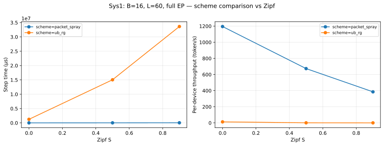
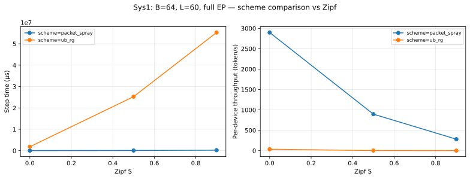
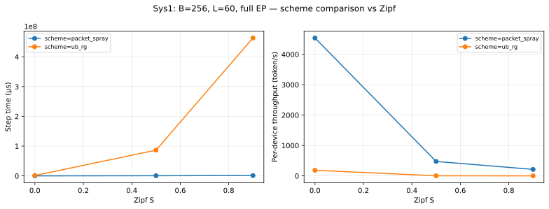
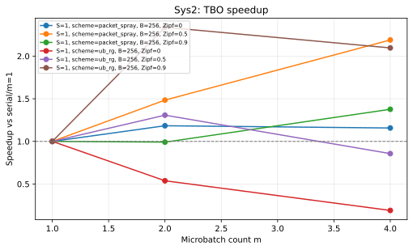
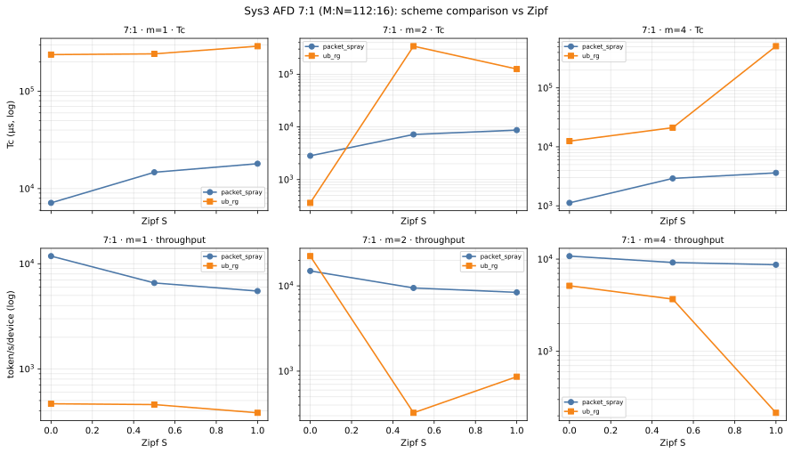
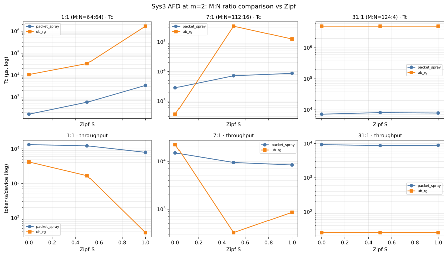
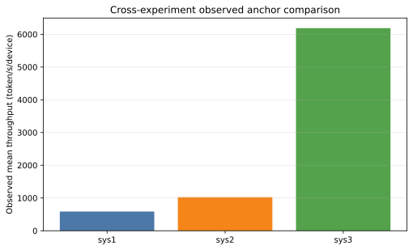

# UB_RG 系统实验 0719 报告

> 本报告只汇总 `engine/network_engine=packet` 的逐包证据。数据缺失处明确标为“缺失”，不使用行为级结果补齐，也不插值。

实验定义仅以精确文件 [`UB_RG实验设计0719.md`](./UB_RG实验设计0719.md) §4.3；不引用不含 `0719` 的同名设计文档。

> **执行状态：完成。** 网络任务 112 个，完成 112、失败 0；系统配置 72 个，完成 72、因网络输入失败 0。拓扑为场景1（单层 switch）。

## 1. 方法与参数矩阵

方法：从每个逐包运行的 `summary.json` 读取网络 CCT/P99 证据与系统模型输出，以 `ledger.json` 核对失败、跳过和裁剪；重复点仅在绘图时取算术平均，[`UB_RG系统实验0719数据.csv`](./UB_RG系统实验0719数据.csv) 保留逐运行记录。

| 实验 | 成功 summary | tier | 场景 | 网络方案 | B | Zipf S | EP | L | m |
|---|---|---|---|---|---|---|---|---|---|
| sys1 | 24 | controls, main | 1 | packet_spray, ub_rg | 16, 256, 64 | 0, 0.5, 0.9 | 128, 64 | 32, 60, 94 | 1 |
| sys2 | 18 | controls, main | 1 | packet_spray, ub_rg | 256 | 0, 0.5, 0.9 | 128 | 60 | 1, 2, 4 |
| sys3 | 30 | controls, main | 1 | packet_spray, ub_rg | 256 | 0, 0.5, 1 | 128 | 60 | 1, 2, 4 |

这是**实收参数矩阵**，不是对未运行配置的宣称；未出现的参数组合视为缺失或被裁剪。

## 2. 逐包证据来源与 packet 门禁

- 输入根目录：`/home/luke/workspace/dyn_latency/results/ub_rg_system_packet`
- 已接受 summary：72 个；ledger：1 个
- 门禁规则：每个可解析输入必须至少声明一个 `engine` 或 `network_engine`，且所有此类声明都必须严格等于 `packet`（二者只需其一；本仓库 system summary 通常只写 `engine=packet`）。runner 的 ledger 也可用`packet_only=true` 作等价声明。`behavioral` 会立即报错并停止写出。

- `sys1/sys1_s1_packet_spray_b16_z0.5_ep128_L60_m1_sd1`：`sys1/sys1_s1_packet_spray_b16_z0.5_ep128_L60_m1_sd1/summary.json`；`/home/luke/workspace/dyn_latency/results/ub_rg_system_packet/network/s1_packet_spray_dispatch_mb16_z0.5_ep128_sd1/summary.json`；`/home/luke/workspace/dyn_latency/results/ub_rg_system_packet/network/s1_packet_spray_combine_mb16_z0.5_ep128_sd1/summary.json`；engine=packet

- `sys1/sys1_s1_packet_spray_b16_z0.9_ep128_L60_m1_sd1`：`sys1/sys1_s1_packet_spray_b16_z0.9_ep128_L60_m1_sd1/summary.json`；`/home/luke/workspace/dyn_latency/results/ub_rg_system_packet/network/s1_packet_spray_dispatch_mb16_z0.9_ep128_sd1/summary.json`；`/home/luke/workspace/dyn_latency/results/ub_rg_system_packet/network/s1_packet_spray_combine_mb16_z0.9_ep128_sd1/summary.json`；engine=packet

- `sys1/sys1_s1_packet_spray_b16_z0_ep128_L60_m1_sd1`：`sys1/sys1_s1_packet_spray_b16_z0_ep128_L60_m1_sd1/summary.json`；`/home/luke/workspace/dyn_latency/results/ub_rg_system_packet/network/s1_packet_spray_dispatch_mb16_z0_ep128_sd1/summary.json`；`/home/luke/workspace/dyn_latency/results/ub_rg_system_packet/network/s1_packet_spray_combine_mb16_z0_ep128_sd1/summary.json`；engine=packet

- `sys1/sys1_s1_packet_spray_b256_z0.5_ep128_L32_m1_sd1`：`sys1/sys1_s1_packet_spray_b256_z0.5_ep128_L32_m1_sd1/summary.json`；`/home/luke/workspace/dyn_latency/results/ub_rg_system_packet/network/s1_packet_spray_dispatch_mb256_z0.5_ep128_sd1/summary.json`；`/home/luke/workspace/dyn_latency/results/ub_rg_system_packet/network/s1_packet_spray_combine_mb256_z0.5_ep128_sd1/summary.json`；engine=packet

- `sys1/sys1_s1_packet_spray_b256_z0.5_ep128_L60_m1_sd1`：`sys1/sys1_s1_packet_spray_b256_z0.5_ep128_L60_m1_sd1/summary.json`；`/home/luke/workspace/dyn_latency/results/ub_rg_system_packet/network/s1_packet_spray_dispatch_mb256_z0.5_ep128_sd1/summary.json`；`/home/luke/workspace/dyn_latency/results/ub_rg_system_packet/network/s1_packet_spray_combine_mb256_z0.5_ep128_sd1/summary.json`；engine=packet

- `sys1/sys1_s1_packet_spray_b256_z0.5_ep128_L94_m1_sd1`：`sys1/sys1_s1_packet_spray_b256_z0.5_ep128_L94_m1_sd1/summary.json`；`/home/luke/workspace/dyn_latency/results/ub_rg_system_packet/network/s1_packet_spray_dispatch_mb256_z0.5_ep128_sd1/summary.json`；`/home/luke/workspace/dyn_latency/results/ub_rg_system_packet/network/s1_packet_spray_combine_mb256_z0.5_ep128_sd1/summary.json`；engine=packet

- `sys1/sys1_s1_packet_spray_b256_z0.5_ep64_L60_m1_sd1`：`sys1/sys1_s1_packet_spray_b256_z0.5_ep64_L60_m1_sd1/summary.json`；`/home/luke/workspace/dyn_latency/results/ub_rg_system_packet/network/s1_packet_spray_dispatch_mb256_z0.5_ep64_sd1/summary.json`；`/home/luke/workspace/dyn_latency/results/ub_rg_system_packet/network/s1_packet_spray_combine_mb256_z0.5_ep64_sd1/summary.json`；engine=packet

- `sys1/sys1_s1_packet_spray_b256_z0.9_ep128_L60_m1_sd1`：`sys1/sys1_s1_packet_spray_b256_z0.9_ep128_L60_m1_sd1/summary.json`；`/home/luke/workspace/dyn_latency/results/ub_rg_system_packet/network/s1_packet_spray_dispatch_mb256_z0.9_ep128_sd1/summary.json`；`/home/luke/workspace/dyn_latency/results/ub_rg_system_packet/network/s1_packet_spray_combine_mb256_z0.9_ep128_sd1/summary.json`；engine=packet

- `sys1/sys1_s1_packet_spray_b256_z0_ep128_L60_m1_sd1`：`sys1/sys1_s1_packet_spray_b256_z0_ep128_L60_m1_sd1/summary.json`；`/home/luke/workspace/dyn_latency/results/ub_rg_system_packet/network/s1_packet_spray_dispatch_mb256_z0_ep128_sd1/summary.json`；`/home/luke/workspace/dyn_latency/results/ub_rg_system_packet/network/s1_packet_spray_combine_mb256_z0_ep128_sd1/summary.json`；engine=packet

- `sys1/sys1_s1_packet_spray_b64_z0.5_ep128_L60_m1_sd1`：`sys1/sys1_s1_packet_spray_b64_z0.5_ep128_L60_m1_sd1/summary.json`；`/home/luke/workspace/dyn_latency/results/ub_rg_system_packet/network/s1_packet_spray_dispatch_mb64_z0.5_ep128_sd1/summary.json`；`/home/luke/workspace/dyn_latency/results/ub_rg_system_packet/network/s1_packet_spray_combine_mb64_z0.5_ep128_sd1/summary.json`；engine=packet

- `sys1/sys1_s1_packet_spray_b64_z0.9_ep128_L60_m1_sd1`：`sys1/sys1_s1_packet_spray_b64_z0.9_ep128_L60_m1_sd1/summary.json`；`/home/luke/workspace/dyn_latency/results/ub_rg_system_packet/network/s1_packet_spray_dispatch_mb64_z0.9_ep128_sd1/summary.json`；`/home/luke/workspace/dyn_latency/results/ub_rg_system_packet/network/s1_packet_spray_combine_mb64_z0.9_ep128_sd1/summary.json`；engine=packet

- `sys1/sys1_s1_packet_spray_b64_z0_ep128_L60_m1_sd1`：`sys1/sys1_s1_packet_spray_b64_z0_ep128_L60_m1_sd1/summary.json`；`/home/luke/workspace/dyn_latency/results/ub_rg_system_packet/network/s1_packet_spray_dispatch_mb64_z0_ep128_sd1/summary.json`；`/home/luke/workspace/dyn_latency/results/ub_rg_system_packet/network/s1_packet_spray_combine_mb64_z0_ep128_sd1/summary.json`；engine=packet

- `sys1/sys1_s1_ub_rg_b16_z0.5_ep128_L60_m1_sd1`：`sys1/sys1_s1_ub_rg_b16_z0.5_ep128_L60_m1_sd1/summary.json`；`/home/luke/workspace/dyn_latency/results/ub_rg_system_packet/network/s1_ub_rg_dispatch_mb16_z0.5_ep128_sd1/summary.json`；`/home/luke/workspace/dyn_latency/results/ub_rg_system_packet/network/s1_ub_rg_combine_mb16_z0.5_ep128_sd1/summary.json`；engine=packet

- `sys1/sys1_s1_ub_rg_b16_z0.9_ep128_L60_m1_sd1`：`sys1/sys1_s1_ub_rg_b16_z0.9_ep128_L60_m1_sd1/summary.json`；`/home/luke/workspace/dyn_latency/results/ub_rg_system_packet/network/s1_ub_rg_dispatch_mb16_z0.9_ep128_sd1/summary.json`；`/home/luke/workspace/dyn_latency/results/ub_rg_system_packet/network/s1_ub_rg_combine_mb16_z0.9_ep128_sd1/summary.json`；engine=packet

- `sys1/sys1_s1_ub_rg_b16_z0_ep128_L60_m1_sd1`：`sys1/sys1_s1_ub_rg_b16_z0_ep128_L60_m1_sd1/summary.json`；`/home/luke/workspace/dyn_latency/results/ub_rg_system_packet/network/s1_ub_rg_dispatch_mb16_z0_ep128_sd1/summary.json`；`/home/luke/workspace/dyn_latency/results/ub_rg_system_packet/network/s1_ub_rg_combine_mb16_z0_ep128_sd1/summary.json`；engine=packet

- `sys1/sys1_s1_ub_rg_b256_z0.5_ep128_L32_m1_sd1`：`sys1/sys1_s1_ub_rg_b256_z0.5_ep128_L32_m1_sd1/summary.json`；`/home/luke/workspace/dyn_latency/results/ub_rg_system_packet/network/s1_ub_rg_dispatch_mb256_z0.5_ep128_sd1/summary.json`；`/home/luke/workspace/dyn_latency/results/ub_rg_system_packet/network/s1_ub_rg_combine_mb256_z0.5_ep128_sd1/summary.json`；engine=packet

- `sys1/sys1_s1_ub_rg_b256_z0.5_ep128_L60_m1_sd1`：`sys1/sys1_s1_ub_rg_b256_z0.5_ep128_L60_m1_sd1/summary.json`；`/home/luke/workspace/dyn_latency/results/ub_rg_system_packet/network/s1_ub_rg_dispatch_mb256_z0.5_ep128_sd1/summary.json`；`/home/luke/workspace/dyn_latency/results/ub_rg_system_packet/network/s1_ub_rg_combine_mb256_z0.5_ep128_sd1/summary.json`；engine=packet

- `sys1/sys1_s1_ub_rg_b256_z0.5_ep128_L94_m1_sd1`：`sys1/sys1_s1_ub_rg_b256_z0.5_ep128_L94_m1_sd1/summary.json`；`/home/luke/workspace/dyn_latency/results/ub_rg_system_packet/network/s1_ub_rg_dispatch_mb256_z0.5_ep128_sd1/summary.json`；`/home/luke/workspace/dyn_latency/results/ub_rg_system_packet/network/s1_ub_rg_combine_mb256_z0.5_ep128_sd1/summary.json`；engine=packet

- `sys1/sys1_s1_ub_rg_b256_z0.5_ep64_L60_m1_sd1`：`sys1/sys1_s1_ub_rg_b256_z0.5_ep64_L60_m1_sd1/summary.json`；`/home/luke/workspace/dyn_latency/results/ub_rg_system_packet/network/s1_ub_rg_dispatch_mb256_z0.5_ep64_sd1/summary.json`；`/home/luke/workspace/dyn_latency/results/ub_rg_system_packet/network/s1_ub_rg_combine_mb256_z0.5_ep64_sd1/summary.json`；engine=packet

- `sys1/sys1_s1_ub_rg_b256_z0.9_ep128_L60_m1_sd1`：`sys1/sys1_s1_ub_rg_b256_z0.9_ep128_L60_m1_sd1/summary.json`；`/home/luke/workspace/dyn_latency/results/ub_rg_system_packet/network/s1_ub_rg_dispatch_mb256_z0.9_ep128_sd1/summary.json`；`/home/luke/workspace/dyn_latency/results/ub_rg_system_packet/network/s1_ub_rg_combine_mb256_z0.9_ep128_sd1/summary.json`；engine=packet

- `sys1/sys1_s1_ub_rg_b256_z0_ep128_L60_m1_sd1`：`sys1/sys1_s1_ub_rg_b256_z0_ep128_L60_m1_sd1/summary.json`；`/home/luke/workspace/dyn_latency/results/ub_rg_system_packet/network/s1_ub_rg_dispatch_mb256_z0_ep128_sd1/summary.json`；`/home/luke/workspace/dyn_latency/results/ub_rg_system_packet/network/s1_ub_rg_combine_mb256_z0_ep128_sd1/summary.json`；engine=packet

- `sys1/sys1_s1_ub_rg_b64_z0.5_ep128_L60_m1_sd1`：`sys1/sys1_s1_ub_rg_b64_z0.5_ep128_L60_m1_sd1/summary.json`；`/home/luke/workspace/dyn_latency/results/ub_rg_system_packet/network/s1_ub_rg_dispatch_mb64_z0.5_ep128_sd1/summary.json`；`/home/luke/workspace/dyn_latency/results/ub_rg_system_packet/network/s1_ub_rg_combine_mb64_z0.5_ep128_sd1/summary.json`；engine=packet

- `sys1/sys1_s1_ub_rg_b64_z0.9_ep128_L60_m1_sd1`：`sys1/sys1_s1_ub_rg_b64_z0.9_ep128_L60_m1_sd1/summary.json`；`/home/luke/workspace/dyn_latency/results/ub_rg_system_packet/network/s1_ub_rg_dispatch_mb64_z0.9_ep128_sd1/summary.json`；`/home/luke/workspace/dyn_latency/results/ub_rg_system_packet/network/s1_ub_rg_combine_mb64_z0.9_ep128_sd1/summary.json`；engine=packet

- `sys1/sys1_s1_ub_rg_b64_z0_ep128_L60_m1_sd1`：`sys1/sys1_s1_ub_rg_b64_z0_ep128_L60_m1_sd1/summary.json`；`/home/luke/workspace/dyn_latency/results/ub_rg_system_packet/network/s1_ub_rg_dispatch_mb64_z0_ep128_sd1/summary.json`；`/home/luke/workspace/dyn_latency/results/ub_rg_system_packet/network/s1_ub_rg_combine_mb64_z0_ep128_sd1/summary.json`；engine=packet

- `sys2/sys2_s1_packet_spray_b256_z0.5_ep128_L60_m1_sd1`：`sys2/sys2_s1_packet_spray_b256_z0.5_ep128_L60_m1_sd1/summary.json`；`/home/luke/workspace/dyn_latency/results/ub_rg_system_packet/network/s1_packet_spray_dispatch_mb256_z0.5_ep128_sd1/summary.json`；`/home/luke/workspace/dyn_latency/results/ub_rg_system_packet/network/s1_packet_spray_combine_mb256_z0.5_ep128_sd1/summary.json`；engine=packet

- `sys2/sys2_s1_packet_spray_b256_z0.5_ep128_L60_m2_sd1`：`sys2/sys2_s1_packet_spray_b256_z0.5_ep128_L60_m2_sd1/summary.json`；`/home/luke/workspace/dyn_latency/results/ub_rg_system_packet/network/s1_packet_spray_dispatch_mb128_z0.5_ep128_sd1/summary.json`；`/home/luke/workspace/dyn_latency/results/ub_rg_system_packet/network/s1_packet_spray_combine_mb128_z0.5_ep128_sd1/summary.json`；engine=packet

- `sys2/sys2_s1_packet_spray_b256_z0.5_ep128_L60_m4_sd1`：`sys2/sys2_s1_packet_spray_b256_z0.5_ep128_L60_m4_sd1/summary.json`；`/home/luke/workspace/dyn_latency/results/ub_rg_system_packet/network/s1_packet_spray_dispatch_mb64_z0.5_ep128_sd1/summary.json`；`/home/luke/workspace/dyn_latency/results/ub_rg_system_packet/network/s1_packet_spray_combine_mb64_z0.5_ep128_sd1/summary.json`；engine=packet

- `sys2/sys2_s1_packet_spray_b256_z0.9_ep128_L60_m1_sd1`：`sys2/sys2_s1_packet_spray_b256_z0.9_ep128_L60_m1_sd1/summary.json`；`/home/luke/workspace/dyn_latency/results/ub_rg_system_packet/network/s1_packet_spray_dispatch_mb256_z0.9_ep128_sd1/summary.json`；`/home/luke/workspace/dyn_latency/results/ub_rg_system_packet/network/s1_packet_spray_combine_mb256_z0.9_ep128_sd1/summary.json`；engine=packet

- `sys2/sys2_s1_packet_spray_b256_z0.9_ep128_L60_m2_sd1`：`sys2/sys2_s1_packet_spray_b256_z0.9_ep128_L60_m2_sd1/summary.json`；`/home/luke/workspace/dyn_latency/results/ub_rg_system_packet/network/s1_packet_spray_dispatch_mb128_z0.9_ep128_sd1/summary.json`；`/home/luke/workspace/dyn_latency/results/ub_rg_system_packet/network/s1_packet_spray_combine_mb128_z0.9_ep128_sd1/summary.json`；engine=packet

- `sys2/sys2_s1_packet_spray_b256_z0.9_ep128_L60_m4_sd1`：`sys2/sys2_s1_packet_spray_b256_z0.9_ep128_L60_m4_sd1/summary.json`；`/home/luke/workspace/dyn_latency/results/ub_rg_system_packet/network/s1_packet_spray_dispatch_mb64_z0.9_ep128_sd1/summary.json`；`/home/luke/workspace/dyn_latency/results/ub_rg_system_packet/network/s1_packet_spray_combine_mb64_z0.9_ep128_sd1/summary.json`；engine=packet

- `sys2/sys2_s1_packet_spray_b256_z0_ep128_L60_m1_sd1`：`sys2/sys2_s1_packet_spray_b256_z0_ep128_L60_m1_sd1/summary.json`；`/home/luke/workspace/dyn_latency/results/ub_rg_system_packet/network/s1_packet_spray_dispatch_mb256_z0_ep128_sd1/summary.json`；`/home/luke/workspace/dyn_latency/results/ub_rg_system_packet/network/s1_packet_spray_combine_mb256_z0_ep128_sd1/summary.json`；engine=packet

- `sys2/sys2_s1_packet_spray_b256_z0_ep128_L60_m2_sd1`：`sys2/sys2_s1_packet_spray_b256_z0_ep128_L60_m2_sd1/summary.json`；`/home/luke/workspace/dyn_latency/results/ub_rg_system_packet/network/s1_packet_spray_dispatch_mb128_z0_ep128_sd1/summary.json`；`/home/luke/workspace/dyn_latency/results/ub_rg_system_packet/network/s1_packet_spray_combine_mb128_z0_ep128_sd1/summary.json`；engine=packet

- `sys2/sys2_s1_packet_spray_b256_z0_ep128_L60_m4_sd1`：`sys2/sys2_s1_packet_spray_b256_z0_ep128_L60_m4_sd1/summary.json`；`/home/luke/workspace/dyn_latency/results/ub_rg_system_packet/network/s1_packet_spray_dispatch_mb64_z0_ep128_sd1/summary.json`；`/home/luke/workspace/dyn_latency/results/ub_rg_system_packet/network/s1_packet_spray_combine_mb64_z0_ep128_sd1/summary.json`；engine=packet

- `sys2/sys2_s1_ub_rg_b256_z0.5_ep128_L60_m1_sd1`：`sys2/sys2_s1_ub_rg_b256_z0.5_ep128_L60_m1_sd1/summary.json`；`/home/luke/workspace/dyn_latency/results/ub_rg_system_packet/network/s1_ub_rg_dispatch_mb256_z0.5_ep128_sd1/summary.json`；`/home/luke/workspace/dyn_latency/results/ub_rg_system_packet/network/s1_ub_rg_combine_mb256_z0.5_ep128_sd1/summary.json`；engine=packet

- `sys2/sys2_s1_ub_rg_b256_z0.5_ep128_L60_m2_sd1`：`sys2/sys2_s1_ub_rg_b256_z0.5_ep128_L60_m2_sd1/summary.json`；`/home/luke/workspace/dyn_latency/results/ub_rg_system_packet/network/s1_ub_rg_dispatch_mb128_z0.5_ep128_sd1/summary.json`；`/home/luke/workspace/dyn_latency/results/ub_rg_system_packet/network/s1_ub_rg_combine_mb128_z0.5_ep128_sd1/summary.json`；engine=packet

- `sys2/sys2_s1_ub_rg_b256_z0.5_ep128_L60_m4_sd1`：`sys2/sys2_s1_ub_rg_b256_z0.5_ep128_L60_m4_sd1/summary.json`；`/home/luke/workspace/dyn_latency/results/ub_rg_system_packet/network/s1_ub_rg_dispatch_mb64_z0.5_ep128_sd1/summary.json`；`/home/luke/workspace/dyn_latency/results/ub_rg_system_packet/network/s1_ub_rg_combine_mb64_z0.5_ep128_sd1/summary.json`；engine=packet

- `sys2/sys2_s1_ub_rg_b256_z0.9_ep128_L60_m1_sd1`：`sys2/sys2_s1_ub_rg_b256_z0.9_ep128_L60_m1_sd1/summary.json`；`/home/luke/workspace/dyn_latency/results/ub_rg_system_packet/network/s1_ub_rg_dispatch_mb256_z0.9_ep128_sd1/summary.json`；`/home/luke/workspace/dyn_latency/results/ub_rg_system_packet/network/s1_ub_rg_combine_mb256_z0.9_ep128_sd1/summary.json`；engine=packet

- `sys2/sys2_s1_ub_rg_b256_z0.9_ep128_L60_m2_sd1`：`sys2/sys2_s1_ub_rg_b256_z0.9_ep128_L60_m2_sd1/summary.json`；`/home/luke/workspace/dyn_latency/results/ub_rg_system_packet/network/s1_ub_rg_dispatch_mb128_z0.9_ep128_sd1/summary.json`；`/home/luke/workspace/dyn_latency/results/ub_rg_system_packet/network/s1_ub_rg_combine_mb128_z0.9_ep128_sd1/summary.json`；engine=packet

- `sys2/sys2_s1_ub_rg_b256_z0.9_ep128_L60_m4_sd1`：`sys2/sys2_s1_ub_rg_b256_z0.9_ep128_L60_m4_sd1/summary.json`；`/home/luke/workspace/dyn_latency/results/ub_rg_system_packet/network/s1_ub_rg_dispatch_mb64_z0.9_ep128_sd1/summary.json`；`/home/luke/workspace/dyn_latency/results/ub_rg_system_packet/network/s1_ub_rg_combine_mb64_z0.9_ep128_sd1/summary.json`；engine=packet

- `sys2/sys2_s1_ub_rg_b256_z0_ep128_L60_m1_sd1`：`sys2/sys2_s1_ub_rg_b256_z0_ep128_L60_m1_sd1/summary.json`；`/home/luke/workspace/dyn_latency/results/ub_rg_system_packet/network/s1_ub_rg_dispatch_mb256_z0_ep128_sd1/summary.json`；`/home/luke/workspace/dyn_latency/results/ub_rg_system_packet/network/s1_ub_rg_combine_mb256_z0_ep128_sd1/summary.json`；engine=packet

- `sys2/sys2_s1_ub_rg_b256_z0_ep128_L60_m2_sd1`：`sys2/sys2_s1_ub_rg_b256_z0_ep128_L60_m2_sd1/summary.json`；`/home/luke/workspace/dyn_latency/results/ub_rg_system_packet/network/s1_ub_rg_dispatch_mb128_z0_ep128_sd1/summary.json`；`/home/luke/workspace/dyn_latency/results/ub_rg_system_packet/network/s1_ub_rg_combine_mb128_z0_ep128_sd1/summary.json`；engine=packet

- `sys2/sys2_s1_ub_rg_b256_z0_ep128_L60_m4_sd1`：`sys2/sys2_s1_ub_rg_b256_z0_ep128_L60_m4_sd1/summary.json`；`/home/luke/workspace/dyn_latency/results/ub_rg_system_packet/network/s1_ub_rg_dispatch_mb64_z0_ep128_sd1/summary.json`；`/home/luke/workspace/dyn_latency/results/ub_rg_system_packet/network/s1_ub_rg_combine_mb64_z0_ep128_sd1/summary.json`；engine=packet

- `sys3/sys3_s1_packet_spray_b256_z0.5_ep128_L60_m1_M112_N16_hidden_role_packed_sd1`：`sys3/sys3_s1_packet_spray_b256_z0.5_ep128_L60_m1_M112_N16_hidden_role_packed_sd1/summary.json`；`/home/luke/workspace/dyn_latency/results/ub_rg_system_packet/network/s1_packet_spray_afd_m2n_mb256_z0.5_ep128_M112_N16_role_packed_sd1/summary.json`；`/home/luke/workspace/dyn_latency/results/ub_rg_system_packet/network/s1_packet_spray_afd_n2m_mb256_z0.5_ep128_M112_N16_role_packed_sd1/summary.json`；engine=packet

- `sys3/sys3_s1_packet_spray_b256_z0.5_ep128_L60_m2_M112_N16_hidden_role_packed_sd1`：`sys3/sys3_s1_packet_spray_b256_z0.5_ep128_L60_m2_M112_N16_hidden_role_packed_sd1/summary.json`；`/home/luke/workspace/dyn_latency/results/ub_rg_system_packet/network/s1_packet_spray_afd_m2n_mb128_z0.5_ep128_M112_N16_role_packed_sd1/summary.json`；`/home/luke/workspace/dyn_latency/results/ub_rg_system_packet/network/s1_packet_spray_afd_n2m_mb128_z0.5_ep128_M112_N16_role_packed_sd1/summary.json`；engine=packet

- `sys3/sys3_s1_packet_spray_b256_z0.5_ep128_L60_m2_M124_N4_exposed_role_packed_sd1`：`sys3/sys3_s1_packet_spray_b256_z0.5_ep128_L60_m2_M124_N4_exposed_role_packed_sd1/summary.json`；`/home/luke/workspace/dyn_latency/results/ub_rg_system_packet/network/s1_packet_spray_afd_m2n_mb128_z0.5_ep128_M124_N4_role_packed_sd1/summary.json`；`/home/luke/workspace/dyn_latency/results/ub_rg_system_packet/network/s1_packet_spray_afd_n2m_mb128_z0.5_ep128_M124_N4_role_packed_sd1/summary.json`；engine=packet

- `sys3/sys3_s1_packet_spray_b256_z0.5_ep128_L60_m2_M64_N64_hidden_role_packed_sd1`：`sys3/sys3_s1_packet_spray_b256_z0.5_ep128_L60_m2_M64_N64_hidden_role_packed_sd1/summary.json`；`/home/luke/workspace/dyn_latency/results/ub_rg_system_packet/network/s1_packet_spray_afd_m2n_mb128_z0.5_ep128_M64_N64_role_packed_sd1/summary.json`；`/home/luke/workspace/dyn_latency/results/ub_rg_system_packet/network/s1_packet_spray_afd_n2m_mb128_z0.5_ep128_M64_N64_role_packed_sd1/summary.json`；engine=packet

- `sys3/sys3_s1_packet_spray_b256_z0.5_ep128_L60_m4_M112_N16_hidden_role_packed_sd1`：`sys3/sys3_s1_packet_spray_b256_z0.5_ep128_L60_m4_M112_N16_hidden_role_packed_sd1/summary.json`；`/home/luke/workspace/dyn_latency/results/ub_rg_system_packet/network/s1_packet_spray_afd_m2n_mb64_z0.5_ep128_M112_N16_role_packed_sd1/summary.json`；`/home/luke/workspace/dyn_latency/results/ub_rg_system_packet/network/s1_packet_spray_afd_n2m_mb64_z0.5_ep128_M112_N16_role_packed_sd1/summary.json`；engine=packet

- `sys3/sys3_s1_packet_spray_b256_z0_ep128_L60_m1_M112_N16_hidden_role_packed_sd1`：`sys3/sys3_s1_packet_spray_b256_z0_ep128_L60_m1_M112_N16_hidden_role_packed_sd1/summary.json`；`/home/luke/workspace/dyn_latency/results/ub_rg_system_packet/network/s1_packet_spray_afd_m2n_mb256_z0_ep128_M112_N16_role_packed_sd1/summary.json`；`/home/luke/workspace/dyn_latency/results/ub_rg_system_packet/network/s1_packet_spray_afd_n2m_mb256_z0_ep128_M112_N16_role_packed_sd1/summary.json`；engine=packet

- `sys3/sys3_s1_packet_spray_b256_z0_ep128_L60_m2_M112_N16_hidden_role_packed_sd1`：`sys3/sys3_s1_packet_spray_b256_z0_ep128_L60_m2_M112_N16_hidden_role_packed_sd1/summary.json`；`/home/luke/workspace/dyn_latency/results/ub_rg_system_packet/network/s1_packet_spray_afd_m2n_mb128_z0_ep128_M112_N16_role_packed_sd1/summary.json`；`/home/luke/workspace/dyn_latency/results/ub_rg_system_packet/network/s1_packet_spray_afd_n2m_mb128_z0_ep128_M112_N16_role_packed_sd1/summary.json`；engine=packet

- `sys3/sys3_s1_packet_spray_b256_z0_ep128_L60_m2_M124_N4_exposed_role_packed_sd1`：`sys3/sys3_s1_packet_spray_b256_z0_ep128_L60_m2_M124_N4_exposed_role_packed_sd1/summary.json`；`/home/luke/workspace/dyn_latency/results/ub_rg_system_packet/network/s1_packet_spray_afd_m2n_mb128_z0_ep128_M124_N4_role_packed_sd1/summary.json`；`/home/luke/workspace/dyn_latency/results/ub_rg_system_packet/network/s1_packet_spray_afd_n2m_mb128_z0_ep128_M124_N4_role_packed_sd1/summary.json`；engine=packet

- `sys3/sys3_s1_packet_spray_b256_z0_ep128_L60_m2_M64_N64_hidden_role_packed_sd1`：`sys3/sys3_s1_packet_spray_b256_z0_ep128_L60_m2_M64_N64_hidden_role_packed_sd1/summary.json`；`/home/luke/workspace/dyn_latency/results/ub_rg_system_packet/network/s1_packet_spray_afd_m2n_mb128_z0_ep128_M64_N64_role_packed_sd1/summary.json`；`/home/luke/workspace/dyn_latency/results/ub_rg_system_packet/network/s1_packet_spray_afd_n2m_mb128_z0_ep128_M64_N64_role_packed_sd1/summary.json`；engine=packet

- `sys3/sys3_s1_packet_spray_b256_z0_ep128_L60_m4_M112_N16_hidden_role_packed_sd1`：`sys3/sys3_s1_packet_spray_b256_z0_ep128_L60_m4_M112_N16_hidden_role_packed_sd1/summary.json`；`/home/luke/workspace/dyn_latency/results/ub_rg_system_packet/network/s1_packet_spray_afd_m2n_mb64_z0_ep128_M112_N16_role_packed_sd1/summary.json`；`/home/luke/workspace/dyn_latency/results/ub_rg_system_packet/network/s1_packet_spray_afd_n2m_mb64_z0_ep128_M112_N16_role_packed_sd1/summary.json`；engine=packet

- `sys3/sys3_s1_packet_spray_b256_z1_ep128_L60_m1_M112_N16_hidden_role_packed_sd1`：`sys3/sys3_s1_packet_spray_b256_z1_ep128_L60_m1_M112_N16_hidden_role_packed_sd1/summary.json`；`/home/luke/workspace/dyn_latency/results/ub_rg_system_packet/network/s1_packet_spray_afd_m2n_mb256_z1_ep128_M112_N16_role_packed_sd1/summary.json`；`/home/luke/workspace/dyn_latency/results/ub_rg_system_packet/network/s1_packet_spray_afd_n2m_mb256_z1_ep128_M112_N16_role_packed_sd1/summary.json`；engine=packet

- `sys3/sys3_s1_packet_spray_b256_z1_ep128_L60_m2_M112_N16_hidden_role_packed_sd1`：`sys3/sys3_s1_packet_spray_b256_z1_ep128_L60_m2_M112_N16_hidden_role_packed_sd1/summary.json`；`/home/luke/workspace/dyn_latency/results/ub_rg_system_packet/network/s1_packet_spray_afd_m2n_mb128_z1_ep128_M112_N16_role_packed_sd1/summary.json`；`/home/luke/workspace/dyn_latency/results/ub_rg_system_packet/network/s1_packet_spray_afd_n2m_mb128_z1_ep128_M112_N16_role_packed_sd1/summary.json`；engine=packet

- `sys3/sys3_s1_packet_spray_b256_z1_ep128_L60_m2_M124_N4_exposed_role_packed_sd1`：`sys3/sys3_s1_packet_spray_b256_z1_ep128_L60_m2_M124_N4_exposed_role_packed_sd1/summary.json`；`/home/luke/workspace/dyn_latency/results/ub_rg_system_packet/network/s1_packet_spray_afd_m2n_mb128_z1_ep128_M124_N4_role_packed_sd1/summary.json`；`/home/luke/workspace/dyn_latency/results/ub_rg_system_packet/network/s1_packet_spray_afd_n2m_mb128_z1_ep128_M124_N4_role_packed_sd1/summary.json`；engine=packet

- `sys3/sys3_s1_packet_spray_b256_z1_ep128_L60_m2_M64_N64_hidden_role_packed_sd1`：`sys3/sys3_s1_packet_spray_b256_z1_ep128_L60_m2_M64_N64_hidden_role_packed_sd1/summary.json`；`/home/luke/workspace/dyn_latency/results/ub_rg_system_packet/network/s1_packet_spray_afd_m2n_mb128_z1_ep128_M64_N64_role_packed_sd1/summary.json`；`/home/luke/workspace/dyn_latency/results/ub_rg_system_packet/network/s1_packet_spray_afd_n2m_mb128_z1_ep128_M64_N64_role_packed_sd1/summary.json`；engine=packet

- `sys3/sys3_s1_packet_spray_b256_z1_ep128_L60_m4_M112_N16_hidden_role_packed_sd1`：`sys3/sys3_s1_packet_spray_b256_z1_ep128_L60_m4_M112_N16_hidden_role_packed_sd1/summary.json`；`/home/luke/workspace/dyn_latency/results/ub_rg_system_packet/network/s1_packet_spray_afd_m2n_mb64_z1_ep128_M112_N16_role_packed_sd1/summary.json`；`/home/luke/workspace/dyn_latency/results/ub_rg_system_packet/network/s1_packet_spray_afd_n2m_mb64_z1_ep128_M112_N16_role_packed_sd1/summary.json`；engine=packet

- `sys3/sys3_s1_ub_rg_b256_z0.5_ep128_L60_m1_M112_N16_hidden_role_packed_sd1`：`sys3/sys3_s1_ub_rg_b256_z0.5_ep128_L60_m1_M112_N16_hidden_role_packed_sd1/summary.json`；`/home/luke/workspace/dyn_latency/results/ub_rg_system_packet/network/s1_ub_rg_afd_m2n_mb256_z0.5_ep128_M112_N16_role_packed_sd1/summary.json`；`/home/luke/workspace/dyn_latency/results/ub_rg_system_packet/network/s1_ub_rg_afd_n2m_mb256_z0.5_ep128_M112_N16_role_packed_sd1/summary.json`；engine=packet

- `sys3/sys3_s1_ub_rg_b256_z0.5_ep128_L60_m2_M112_N16_hidden_role_packed_sd1`：`sys3/sys3_s1_ub_rg_b256_z0.5_ep128_L60_m2_M112_N16_hidden_role_packed_sd1/summary.json`；`/home/luke/workspace/dyn_latency/results/ub_rg_system_packet/network/s1_ub_rg_afd_m2n_mb128_z0.5_ep128_M112_N16_role_packed_sd1/summary.json`；`/home/luke/workspace/dyn_latency/results/ub_rg_system_packet/network/s1_ub_rg_afd_n2m_mb128_z0.5_ep128_M112_N16_role_packed_sd1/summary.json`；engine=packet

- `sys3/sys3_s1_ub_rg_b256_z0.5_ep128_L60_m2_M124_N4_exposed_role_packed_sd1`：`sys3/sys3_s1_ub_rg_b256_z0.5_ep128_L60_m2_M124_N4_exposed_role_packed_sd1/summary.json`；`/home/luke/workspace/dyn_latency/results/ub_rg_system_packet/network/s1_ub_rg_afd_m2n_mb128_z0.5_ep128_M124_N4_role_packed_sd1/summary.json`；`/home/luke/workspace/dyn_latency/results/ub_rg_system_packet/network/s1_ub_rg_afd_n2m_mb128_z0.5_ep128_M124_N4_role_packed_sd1/summary.json`；engine=packet

- `sys3/sys3_s1_ub_rg_b256_z0.5_ep128_L60_m2_M64_N64_hidden_role_packed_sd1`：`sys3/sys3_s1_ub_rg_b256_z0.5_ep128_L60_m2_M64_N64_hidden_role_packed_sd1/summary.json`；`/home/luke/workspace/dyn_latency/results/ub_rg_system_packet/network/s1_ub_rg_afd_m2n_mb128_z0.5_ep128_M64_N64_role_packed_sd1/summary.json`；`/home/luke/workspace/dyn_latency/results/ub_rg_system_packet/network/s1_ub_rg_afd_n2m_mb128_z0.5_ep128_M64_N64_role_packed_sd1/summary.json`；engine=packet

- `sys3/sys3_s1_ub_rg_b256_z0.5_ep128_L60_m4_M112_N16_hidden_role_packed_sd1`：`sys3/sys3_s1_ub_rg_b256_z0.5_ep128_L60_m4_M112_N16_hidden_role_packed_sd1/summary.json`；`/home/luke/workspace/dyn_latency/results/ub_rg_system_packet/network/s1_ub_rg_afd_m2n_mb64_z0.5_ep128_M112_N16_role_packed_sd1/summary.json`；`/home/luke/workspace/dyn_latency/results/ub_rg_system_packet/network/s1_ub_rg_afd_n2m_mb64_z0.5_ep128_M112_N16_role_packed_sd1/summary.json`；engine=packet

- `sys3/sys3_s1_ub_rg_b256_z0_ep128_L60_m1_M112_N16_hidden_role_packed_sd1`：`sys3/sys3_s1_ub_rg_b256_z0_ep128_L60_m1_M112_N16_hidden_role_packed_sd1/summary.json`；`/home/luke/workspace/dyn_latency/results/ub_rg_system_packet/network/s1_ub_rg_afd_m2n_mb256_z0_ep128_M112_N16_role_packed_sd1/summary.json`；`/home/luke/workspace/dyn_latency/results/ub_rg_system_packet/network/s1_ub_rg_afd_n2m_mb256_z0_ep128_M112_N16_role_packed_sd1/summary.json`；engine=packet

- `sys3/sys3_s1_ub_rg_b256_z0_ep128_L60_m2_M112_N16_hidden_role_packed_sd1`：`sys3/sys3_s1_ub_rg_b256_z0_ep128_L60_m2_M112_N16_hidden_role_packed_sd1/summary.json`；`/home/luke/workspace/dyn_latency/results/ub_rg_system_packet/network/s1_ub_rg_afd_m2n_mb128_z0_ep128_M112_N16_role_packed_sd1/summary.json`；`/home/luke/workspace/dyn_latency/results/ub_rg_system_packet/network/s1_ub_rg_afd_n2m_mb128_z0_ep128_M112_N16_role_packed_sd1/summary.json`；engine=packet

- `sys3/sys3_s1_ub_rg_b256_z0_ep128_L60_m2_M124_N4_exposed_role_packed_sd1`：`sys3/sys3_s1_ub_rg_b256_z0_ep128_L60_m2_M124_N4_exposed_role_packed_sd1/summary.json`；`/home/luke/workspace/dyn_latency/results/ub_rg_system_packet/network/s1_ub_rg_afd_m2n_mb128_z0_ep128_M124_N4_role_packed_sd1/summary.json`；`/home/luke/workspace/dyn_latency/results/ub_rg_system_packet/network/s1_ub_rg_afd_n2m_mb128_z0_ep128_M124_N4_role_packed_sd1/summary.json`；engine=packet

- `sys3/sys3_s1_ub_rg_b256_z0_ep128_L60_m2_M64_N64_hidden_role_packed_sd1`：`sys3/sys3_s1_ub_rg_b256_z0_ep128_L60_m2_M64_N64_hidden_role_packed_sd1/summary.json`；`/home/luke/workspace/dyn_latency/results/ub_rg_system_packet/network/s1_ub_rg_afd_m2n_mb128_z0_ep128_M64_N64_role_packed_sd1/summary.json`；`/home/luke/workspace/dyn_latency/results/ub_rg_system_packet/network/s1_ub_rg_afd_n2m_mb128_z0_ep128_M64_N64_role_packed_sd1/summary.json`；engine=packet

- `sys3/sys3_s1_ub_rg_b256_z0_ep128_L60_m4_M112_N16_hidden_role_packed_sd1`：`sys3/sys3_s1_ub_rg_b256_z0_ep128_L60_m4_M112_N16_hidden_role_packed_sd1/summary.json`；`/home/luke/workspace/dyn_latency/results/ub_rg_system_packet/network/s1_ub_rg_afd_m2n_mb64_z0_ep128_M112_N16_role_packed_sd1/summary.json`；`/home/luke/workspace/dyn_latency/results/ub_rg_system_packet/network/s1_ub_rg_afd_n2m_mb64_z0_ep128_M112_N16_role_packed_sd1/summary.json`；engine=packet

- `sys3/sys3_s1_ub_rg_b256_z1_ep128_L60_m1_M112_N16_hidden_role_packed_sd1`：`sys3/sys3_s1_ub_rg_b256_z1_ep128_L60_m1_M112_N16_hidden_role_packed_sd1/summary.json`；`/home/luke/workspace/dyn_latency/results/ub_rg_system_packet/network/s1_ub_rg_afd_m2n_mb256_z1_ep128_M112_N16_role_packed_sd1/summary.json`；`/home/luke/workspace/dyn_latency/results/ub_rg_system_packet/network/s1_ub_rg_afd_n2m_mb256_z1_ep128_M112_N16_role_packed_sd1/summary.json`；engine=packet

- `sys3/sys3_s1_ub_rg_b256_z1_ep128_L60_m2_M112_N16_hidden_role_packed_sd1`：`sys3/sys3_s1_ub_rg_b256_z1_ep128_L60_m2_M112_N16_hidden_role_packed_sd1/summary.json`；`/home/luke/workspace/dyn_latency/results/ub_rg_system_packet/network/s1_ub_rg_afd_m2n_mb128_z1_ep128_M112_N16_role_packed_sd1/summary.json`；`/home/luke/workspace/dyn_latency/results/ub_rg_system_packet/network/s1_ub_rg_afd_n2m_mb128_z1_ep128_M112_N16_role_packed_sd1/summary.json`；engine=packet

- `sys3/sys3_s1_ub_rg_b256_z1_ep128_L60_m2_M124_N4_exposed_role_packed_sd1`：`sys3/sys3_s1_ub_rg_b256_z1_ep128_L60_m2_M124_N4_exposed_role_packed_sd1/summary.json`；`/home/luke/workspace/dyn_latency/results/ub_rg_system_packet/network/s1_ub_rg_afd_m2n_mb128_z1_ep128_M124_N4_role_packed_sd1/summary.json`；`/home/luke/workspace/dyn_latency/results/ub_rg_system_packet/network/s1_ub_rg_afd_n2m_mb128_z1_ep128_M124_N4_role_packed_sd1/summary.json`；engine=packet

- `sys3/sys3_s1_ub_rg_b256_z1_ep128_L60_m2_M64_N64_hidden_role_packed_sd1`：`sys3/sys3_s1_ub_rg_b256_z1_ep128_L60_m2_M64_N64_hidden_role_packed_sd1/summary.json`；`/home/luke/workspace/dyn_latency/results/ub_rg_system_packet/network/s1_ub_rg_afd_m2n_mb128_z1_ep128_M64_N64_role_packed_sd1/summary.json`；`/home/luke/workspace/dyn_latency/results/ub_rg_system_packet/network/s1_ub_rg_afd_n2m_mb128_z1_ep128_M64_N64_role_packed_sd1/summary.json`；engine=packet

- `sys3/sys3_s1_ub_rg_b256_z1_ep128_L60_m4_M112_N16_hidden_role_packed_sd1`：`sys3/sys3_s1_ub_rg_b256_z1_ep128_L60_m4_M112_N16_hidden_role_packed_sd1/summary.json`；`/home/luke/workspace/dyn_latency/results/ub_rg_system_packet/network/s1_ub_rg_afd_m2n_mb64_z1_ep128_M112_N16_role_packed_sd1/summary.json`；`/home/luke/workspace/dyn_latency/results/ub_rg_system_packet/network/s1_ub_rg_afd_n2m_mb64_z1_ep128_M112_N16_role_packed_sd1/summary.json`；engine=packet

## 3. Sys1：串行 Wide-EP（step 与 throughput）

**设计（§4.3.1）**：Wide-EP 同构部署；同一 microbatch 上 `Attn → Dispatch → FFN → Combine` **严格串行**，通讯与计算不重叠。主观测：step 时延与 per-device throughput（$B/T_{step}$）。本报告范围：场景1；方案 `packet_spray` / `ub_rg`。

**本轮矩阵**：B∈{16, 64, 256} 均扫 Zipf S∈{0, 0.5, 0.9}（EP=128、L=60）；另含 EP=64 与 L∈{32, 94} 单点对照（默认 S=0.5）。实收 summary **24** 个。

**本轮结论**：

- 主锚点（B=256、S=0.5、L=60、EP=128）：Packet Spray step=539198.1 µs、吞吐 474.8 token/s/device；`ub_rg` step=86513729.2 µs、吞吐 3.0。`ub_rg` step 约为 Spray 的 **160.4×**（更慢），串行 Wide-EP 下逐包证据不支持 `ub_rg` 相对 Spray 加速。

- Zipf 敏感（B=256 Spray）：step 随 S 从 56392.5 （S=0）升至 539198.1（S=0.5）、1198079.6（S=0.9）。

- B=16/64 与 B=256 一样具备完整 Zipf 三点曲线；下图按 B 分面，同图对比 `packet_spray` 与 `ub_rg`（仅 L=60、EP=128；EP/L 单点对照只在表中）。

| run | 场景 | 方案 | B | Zipf S | step (µs) | token/s/device |
|---|---|---|---|---|---|---|
| sys1_s1_packet_spray_b16_z0.5_ep128_L60_m1_sd1 | 1 | packet_spray | 16 | 0.5 | 23758.542 | 673.442 |
| sys1_s1_packet_spray_b16_z0.9_ep128_L60_m1_sd1 | 1 | packet_spray | 16 | 0.9 | 41537.862 | 385.191 |
| sys1_s1_packet_spray_b16_z0_ep128_L60_m1_sd1 | 1 | packet_spray | 16 | 0 | 13385.922 | 1195.286 |
| sys1_s1_packet_spray_b256_z0.5_ep128_L32_m1_sd1 | 1 | packet_spray | 256 | 0.5 | 287549.637 | 890.281 |
| sys1_s1_packet_spray_b256_z0.5_ep128_L60_m1_sd1 | 1 | packet_spray | 256 | 0.5 | 539198.142 | 474.779 |
| sys1_s1_packet_spray_b256_z0.5_ep128_L94_m1_sd1 | 1 | packet_spray | 256 | 0.5 | 844687.662 | 303.071 |
| sys1_s1_packet_spray_b256_z0.5_ep64_L60_m1_sd1 | 1 | packet_spray | 256 | 0.5 | 238759.302 | 1072.21 |
| sys1_s1_packet_spray_b256_z0.9_ep128_L60_m1_sd1 | 1 | packet_spray | 256 | 0.9 | 1198079.562 | 213.675 |
| sys1_s1_packet_spray_b256_z0_ep128_L60_m1_sd1 | 1 | packet_spray | 256 | 0 | 56392.542 | 4539.607 |
| sys1_s1_packet_spray_b64_z0.5_ep128_L60_m1_sd1 | 1 | packet_spray | 64 | 0.5 | 71461.242 | 895.59 |
| sys1_s1_packet_spray_b64_z0.9_ep128_L60_m1_sd1 | 1 | packet_spray | 64 | 0.9 | 227508.522 | 281.308 |
| sys1_s1_packet_spray_b64_z0_ep128_L60_m1_sd1 | 1 | packet_spray | 64 | 0 | 22083.462 | 2898.096 |
| sys1_s1_ub_rg_b16_z0.5_ep128_L60_m1_sd1 | 1 | ub_rg | 16 | 0.5 | 15047425.962 | 1.063 |
| sys1_s1_ub_rg_b16_z0.9_ep128_L60_m1_sd1 | 1 | ub_rg | 16 | 0.9 | 33621249.162 | 0.476 |
| sys1_s1_ub_rg_b16_z0_ep128_L60_m1_sd1 | 1 | ub_rg | 16 | 0 | 1249584.642 | 12.804 |
| sys1_s1_ub_rg_b256_z0.5_ep128_L32_m1_sd1 | 1 | ub_rg | 256 | 0.5 | 46140632.869 | 5.548 |
| sys1_s1_ub_rg_b256_z0.5_ep128_L60_m1_sd1 | 1 | ub_rg | 256 | 0.5 | 86513729.202 | 2.959 |
| sys1_s1_ub_rg_b256_z0.5_ep128_L94_m1_sd1 | 1 | ub_rg | 256 | 0.5 | 135538119.656 | 1.889 |
| sys1_s1_ub_rg_b256_z0.5_ep64_L60_m1_sd1 | 1 | ub_rg | 256 | 0.5 | 42129592.362 | 6.076 |
| sys1_s1_ub_rg_b256_z0.9_ep128_L60_m1_sd1 | 1 | ub_rg | 256 | 0.9 | 463277008.482 | 0.553 |
| sys1_s1_ub_rg_b256_z0_ep128_L60_m1_sd1 | 1 | ub_rg | 256 | 0 | 1389819.042 | 184.197 |
| sys1_s1_ub_rg_b64_z0.5_ep128_L60_m1_sd1 | 1 | ub_rg | 64 | 0.5 | 25258066.842 | 2.534 |
| sys1_s1_ub_rg_b64_z0.9_ep128_L60_m1_sd1 | 1 | ub_rg | 64 | 0.9 | 55263722.802 | 1.158 |
| sys1_s1_ub_rg_b64_z0_ep128_L60_m1_sd1 | 1 | ub_rg | 64 | 0 | 1836226.602 | 34.854 |







## 4. Sys2：Wide-EP TBO（m、speedup 与掩盖）

**设计（§4.3.2）**：仍为 Wide-EP；全局 batch 切成 m 个 microbatch，计算/通讯双 stream 做 TBO ping-pong，期望通讯被计算掩盖。主配置 m=2；对照 m=1（退化为不掩盖）与 m=4。每 MB 网络时延取自 batch=$B/m$ 的逐包 Dispatch/Combine CCT，并在 L 层上对每个 MB 各用一次。

**本轮矩阵**：场景1、B=256、EP=128、L=60；m∈{1, 2, 4} × S∈{0, 0.5, 0.9} × {`packet_spray`, `ub_rg`}。实收 summary **18** 个。

**本轮结论**：

- Packet Spray、S=0.5：m=2/m=4 相对 m=1 为 1.48× / 2.19×（mask：5.4% 通讯重叠 / 16.0% 通讯重叠）。加速主要来自更小 MB 的 CCT 下降；本矩阵未做因素消融。

- 高倾斜下掩盖变难：Spray S=0.9 时 m=2 相对 m=1 仅 0.99×（mask：1.6% 通讯重叠）。

- `ub_rg`、S=0.5：m=2/m=4 speedup 为 1.31× / 0.86×（m=4 相对串行退化）；通讯利用率≈1，计算几乎藏不住通讯（mask≈0）。

- **为何 m=4 speedup 小于 1（`ub_rg`, S=0.5）**：step 由 $L \cdot m \cdot (\mathrm{Disp}_{B/m}+\mathrm{Comb}_{B/m})$ 主导。m=1 用 batch=256 CCT（Disp+Comb=1441730.2 µs）；m=4 用 batch=64 CCT，但要跑 4 次，总通讯量 1683210.0 µs ≈ **1.17×** m=1。Combine CCT 随 batch 缩小近线性不足（固定/调度开销占比高），切 4 份后总通讯变重，又几乎无计算可重叠，故 TBO 净效应为退化。

- `ub_rg`、S=0（已补齐 m=1/2/4）：speedup=0.54× / 0.19×；均匀流量下切 MB 同样放大总 RG 通讯，m 越大越差。

指标口径：Speedup 优先用 summary 明示值；否则仅在存在同锚点 m=1 或 Sys1 step 时计算 `baseline_step / sys2_step`。掩盖列优先用 summary 明示 mask/hidden；若只有序列化 TBO events，则精确计算通讯事件与计算事件的时长重叠比例，不从 speedup 猜测。

| run | m | step (µs) | 基线 step | speedup | mask | token/s/device |
|---|---|---|---|---|---|---|
| sys2_s1_packet_spray_b256_z0.5_ep128_L60_m1_sd1 | 1 | 539198.142 | 539198.142 | 1 | 0.0% 通讯重叠 | 474.779 |
| sys2_s1_packet_spray_b256_z0.5_ep128_L60_m2_sd1 | 2 | 363300.455 | 539198.142 | 1.484 | 5.4% 通讯重叠 | 704.651 |
| sys2_s1_packet_spray_b256_z0.5_ep128_L60_m4_sd1 | 4 | 246252.935 | 539198.142 | 2.19 | 16.0% 通讯重叠 | 1039.582 |
| sys2_s1_packet_spray_b256_z0.9_ep128_L60_m1_sd1 | 1 | 1198079.562 | 1198079.562 | 1 | 0.0% 通讯重叠 | 213.675 |
| sys2_s1_packet_spray_b256_z0.9_ep128_L60_m2_sd1 | 2 | 1208718.935 | 1198079.562 | 0.991 | 1.6% 通讯重叠 | 211.794 |
| sys2_s1_packet_spray_b256_z0.9_ep128_L60_m4_sd1 | 4 | 870442.055 | 1198079.562 | 1.376 | 4.5% 通讯重叠 | 294.103 |
| sys2_s1_packet_spray_b256_z0_ep128_L60_m1_sd1 | 1 | 56392.542 | 56392.542 | 1 | 0.0% 通讯重叠 | 4539.607 |
| sys2_s1_packet_spray_b256_z0_ep128_L60_m2_sd1 | 2 | 47655.815 | 56392.542 | 1.183 | 41.4% 通讯重叠 | 5371.852 |
| sys2_s1_packet_spray_b256_z0_ep128_L60_m4_sd1 | 4 | 48741.815 | 56392.542 | 1.157 | 81.2% 通讯重叠 | 5252.164 |
| sys2_s1_ub_rg_b256_z0.5_ep128_L60_m1_sd1 | 1 | 86513729.202 | 86513729.202 | 1 | 0.0% 通讯重叠 | 2.959 |
| sys2_s1_ub_rg_b256_z0.5_ep128_L60_m2_sd1 | 2 | 66173115.095 | 86513729.202 | 1.307 | 0.0% 通讯重叠 | 3.869 |
| sys2_s1_ub_rg_b256_z0.5_ep128_L60_m4_sd1 | 4 | 100992675.335 | 86513729.202 | 0.857 | 0.0% 通讯重叠 | 2.535 |
| sys2_s1_ub_rg_b256_z0.9_ep128_L60_m1_sd1 | 1 | 463277008.482 | 463277008.482 | 1 | 0.0% 通讯重叠 | 0.553 |
| sys2_s1_ub_rg_b256_z0.9_ep128_L60_m2_sd1 | 2 | 198125424.695 | 463277008.482 | 2.338 | 0.0% 通讯重叠 | 1.292 |
| sys2_s1_ub_rg_b256_z0.9_ep128_L60_m4_sd1 | 4 | 221015299.175 | 463277008.482 | 2.096 | 0.0% 通讯重叠 | 1.158 |
| sys2_s1_ub_rg_b256_z0_ep128_L60_m1_sd1 | 1 | 1389819.042 | 1389819.042 | 1 | 0.0% 通讯重叠 | 184.197 |
| sys2_s1_ub_rg_b256_z0_ep128_L60_m2_sd1 | 2 | 2583197.015 | 1389819.042 | 0.538 | 0.8% 通讯重叠 | 99.102 |
| sys2_s1_ub_rg_b256_z0_ep128_L60_m4_sd1 | 4 | 7305314.375 | 1389819.042 | 0.19 | 0.5% 通讯重叠 | 35.043 |



## 5. Sys3：AFD（M:N、Tc、mask 与 throughput）

**设计（§4.3.3）**：AFD 角色分离——M 个 Attention NPU 与 N 个 FFN NPU；层边界为非对称 M2N Dispatch / N2M Combine，再叠 m-microbatch ping-pong。网络侧测 $T_c=\max(\mathrm{M2N\ CCT},\ \mathrm{N2M\ CCT})$；系统侧看 Tc、双向掩盖是否通过、step/吞吐。场景1 主推荐 7:1（M:N=112:16），对照 1:1 与 31:1。

**本轮矩阵**：场景1、B=256、L=60、placement=`role_packed`；7:1 为 m∈{1,2,4}×S∈{0,0.5,1} 全网格；1:1 与 31:1（exposed）在 m=2 上扫 S∈{0,0.5,1}；两方案 `packet_spray` / `ub_rg`。实收 summary **30** 个。

**本轮结论**：

- 双向掩盖：30/30 个样本标记为未通过；无样本显示通讯被计算完全隐藏。

- 7:1、m=2、S=0.5：Spray Tc=7188.1 µs、step=23672.0 µs；`ub_rg` Tc=340446.9 µs、step=690189.6 µs。倾斜负载下 Spray 的 AFD Tc/step 明显更低。

- `ub_rg` 在均匀专家（S=0、7:1、m=2）Tc=361.7 µs，远低于同结构 S=0.5 的 340446.9 µs；RG 对热点更敏感。

- 1:1 对照（m=2、S=0.5）`ub_rg` Tc=33622.2 µs，仍未通过双向掩盖；逐包证据不支持“本 fabric 上 m=2 可无条件隐藏 AFD 双向通信”。

- Tc 口径为单 seed 方向 CCT 的 max，不是跨 seed CCT-P99；不用逐 token latency 替代。
- 下图分两张：① 7:1 按 m=1/2/4 分面，对比 scheme×Zipf；② m=2 按 M:N=1:1/7:1/31:1 分面。Tc 与吞吐均用对数纵轴以便跨数量级对比。

| run | M:N | 比值 | placement | m | Tc (µs) | mask | step (µs) | token/s/device |
|---|---|---|---|---|---|---|---|---|
| sys3_s1_packet_spray_b256_z0.5_ep128_L60_m1_M112_N16_hidden_role_packed_sd1 | 112:16 | 7 | role_packed | 1 | 14716.019 | 未通过 | 34106.877 | 6567.591 |
| sys3_s1_packet_spray_b256_z0.5_ep128_L60_m2_M112_N16_hidden_role_packed_sd1 | 112:16 | 7 | role_packed | 2 | 7188.104 | 未通过 | 23671.974 | 9462.667 |
| sys3_s1_packet_spray_b256_z0.5_ep128_L60_m2_M124_N4_exposed_role_packed_sd1 | 124:4 | 31 | role_packed | 2 | 8167.507 | 未通过 | 28426.442 | 8724.272 |
| sys3_s1_packet_spray_b256_z0.5_ep128_L60_m2_M64_N64_hidden_role_packed_sd1 | 64:64 | 1 | role_packed | 2 | 586.993 | 未通过 | 10469.752 | 12225.695 |
| sys3_s1_packet_spray_b256_z0.5_ep128_L60_m4_M112_N16_hidden_role_packed_sd1 | 112:16 | 7 | role_packed | 4 | 2913.679 | 未通过 | 24364.98 | 9193.523 |
| sys3_s1_packet_spray_b256_z0_ep128_L60_m1_M112_N16_hidden_role_packed_sd1 | 112:16 | 7 | role_packed | 1 | 7138.82 | 未通过 | 18952.479 | 11819.035 |
| sys3_s1_packet_spray_b256_z0_ep128_L60_m2_M112_N16_hidden_role_packed_sd1 | 112:16 | 7 | role_packed | 2 | 2830.876 | 未通过 | 14957.518 | 14975.746 |
| sys3_s1_packet_spray_b256_z0_ep128_L60_m2_M124_N4_exposed_role_packed_sd1 | 124:4 | 31 | role_packed | 2 | 7248.701 | 未通过 | 26588.83 | 9327.225 |
| sys3_s1_packet_spray_b256_z0_ep128_L60_m2_M64_N64_hidden_role_packed_sd1 | 64:64 | 1 | role_packed | 2 | 166.938 | 未通过 | 9629.642 | 13292.29 |
| sys3_s1_packet_spray_b256_z0_ep128_L60_m4_M112_N16_hidden_role_packed_sd1 | 112:16 | 7 | role_packed | 4 | 1121.568 | 未通过 | 20780.758 | 10779.203 |
| sys3_s1_packet_spray_b256_z1_ep128_L60_m1_M112_N16_hidden_role_packed_sd1 | 112:16 | 7 | role_packed | 1 | 18031.735 | 未通过 | 40738.309 | 5498.51 |
| sys3_s1_packet_spray_b256_z1_ep128_L60_m2_M112_N16_hidden_role_packed_sd1 | 112:16 | 7 | role_packed | 2 | 8691.781 | 未通过 | 26679.328 | 8396.013 |
| sys3_s1_packet_spray_b256_z1_ep128_L60_m2_M124_N4_exposed_role_packed_sd1 | 124:4 | 31 | role_packed | 2 | 7893.715 | 未通过 | 27878.858 | 8895.63 |
| sys3_s1_packet_spray_b256_z1_ep128_L60_m2_M64_N64_hidden_role_packed_sd1 | 64:64 | 1 | role_packed | 2 | 3415.939 | 未通过 | 16127.644 | 7936.683 |
| sys3_s1_packet_spray_b256_z1_ep128_L60_m4_M112_N16_hidden_role_packed_sd1 | 112:16 | 7 | role_packed | 4 | 3621.256 | 未通过 | 25780.134 | 8688.861 |
| sys3_s1_ub_rg_b256_z0.5_ep128_L60_m1_M112_N16_hidden_role_packed_sd1 | 112:16 | 7 | role_packed | 1 | 242301.842 | 未通过 | 489278.523 | 457.817 |
| sys3_s1_ub_rg_b256_z0.5_ep128_L60_m2_M112_N16_hidden_role_packed_sd1 | 112:16 | 7 | role_packed | 2 | 340446.918 | 未通过 | 690189.602 | 324.548 |
| sys3_s1_ub_rg_b256_z0.5_ep128_L60_m2_M124_N4_exposed_role_packed_sd1 | 124:4 | 31 | role_packed | 2 | 4970837.954 | 未通过 | 9953767.336 | 24.915 |
| sys3_s1_ub_rg_b256_z0.5_ep128_L60_m2_M64_N64_hidden_role_packed_sd1 | 64:64 | 1 | role_packed | 2 | 33622.238 | 未通过 | 76540.242 | 1672.323 |
| sys3_s1_ub_rg_b256_z0.5_ep128_L60_m4_M112_N16_hidden_role_packed_sd1 | 112:16 | 7 | role_packed | 4 | 21141.668 | 未通过 | 60820.958 | 3682.941 |
| sys3_s1_ub_rg_b256_z0_ep128_L60_m1_M112_N16_hidden_role_packed_sd1 | 112:16 | 7 | role_packed | 1 | 238032.787 | 未通过 | 480740.413 | 465.948 |
| sys3_s1_ub_rg_b256_z0_ep128_L60_m2_M112_N16_hidden_role_packed_sd1 | 112:16 | 7 | role_packed | 2 | 361.734 | 未通过 | 10019.234 | 22356.998 |
| sys3_s1_ub_rg_b256_z0_ep128_L60_m2_M124_N4_exposed_role_packed_sd1 | 124:4 | 31 | role_packed | 2 | 4970837.954 | 未通过 | 9953767.336 | 24.915 |
| sys3_s1_ub_rg_b256_z0_ep128_L60_m2_M64_N64_hidden_role_packed_sd1 | 64:64 | 1 | role_packed | 2 | 10664.007 | 未通过 | 30623.78 | 4179.758 |
| sys3_s1_ub_rg_b256_z0_ep128_L60_m4_M112_N16_hidden_role_packed_sd1 | 112:16 | 7 | role_packed | 4 | 12522.415 | 未通过 | 43582.452 | 5139.683 |
| sys3_s1_ub_rg_b256_z1_ep128_L60_m1_M112_N16_hidden_role_packed_sd1 | 112:16 | 7 | role_packed | 1 | 290525.086 | 未通过 | 585725.011 | 382.432 |
| sys3_s1_ub_rg_b256_z1_ep128_L60_m2_M112_N16_hidden_role_packed_sd1 | 112:16 | 7 | role_packed | 2 | 125461.28 | 未通过 | 260218.326 | 860.816 |
| sys3_s1_ub_rg_b256_z1_ep128_L60_m2_M124_N4_exposed_role_packed_sd1 | 124:4 | 31 | role_packed | 2 | 4970837.954 | 未通过 | 9953767.336 | 24.915 |
| sys3_s1_ub_rg_b256_z1_ep128_L60_m2_M64_N64_hidden_role_packed_sd1 | 64:64 | 1 | role_packed | 2 | 1690280.393 | 未通过 | 3389856.552 | 37.76 |
| sys3_s1_ub_rg_b256_z1_ep128_L60_m4_M112_N16_hidden_role_packed_sd1 | 112:16 | 7 | role_packed | 4 | 510387.534 | 未通过 | 1039312.69 | 215.527 |





## 6. 跨实验锚点

可比锚点至少应对齐场景、网络方案、B、Zipf S 与 L；Sys2 还需说明 m，Sys3 还需说明 M:N/placement。下图仅展示各实验**已有样本均值**作数据可用性概览，不把未完全对齐的均值解释为方案优劣。

| 实验 | 样本数 | 实收 step 均值 (µs) | 实收吞吐均值 |
|---|---|---|---|
| sys1 | 24 | 37951232.501 | 586.527 |
| sys2 | 18 | 63997464.704 | 1024.051 |
| sys3 | 30 | 1245578.777 | 6187.808 |



## 7. 跨实验要点与证据边界

各实验的设计意图与逐点结论见 §3–§5 章首；此处只收束跨实验边界：
- 本报告仅含场景1逐包证据；不得外推到未跑拓扑。
- Sys1 显示串行 Wide-EP 下 `ub_rg` 相对 Packet Spray 显著更慢；Sys2 显示 Spray 上 TBO 有净加速、`ub_rg` 上并非必然获益；Sys3 显示本轮 AFD 样本双向掩盖均未通过，倾斜下 Spray Tc 通常更低。
- 上图跨实验均值**不对齐**部署形态（Wide-EP vs AFD），只作数据可用性概览，不能直接读成方案排名。
- B≥1024 未纳入；单 seed CCT 不作跨 seed P99。

## 8. 失败、跳过与裁剪可见性

ledger/解析记录：原始网络失败 **0**，由缺失网络输入连带阻塞的系统配置 **0**；合并展示记录 0 条（两者存在因果重复，不代表 0 次独立仿真失败）。跳过 **0**，裁剪 **0**。若已有 summary 通过 packet 门禁，该 summary 仍按可复用证据纳入。

| 类别 | 实验 | run | 原因 | 来源 |
|---|---|---|---|---|
| 数据缺失 | — | — | — | — |

## 9. 数据边界：B>=1024 未纳入

**B>=1024 未纳入本次系统报告统计与结论。** 这是运行矩阵的显式裁剪边界，不是“性能等同于 B<1024”的假设。即使目录中出现 B>=1024 的意外 summary，分析器也会保留原始 CSV 证据，但报告解释应单独复核，不能外推当前图表结论。

## 10. 复现命令

```bash
cd /workspace
# 将父仓库维护的 §4.3 overlay 安装到锁定的 ns-3-ub 子模块
python3 prepare_ns3_system_overlay.py apply
cd ns-3-ub
CC=gcc CXX=g++ python3.12 ./ns3 configure --enable-modules=unified-bus \
  --disable-examples --disable-tests --disable-mpi --disable-mtp \
  --disable-werror -d release
python3.12 ./ns3 build -j 3 ub_rg-packet-experiment
cd ..
# 生成 main + controls 的 packet summary/ledger；不使用 behavioral 输入
python3 run_ub_rg_system_experiments.py --tier all --workers 3 --timeout-s 120 --force
python3 analyze_ub_rg_system_experiments.py \
  --results results/ub_rg_system_packet
python3 -m unittest tests.test_system_model tests.test_system_runner \
  tests.test_system_analyzer
```

输出：`results/ub_rg_system_packet/all_summaries.csv`、`docs/UB_RG系统实验0719数据.csv`、`docs/UB_RG系统实验0719报告.md`、同名 HTML 与 `docs/ub_rg_system_figures/*.svg`。
