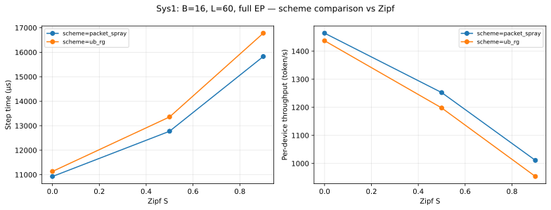
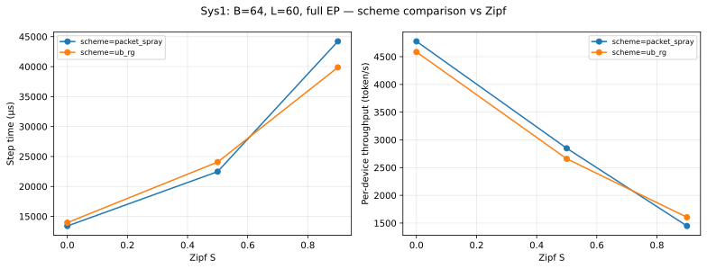
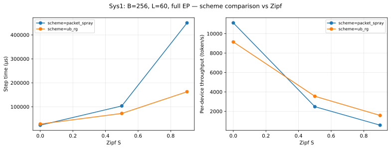
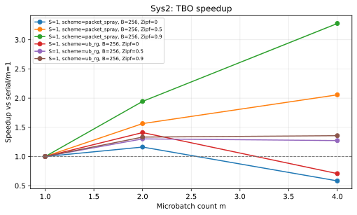
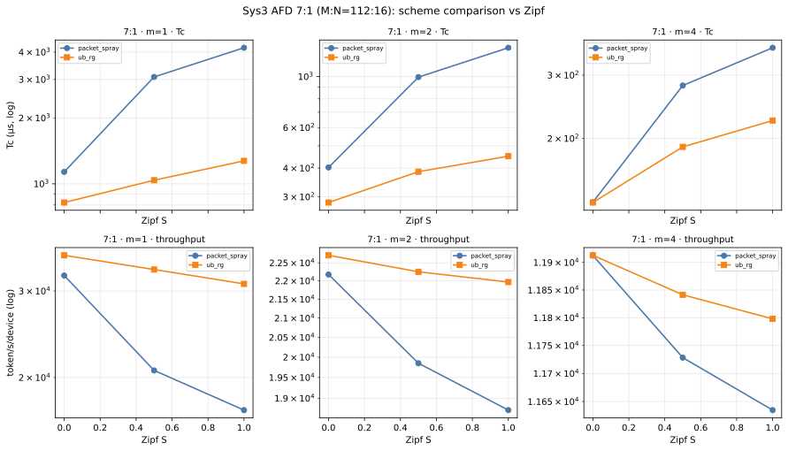
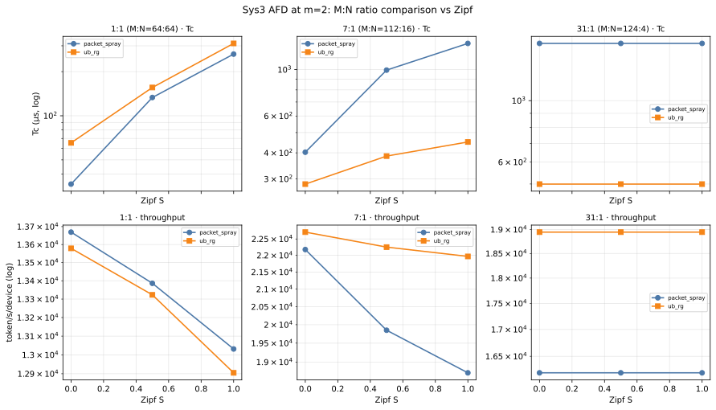
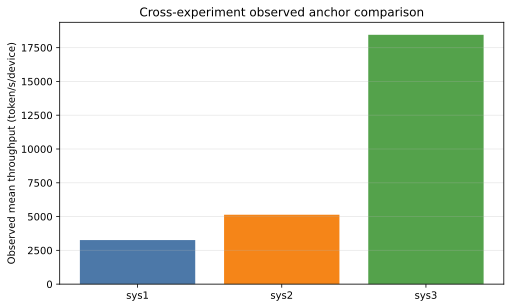

# UB_RG 系统实验 0719 报告

> 本报告只汇总 `engine/network_engine=packet` 的逐包证据。数据缺失处明确标为“缺失”，不使用行为级结果补齐，也不插值。

实验定义仅以精确文件 [`UB_RG实验设计0719.md`](./UB_RG实验设计0719.md) §4.3；不引用不含 `0719` 的同名设计文档。

> **执行状态：完成。** 网络任务 112 个，完成 112、失败 0；系统配置 72 个，完成 72、因网络输入失败 0。拓扑为场景1（单层 switch）。

## 1. 方法与参数矩阵

方法：从每个逐包运行的 `summary.json` 读取网络 CCT/P99 证据与系统模型输出，以 `ledger.json` 核对失败、跳过和裁剪；重复点仅在绘图时取算术平均，[`UB_RG系统实验0719数据.csv`](./UB_RG系统实验0719数据.csv) 保留逐运行记录。

| 实验 | 成功 summary | tier | 场景 | 网络方案 | B | Zipf S | EP | L | m |
|---|---|---|---|---|---|---|---|---|---|
| sys1 | 24 | controls, main | 1 | packet_spray, ub_rg | 16, 256, 64 | 0, 0.5, 0.9 | 128, 64 | 32, 60, 94 | 1 |
| sys2 | 18 | controls, main | 1 | packet_spray, ub_rg | 256 | 0, 0.5, 0.9 | 128 | 60 | 1, 2, 4 |
| sys3 | 30 | controls, main | 1 | packet_spray, ub_rg | 256 | 0, 0.5, 1 | 128 | 60 | 1, 2, 4 |

这是**实收参数矩阵**，不是对未运行配置的宣称；未出现的参数组合视为缺失或被裁剪。逐包证据清单与复现命令见文末附录。

## 2. 结论摘要

各实验的设计意图与逐点结论见后文 Sys1–Sys3 章首；此处先收束跨实验结论：
- 本报告仅含场景1逐包证据；不得外推到未跑拓扑。
- Sys1：串行 Wide-EP 主锚点上 `ub_rg` step 约为 Spray 的 0.7×（更快）。
- Sys2：Spray 上 TBO 有净加速；`ub_rg` 上并非必然获益（通信受限且 CCT 随 batch 缩小不足线性时，增大 m 可退化）。
- Sys3：本轮 AFD 双向掩盖率普遍远低于 100%；倾斜负载下 `ub_rg` 的 Tc 通常更低。
- 跨实验均值图不对齐部署形态（Wide-EP vs AFD），只作数据可用性概览，不能直接读成方案排名。B≥1024 未纳入；单 seed CCT 不作跨 seed P99。

## 3. Sys1：串行 Wide-EP（step 与 throughput）

**设计（§4.3.1）**：Wide-EP 同构部署；同一 microbatch 上 `Attn → Dispatch → FFN → Combine` **严格串行**，通讯与计算不重叠。主观测：step 时延与 per-device throughput（$B/T_{\mathrm{step}}$）。本报告范围：场景1；方案 `packet_spray` / `ub_rg`。

**本轮矩阵**：B∈{16, 64, 256} 均扫 Zipf S∈{0, 0.5, 0.9}（EP=128、L=60）；另含 EP=64 与 L∈{32, 94} 单点对照（默认 S=0.5）。实收 summary **24** 个。

**本轮结论**：

- 主锚点（B=256、S=0.5、L=60、EP=128）：Packet Spray step=103423.0 µs、吞吐 2475.3 token/s/device；`ub_rg` step=72160.4 µs、吞吐 3547.7。`ub_rg` step 约为 Spray 的 **0.7×**（更快），串行 Wide-EP 主锚点上逐包证据支持 `ub_rg` 相对 Spray 降 step。

- Zipf 敏感（B=256 Spray）：step 随 S 从 23043.6 （S=0）升至 103423.0（S=0.5）、450163.7（S=0.9）。

- B=16/64 与 B=256 一样具备完整 Zipf 三点曲线；下图按 B 分面，同图对比 `packet_spray` 与 `ub_rg`（仅 L=60、EP=128；EP/L 单点对照只在表中）。

| run | 场景 | 方案 | B | Zipf S | step (µs) | token/s/device |
|---|---|---|---|---|---|---|
| sys1_s1_packet_spray_b16_z0.5_ep128_L60_m1_sd1 | 1 | packet_spray | 16 | 0.5 | 12775.542 | 1252.393 |
| sys1_s1_packet_spray_b16_z0.9_ep128_L60_m1_sd1 | 1 | packet_spray | 16 | 0.9 | 15827.142 | 1010.922 |
| sys1_s1_packet_spray_b16_z0_ep128_L60_m1_sd1 | 1 | packet_spray | 16 | 0 | 10927.722 | 1464.166 |
| sys1_s1_packet_spray_b256_z0.5_ep128_L32_m1_sd1 | 1 | packet_spray | 256 | 0.5 | 55136.229 | 4643.045 |
| sys1_s1_packet_spray_b256_z0.5_ep128_L60_m1_sd1 | 1 | packet_spray | 256 | 0.5 | 103423.002 | 2475.271 |
| sys1_s1_packet_spray_b256_z0.5_ep128_L94_m1_sd1 | 1 | packet_spray | 256 | 0.5 | 161973.276 | 1580.508 |
| sys1_s1_packet_spray_b256_z0.5_ep64_L60_m1_sd1 | 1 | packet_spray | 256 | 0.5 | 53787.762 | 4759.447 |
| sys1_s1_packet_spray_b256_z0.9_ep128_L60_m1_sd1 | 1 | packet_spray | 256 | 0.9 | 450163.662 | 568.682 |
| sys1_s1_packet_spray_b256_z0_ep128_L60_m1_sd1 | 1 | packet_spray | 256 | 0 | 23043.582 | 11109.384 |
| sys1_s1_packet_spray_b64_z0.5_ep128_L60_m1_sd1 | 1 | packet_spray | 64 | 0.5 | 22469.862 | 2848.26 |
| sys1_s1_packet_spray_b64_z0.9_ep128_L60_m1_sd1 | 1 | packet_spray | 64 | 0.9 | 44218.662 | 1447.353 |
| sys1_s1_packet_spray_b64_z0_ep128_L60_m1_sd1 | 1 | packet_spray | 64 | 0 | 13398.402 | 4776.689 |
| sys1_s1_ub_rg_b16_z0.5_ep128_L60_m1_sd1 | 1 | ub_rg | 16 | 0.5 | 13359.462 | 1197.653 |
| sys1_s1_ub_rg_b16_z0.9_ep128_L60_m1_sd1 | 1 | ub_rg | 16 | 0.9 | 16779.882 | 953.523 |
| sys1_s1_ub_rg_b16_z0_ep128_L60_m1_sd1 | 1 | ub_rg | 16 | 0 | 11133.342 | 1437.125 |
| sys1_s1_ub_rg_b256_z0.5_ep128_L32_m1_sd1 | 1 | ub_rg | 256 | 0.5 | 38462.821 | 6655.778 |
| sys1_s1_ub_rg_b256_z0.5_ep128_L60_m1_sd1 | 1 | ub_rg | 256 | 0.5 | 72160.362 | 3547.654 |
| sys1_s1_ub_rg_b256_z0.5_ep128_L94_m1_sd1 | 1 | ub_rg | 256 | 0.5 | 112995.14 | 2265.584 |
| sys1_s1_ub_rg_b256_z0.5_ep64_L60_m1_sd1 | 1 | ub_rg | 256 | 0.5 | 54426.882 | 4703.558 |
| sys1_s1_ub_rg_b256_z0.9_ep128_L60_m1_sd1 | 1 | ub_rg | 256 | 0.9 | 162695.262 | 1573.494 |
| sys1_s1_ub_rg_b256_z0_ep128_L60_m1_sd1 | 1 | ub_rg | 256 | 0 | 27995.322 | 9144.385 |
| sys1_s1_ub_rg_b64_z0.5_ep128_L60_m1_sd1 | 1 | ub_rg | 64 | 0.5 | 24070.602 | 2658.845 |
| sys1_s1_ub_rg_b64_z0.9_ep128_L60_m1_sd1 | 1 | ub_rg | 64 | 0.9 | 39874.542 | 1605.034 |
| sys1_s1_ub_rg_b64_z0_ep128_L60_m1_sd1 | 1 | ub_rg | 64 | 0 | 13958.502 | 4585.019 |







## 4. Sys2：Wide-EP TBO（m、speedup 与掩盖）

**设计（§4.3.2）**：仍为 Wide-EP；全局 batch 切成 m 个 microbatch，计算/通讯双 stream 做 TBO ping-pong，期望通讯被计算掩盖。主配置 m=2；对照 m=1（退化为不掩盖）与 m=4。每 MB 网络时延取自 batch=$B/m$ 的逐包 Dispatch/Combine CCT，并在 L 层上对每个 MB 各用一次。

**本轮矩阵**：场景1、B=256、EP=128、L=60；m∈{1, 2, 4} × S∈{0, 0.5, 0.9} × {`packet_spray`, `ub_rg`}。实收 summary **18** 个。

**本轮结论**：

- Packet Spray、S=0.5：m=2/m=4 相对 m=1 为 1.56× / 2.06×（mask：29.8% 通讯重叠 / 78.7% 通讯重叠）。加速主要来自更小 MB 的 CCT 下降；本矩阵未做因素消融。

- 高倾斜下掩盖变难：Spray S=0.9 时 m=2 相对 m=1 仅 1.94×（mask：8.5% 通讯重叠）。

- `ub_rg`、S=0.5：m=2/m=4 speedup 为 1.30× / 1.27×；通讯利用率≈1，计算几乎藏不住通讯（mask≈0）。

- `ub_rg`、S=0（已补齐 m=1/2/4）：speedup=1.41× / 0.71×；均匀流量下切 MB 同样放大总 RG 通讯，m 越大越差。

指标口径：Speedup 优先用 summary 明示值；否则仅在存在同锚点 m=1 或 Sys1 step 时计算 `baseline_step / sys2_step`。掩盖列优先用 summary 明示 mask/hidden；若只有序列化 TBO events，则精确计算通讯事件与计算事件的时长重叠比例，不从 speedup 猜测。

| run | m | step (µs) | 基线 step | speedup | mask | token/s/device |
|---|---|---|---|---|---|---|
| sys2_s1_packet_spray_b256_z0.5_ep128_L60_m1_sd1 | 1 | 103423.002 | 103423.002 | 1 | 0.0% 通讯重叠 | 2475.271 |
| sys2_s1_packet_spray_b256_z0.5_ep128_L60_m2_sd1 | 2 | 66130.175 | 103423.002 | 1.564 | 29.8% 通讯重叠 | 3871.153 |
| sys2_s1_packet_spray_b256_z0.5_ep128_L60_m4_sd1 | 4 | 50287.415 | 103423.002 | 2.057 | 78.7% 通讯重叠 | 5090.737 |
| sys2_s1_packet_spray_b256_z0.9_ep128_L60_m1_sd1 | 1 | 450163.662 | 450163.662 | 1 | 0.0% 通讯重叠 | 568.682 |
| sys2_s1_packet_spray_b256_z0.9_ep128_L60_m2_sd1 | 2 | 231550.655 | 450163.662 | 1.944 | 8.5% 通讯重叠 | 1105.59 |
| sys2_s1_packet_spray_b256_z0.9_ep128_L60_m4_sd1 | 4 | 137282.615 | 450163.662 | 3.279 | 28.8% 通讯重叠 | 1864.766 |
| sys2_s1_packet_spray_b256_z0_ep128_L60_m1_sd1 | 1 | 23043.582 | 23043.582 | 1 | 0.0% 通讯重叠 | 11109.384 |
| sys2_s1_packet_spray_b256_z0_ep128_L60_m2_sd1 | 2 | 19834.756 | 23043.582 | 1.162 | 99.6% 通讯重叠 | 12906.637 |
| sys2_s1_packet_spray_b256_z0_ep128_L60_m4_sd1 | 4 | 39604.179 | 23043.582 | 0.582 | 99.8% 通讯重叠 | 6463.964 |
| sys2_s1_ub_rg_b256_z0.5_ep128_L60_m1_sd1 | 1 | 72160.362 | 72160.362 | 1 | 0.0% 通讯重叠 | 3547.654 |
| sys2_s1_ub_rg_b256_z0.5_ep128_L60_m2_sd1 | 2 | 55444.775 | 72160.362 | 1.301 | 35.6% 通讯重叠 | 4617.207 |
| sys2_s1_ub_rg_b256_z0.5_ep128_L60_m4_sd1 | 4 | 56690.375 | 72160.362 | 1.273 | 69.8% 通讯重叠 | 4515.758 |
| sys2_s1_ub_rg_b256_z0.9_ep128_L60_m1_sd1 | 1 | 162695.262 | 162695.262 | 1 | 0.0% 通讯重叠 | 1573.494 |
| sys2_s1_ub_rg_b256_z0.9_ep128_L60_m2_sd1 | 2 | 122095.415 | 162695.262 | 1.333 | 16.1% 通讯重叠 | 2096.721 |
| sys2_s1_ub_rg_b256_z0.9_ep128_L60_m4_sd1 | 4 | 119906.135 | 162695.262 | 1.357 | 33.0% 通讯重叠 | 2135.003 |
| sys2_s1_ub_rg_b256_z0_ep128_L60_m1_sd1 | 1 | 27995.322 | 27995.322 | 1 | 0.0% 通讯重叠 | 9144.385 |
| sys2_s1_ub_rg_b256_z0_ep128_L60_m2_sd1 | 2 | 19854.2 | 27995.322 | 1.41 | 99.6% 通讯重叠 | 12893.997 |
| sys2_s1_ub_rg_b256_z0_ep128_L60_m4_sd1 | 4 | 39609.853 | 27995.322 | 0.707 | 99.8% 通讯重叠 | 6463.038 |



## 5. Sys3：AFD（M:N、Tc、双向掩盖率与 throughput）

**设计（§4.3.3）**：AFD 角色分离——M 个 Attention NPU 与 N 个 FFN NPU；层边界为非对称 M2N Dispatch / N2M Combine，再叠 m-microbatch ping-pong。网络侧测 $T_c=\max(T_{\mathrm{M2N}}, T_{\mathrm{N2M}})$，$T_f=\max(T_a,T_e)$。双向掩盖条件为 $m T_f \ge 2(T_f+T_c)$；表中**双向掩盖率**=$m T_f / 2(T_f+T_c)$（≥100% 为通过）。场景1 主推荐 7:1（M:N=112:16），对照 1:1 与 31:1。

**本轮矩阵**：场景1、B=256、L=60、placement=`role_packed`；7:1 为 m∈{1,2,4}×S∈{0,0.5,1} 全网格；1:1 与 31:1（exposed）在 m=2 上扫 S∈{0,0.5,1}；两方案 `packet_spray` / `ub_rg`。实收 summary **30** 个。

**本轮结论**：

- 双向掩盖率：0/30 个样本 ≥100%（通过）；本轮最小/中位/最大为 0.90% / 16.69% / 73.44%。未通过时表中直接给出该比率（越小说明 $T_c$ 相对 $T_f$ 越大）。

- 7:1、m=2、S=0.5：Spray Tc=994.7 µs、step=11285.2 µs；`ub_rg` Tc=386.0 µs、step=10067.7 µs。倾斜负载下 `ub_rg` 的 AFD Tc/step 更低。

- `ub_rg` 在均匀专家（S=0、7:1、m=2）Tc=283.4 µs，远低于同结构 S=0.5 的 386.0 µs；RG 对热点更敏感。

- 1:1 对照（m=2、S=0.5）`ub_rg` Tc=155.8 µs，双向掩盖率 33.1%；逐包证据不支持“本 fabric 上 m=2 可无条件隐藏 AFD 双向通信”。

- Tc 口径为单 seed 方向 CCT 的 max，不是跨 seed CCT-P99；不用逐 token latency 替代。
- 下图分两张：① 7:1 按 m=1/2/4 分面，对比 scheme×Zipf；② m=2 按 M:N=1:1/7:1/31:1 分面。Tc 与吞吐均用对数纵轴以便跨数量级对比。

| run | M:N | 比值 | placement | m | Tc (µs) | 双向掩盖率 | step (µs) | token/s/device |
|---|---|---|---|---|---|---|---|---|
| sys3_s1_packet_spray_b256_z0.5_ep128_L60_m1_M112_N16_hidden_role_packed_sd1 | 112:16 | 7 | role_packed | 1 | 3079.751 | 1.2% | 10834.341 | 20675.001 |
| sys3_s1_packet_spray_b256_z0.5_ep128_L60_m2_M112_N16_hidden_role_packed_sd1 | 112:16 | 7 | role_packed | 2 | 994.741 | 7.2% | 11285.248 | 19848.921 |
| sys3_s1_packet_spray_b256_z0.5_ep128_L60_m2_M124_N4_exposed_role_packed_sd1 | 124:4 | 31 | role_packed | 2 | 1609.056 | 5.9% | 15309.54 | 16199.05 |
| sys3_s1_packet_spray_b256_z0.5_ep128_L60_m2_M64_N64_hidden_role_packed_sd1 | 64:64 | 1 | role_packed | 2 | 133.22 | 36.6% | 9562.206 | 13386.032 |
| sys3_s1_packet_spray_b256_z0.5_ep128_L60_m4_M112_N16_hidden_role_packed_sd1 | 112:16 | 7 | role_packed | 4 | 280.721 | 43.1% | 19099.064 | 11728.323 |
| sys3_s1_packet_spray_b256_z0_ep128_L60_m1_M112_N16_hidden_role_packed_sd1 | 112:16 | 7 | role_packed | 1 | 1134.445 | 3.2% | 6943.729 | 32259.325 |
| sys3_s1_packet_spray_b256_z0_ep128_L60_m2_M112_N16_hidden_role_packed_sd1 | 112:16 | 7 | role_packed | 2 | 402.751 | 16.1% | 10101.268 | 22175.433 |
| sys3_s1_packet_spray_b256_z0_ep128_L60_m2_M124_N4_exposed_role_packed_sd1 | 124:4 | 31 | role_packed | 2 | 1609.056 | 5.9% | 15309.54 | 16199.05 |
| sys3_s1_packet_spray_b256_z0_ep128_L60_m2_M64_N64_hidden_role_packed_sd1 | 64:64 | 1 | role_packed | 2 | 34.175 | 69.3% | 9364.116 | 13669.202 |
| sys3_s1_packet_spray_b256_z0_ep128_L60_m4_M112_N16_hidden_role_packed_sd1 | 112:16 | 7 | role_packed | 4 | 132.95 | 73.4% | 18803.522 | 11912.662 |
| sys3_s1_packet_spray_b256_z1_ep128_L60_m1_M112_N16_hidden_role_packed_sd1 | 112:16 | 7 | role_packed | 1 | 4186.711 | 0.9% | 13048.261 | 17167.039 |
| sys3_s1_packet_spray_b256_z1_ep128_L60_m2_M112_N16_hidden_role_packed_sd1 | 112:16 | 7 | role_packed | 2 | 1334.621 | 5.5% | 11965.008 | 18721.257 |
| sys3_s1_packet_spray_b256_z1_ep128_L60_m2_M124_N4_exposed_role_packed_sd1 | 124:4 | 31 | role_packed | 2 | 1609.056 | 5.9% | 15309.54 | 16199.05 |
| sys3_s1_packet_spray_b256_z1_ep128_L60_m2_M64_N64_hidden_role_packed_sd1 | 64:64 | 1 | role_packed | 2 | 263.36 | 22.6% | 9822.486 | 13031.324 |
| sys3_s1_packet_spray_b256_z1_ep128_L60_m4_M112_N16_hidden_role_packed_sd1 | 112:16 | 7 | role_packed | 4 | 357.504 | 35.4% | 19252.63 | 11634.774 |
| sys3_s1_ub_rg_b256_z0.5_ep128_L60_m1_M112_N16_hidden_role_packed_sd1 | 112:16 | 7 | role_packed | 1 | 1038.791 | 3.5% | 6752.421 | 33173.289 |
| sys3_s1_ub_rg_b256_z0.5_ep128_L60_m2_M112_N16_hidden_role_packed_sd1 | 112:16 | 7 | role_packed | 2 | 385.954 | 16.6% | 10067.674 | 22249.428 |
| sys3_s1_ub_rg_b256_z0.5_ep128_L60_m2_M124_N4_exposed_role_packed_sd1 | 124:4 | 31 | role_packed | 2 | 499.74 | 16.7% | 13090.908 | 18944.446 |
| sys3_s1_ub_rg_b256_z0.5_ep128_L60_m2_M64_N64_hidden_role_packed_sd1 | 64:64 | 1 | role_packed | 2 | 155.847 | 33.1% | 9607.46 | 13322.98 |
| sys3_s1_ub_rg_b256_z0.5_ep128_L60_m4_M112_N16_hidden_role_packed_sd1 | 112:16 | 7 | role_packed | 4 | 189.533 | 57.8% | 18916.688 | 11841.396 |
| sys3_s1_ub_rg_b256_z0_ep128_L60_m1_M112_N16_hidden_role_packed_sd1 | 112:16 | 7 | role_packed | 1 | 821.49 | 4.3% | 6317.819 | 35455.275 |
| sys3_s1_ub_rg_b256_z0_ep128_L60_m2_M112_N16_hidden_role_packed_sd1 | 112:16 | 7 | role_packed | 2 | 283.45 | 21.4% | 9862.666 | 22711.911 |
| sys3_s1_ub_rg_b256_z0_ep128_L60_m2_M124_N4_exposed_role_packed_sd1 | 124:4 | 31 | role_packed | 2 | 499.74 | 16.7% | 13090.908 | 18944.446 |
| sys3_s1_ub_rg_b256_z0_ep128_L60_m2_M64_N64_hidden_role_packed_sd1 | 64:64 | 1 | role_packed | 2 | 65.325 | 54.1% | 9426.416 | 13578.861 |
| sys3_s1_ub_rg_b256_z0_ep128_L60_m4_M112_N16_hidden_role_packed_sd1 | 112:16 | 7 | role_packed | 4 | 132.725 | 73.4% | 18803.072 | 11912.947 |
| sys3_s1_ub_rg_b256_z1_ep128_L60_m1_M112_N16_hidden_role_packed_sd1 | 112:16 | 7 | role_packed | 1 | 1273.49 | 2.9% | 7221.819 | 31017.118 |
| sys3_s1_ub_rg_b256_z1_ep128_L60_m2_M112_N16_hidden_role_packed_sd1 | 112:16 | 7 | role_packed | 2 | 450.754 | 14.6% | 10197.274 | 21966.654 |
| sys3_s1_ub_rg_b256_z1_ep128_L60_m2_M124_N4_exposed_role_packed_sd1 | 124:4 | 31 | role_packed | 2 | 499.74 | 16.7% | 13090.908 | 18944.446 |
| sys3_s1_ub_rg_b256_z1_ep128_L60_m2_M64_N64_hidden_role_packed_sd1 | 64:64 | 1 | role_packed | 2 | 311.496 | 19.8% | 9918.758 | 12904.841 |
| sys3_s1_ub_rg_b256_z1_ep128_L60_m4_M112_N16_hidden_role_packed_sd1 | 112:16 | 7 | role_packed | 4 | 224.353 | 51.1% | 18986.328 | 11797.963 |





## 6. 跨实验锚点

可比锚点至少应对齐场景、网络方案、B、Zipf S 与 L；Sys2 还需说明 m，Sys3 还需说明 M:N/placement。下图仅展示各实验**已有样本均值**作数据可用性概览，不把未完全对齐的均值解释为方案优劣。

| 实验 | 样本数 | 实收 step 均值 (µs) | 实收吞吐均值 |
|---|---|---|---|
| sys1 | 24 | 64794.04 | 3260.99 |
| sys2 | 18 | 99876.208 | 5135.747 |
| sys3 | 30 | 12378.721 | 18452.415 |



## 附录 A. 逐包证据来源与 packet 门禁

- 输入根目录：`/home/sim/dyn_latency/results/ub_rg_system_packet`
- 已接受 summary：72 个；ledger：1 个
- 门禁规则：每个可解析输入必须至少声明一个 `engine` 或 `network_engine`，且所有此类声明都必须严格等于 `packet`（二者只需其一；本仓库 system summary 通常只写 `engine=packet`）。runner 的 ledger 也可用`packet_only=true` 作等价声明。`behavioral` 会立即报错并停止写出。

- `sys1/sys1_s1_packet_spray_b16_z0.5_ep128_L60_m1_sd1`：`sys1/sys1_s1_packet_spray_b16_z0.5_ep128_L60_m1_sd1/summary.json`；`/home/sim/dyn_latency/results/ub_rg_system_packet/network/s1_packet_spray_dispatch_mb16_z0.5_ep128_sd1/summary.json`；`/home/sim/dyn_latency/results/ub_rg_system_packet/network/s1_packet_spray_combine_mb16_z0.5_ep128_sd1/summary.json`；engine=packet

- `sys1/sys1_s1_packet_spray_b16_z0.9_ep128_L60_m1_sd1`：`sys1/sys1_s1_packet_spray_b16_z0.9_ep128_L60_m1_sd1/summary.json`；`/home/sim/dyn_latency/results/ub_rg_system_packet/network/s1_packet_spray_dispatch_mb16_z0.9_ep128_sd1/summary.json`；`/home/sim/dyn_latency/results/ub_rg_system_packet/network/s1_packet_spray_combine_mb16_z0.9_ep128_sd1/summary.json`；engine=packet

- `sys1/sys1_s1_packet_spray_b16_z0_ep128_L60_m1_sd1`：`sys1/sys1_s1_packet_spray_b16_z0_ep128_L60_m1_sd1/summary.json`；`/home/sim/dyn_latency/results/ub_rg_system_packet/network/s1_packet_spray_dispatch_mb16_z0_ep128_sd1/summary.json`；`/home/sim/dyn_latency/results/ub_rg_system_packet/network/s1_packet_spray_combine_mb16_z0_ep128_sd1/summary.json`；engine=packet

- `sys1/sys1_s1_packet_spray_b256_z0.5_ep128_L32_m1_sd1`：`sys1/sys1_s1_packet_spray_b256_z0.5_ep128_L32_m1_sd1/summary.json`；`/home/sim/dyn_latency/results/ub_rg_system_packet/network/s1_packet_spray_dispatch_mb256_z0.5_ep128_sd1/summary.json`；`/home/sim/dyn_latency/results/ub_rg_system_packet/network/s1_packet_spray_combine_mb256_z0.5_ep128_sd1/summary.json`；engine=packet

- `sys1/sys1_s1_packet_spray_b256_z0.5_ep128_L60_m1_sd1`：`sys1/sys1_s1_packet_spray_b256_z0.5_ep128_L60_m1_sd1/summary.json`；`/home/sim/dyn_latency/results/ub_rg_system_packet/network/s1_packet_spray_dispatch_mb256_z0.5_ep128_sd1/summary.json`；`/home/sim/dyn_latency/results/ub_rg_system_packet/network/s1_packet_spray_combine_mb256_z0.5_ep128_sd1/summary.json`；engine=packet

- `sys1/sys1_s1_packet_spray_b256_z0.5_ep128_L94_m1_sd1`：`sys1/sys1_s1_packet_spray_b256_z0.5_ep128_L94_m1_sd1/summary.json`；`/home/sim/dyn_latency/results/ub_rg_system_packet/network/s1_packet_spray_dispatch_mb256_z0.5_ep128_sd1/summary.json`；`/home/sim/dyn_latency/results/ub_rg_system_packet/network/s1_packet_spray_combine_mb256_z0.5_ep128_sd1/summary.json`；engine=packet

- `sys1/sys1_s1_packet_spray_b256_z0.5_ep64_L60_m1_sd1`：`sys1/sys1_s1_packet_spray_b256_z0.5_ep64_L60_m1_sd1/summary.json`；`/home/sim/dyn_latency/results/ub_rg_system_packet/network/s1_packet_spray_dispatch_mb256_z0.5_ep64_sd1/summary.json`；`/home/sim/dyn_latency/results/ub_rg_system_packet/network/s1_packet_spray_combine_mb256_z0.5_ep64_sd1/summary.json`；engine=packet

- `sys1/sys1_s1_packet_spray_b256_z0.9_ep128_L60_m1_sd1`：`sys1/sys1_s1_packet_spray_b256_z0.9_ep128_L60_m1_sd1/summary.json`；`/home/sim/dyn_latency/results/ub_rg_system_packet/network/s1_packet_spray_dispatch_mb256_z0.9_ep128_sd1/summary.json`；`/home/sim/dyn_latency/results/ub_rg_system_packet/network/s1_packet_spray_combine_mb256_z0.9_ep128_sd1/summary.json`；engine=packet

- `sys1/sys1_s1_packet_spray_b256_z0_ep128_L60_m1_sd1`：`sys1/sys1_s1_packet_spray_b256_z0_ep128_L60_m1_sd1/summary.json`；`/home/sim/dyn_latency/results/ub_rg_system_packet/network/s1_packet_spray_dispatch_mb256_z0_ep128_sd1/summary.json`；`/home/sim/dyn_latency/results/ub_rg_system_packet/network/s1_packet_spray_combine_mb256_z0_ep128_sd1/summary.json`；engine=packet

- `sys1/sys1_s1_packet_spray_b64_z0.5_ep128_L60_m1_sd1`：`sys1/sys1_s1_packet_spray_b64_z0.5_ep128_L60_m1_sd1/summary.json`；`/home/sim/dyn_latency/results/ub_rg_system_packet/network/s1_packet_spray_dispatch_mb64_z0.5_ep128_sd1/summary.json`；`/home/sim/dyn_latency/results/ub_rg_system_packet/network/s1_packet_spray_combine_mb64_z0.5_ep128_sd1/summary.json`；engine=packet

- `sys1/sys1_s1_packet_spray_b64_z0.9_ep128_L60_m1_sd1`：`sys1/sys1_s1_packet_spray_b64_z0.9_ep128_L60_m1_sd1/summary.json`；`/home/sim/dyn_latency/results/ub_rg_system_packet/network/s1_packet_spray_dispatch_mb64_z0.9_ep128_sd1/summary.json`；`/home/sim/dyn_latency/results/ub_rg_system_packet/network/s1_packet_spray_combine_mb64_z0.9_ep128_sd1/summary.json`；engine=packet

- `sys1/sys1_s1_packet_spray_b64_z0_ep128_L60_m1_sd1`：`sys1/sys1_s1_packet_spray_b64_z0_ep128_L60_m1_sd1/summary.json`；`/home/sim/dyn_latency/results/ub_rg_system_packet/network/s1_packet_spray_dispatch_mb64_z0_ep128_sd1/summary.json`；`/home/sim/dyn_latency/results/ub_rg_system_packet/network/s1_packet_spray_combine_mb64_z0_ep128_sd1/summary.json`；engine=packet

- `sys1/sys1_s1_ub_rg_b16_z0.5_ep128_L60_m1_sd1`：`sys1/sys1_s1_ub_rg_b16_z0.5_ep128_L60_m1_sd1/summary.json`；`/home/sim/dyn_latency/results/ub_rg_system_packet/network/s1_ub_rg_dispatch_mb16_z0.5_ep128_sd1/summary.json`；`/home/sim/dyn_latency/results/ub_rg_system_packet/network/s1_ub_rg_combine_mb16_z0.5_ep128_sd1/summary.json`；engine=packet

- `sys1/sys1_s1_ub_rg_b16_z0.9_ep128_L60_m1_sd1`：`sys1/sys1_s1_ub_rg_b16_z0.9_ep128_L60_m1_sd1/summary.json`；`/home/sim/dyn_latency/results/ub_rg_system_packet/network/s1_ub_rg_dispatch_mb16_z0.9_ep128_sd1/summary.json`；`/home/sim/dyn_latency/results/ub_rg_system_packet/network/s1_ub_rg_combine_mb16_z0.9_ep128_sd1/summary.json`；engine=packet

- `sys1/sys1_s1_ub_rg_b16_z0_ep128_L60_m1_sd1`：`sys1/sys1_s1_ub_rg_b16_z0_ep128_L60_m1_sd1/summary.json`；`/home/sim/dyn_latency/results/ub_rg_system_packet/network/s1_ub_rg_dispatch_mb16_z0_ep128_sd1/summary.json`；`/home/sim/dyn_latency/results/ub_rg_system_packet/network/s1_ub_rg_combine_mb16_z0_ep128_sd1/summary.json`；engine=packet

- `sys1/sys1_s1_ub_rg_b256_z0.5_ep128_L32_m1_sd1`：`sys1/sys1_s1_ub_rg_b256_z0.5_ep128_L32_m1_sd1/summary.json`；`/home/sim/dyn_latency/results/ub_rg_system_packet/network/s1_ub_rg_dispatch_mb256_z0.5_ep128_sd1/summary.json`；`/home/sim/dyn_latency/results/ub_rg_system_packet/network/s1_ub_rg_combine_mb256_z0.5_ep128_sd1/summary.json`；engine=packet

- `sys1/sys1_s1_ub_rg_b256_z0.5_ep128_L60_m1_sd1`：`sys1/sys1_s1_ub_rg_b256_z0.5_ep128_L60_m1_sd1/summary.json`；`/home/sim/dyn_latency/results/ub_rg_system_packet/network/s1_ub_rg_dispatch_mb256_z0.5_ep128_sd1/summary.json`；`/home/sim/dyn_latency/results/ub_rg_system_packet/network/s1_ub_rg_combine_mb256_z0.5_ep128_sd1/summary.json`；engine=packet

- `sys1/sys1_s1_ub_rg_b256_z0.5_ep128_L94_m1_sd1`：`sys1/sys1_s1_ub_rg_b256_z0.5_ep128_L94_m1_sd1/summary.json`；`/home/sim/dyn_latency/results/ub_rg_system_packet/network/s1_ub_rg_dispatch_mb256_z0.5_ep128_sd1/summary.json`；`/home/sim/dyn_latency/results/ub_rg_system_packet/network/s1_ub_rg_combine_mb256_z0.5_ep128_sd1/summary.json`；engine=packet

- `sys1/sys1_s1_ub_rg_b256_z0.5_ep64_L60_m1_sd1`：`sys1/sys1_s1_ub_rg_b256_z0.5_ep64_L60_m1_sd1/summary.json`；`/home/sim/dyn_latency/results/ub_rg_system_packet/network/s1_ub_rg_dispatch_mb256_z0.5_ep64_sd1/summary.json`；`/home/sim/dyn_latency/results/ub_rg_system_packet/network/s1_ub_rg_combine_mb256_z0.5_ep64_sd1/summary.json`；engine=packet

- `sys1/sys1_s1_ub_rg_b256_z0.9_ep128_L60_m1_sd1`：`sys1/sys1_s1_ub_rg_b256_z0.9_ep128_L60_m1_sd1/summary.json`；`/home/sim/dyn_latency/results/ub_rg_system_packet/network/s1_ub_rg_dispatch_mb256_z0.9_ep128_sd1/summary.json`；`/home/sim/dyn_latency/results/ub_rg_system_packet/network/s1_ub_rg_combine_mb256_z0.9_ep128_sd1/summary.json`；engine=packet

- `sys1/sys1_s1_ub_rg_b256_z0_ep128_L60_m1_sd1`：`sys1/sys1_s1_ub_rg_b256_z0_ep128_L60_m1_sd1/summary.json`；`/home/sim/dyn_latency/results/ub_rg_system_packet/network/s1_ub_rg_dispatch_mb256_z0_ep128_sd1/summary.json`；`/home/sim/dyn_latency/results/ub_rg_system_packet/network/s1_ub_rg_combine_mb256_z0_ep128_sd1/summary.json`；engine=packet

- `sys1/sys1_s1_ub_rg_b64_z0.5_ep128_L60_m1_sd1`：`sys1/sys1_s1_ub_rg_b64_z0.5_ep128_L60_m1_sd1/summary.json`；`/home/sim/dyn_latency/results/ub_rg_system_packet/network/s1_ub_rg_dispatch_mb64_z0.5_ep128_sd1/summary.json`；`/home/sim/dyn_latency/results/ub_rg_system_packet/network/s1_ub_rg_combine_mb64_z0.5_ep128_sd1/summary.json`；engine=packet

- `sys1/sys1_s1_ub_rg_b64_z0.9_ep128_L60_m1_sd1`：`sys1/sys1_s1_ub_rg_b64_z0.9_ep128_L60_m1_sd1/summary.json`；`/home/sim/dyn_latency/results/ub_rg_system_packet/network/s1_ub_rg_dispatch_mb64_z0.9_ep128_sd1/summary.json`；`/home/sim/dyn_latency/results/ub_rg_system_packet/network/s1_ub_rg_combine_mb64_z0.9_ep128_sd1/summary.json`；engine=packet

- `sys1/sys1_s1_ub_rg_b64_z0_ep128_L60_m1_sd1`：`sys1/sys1_s1_ub_rg_b64_z0_ep128_L60_m1_sd1/summary.json`；`/home/sim/dyn_latency/results/ub_rg_system_packet/network/s1_ub_rg_dispatch_mb64_z0_ep128_sd1/summary.json`；`/home/sim/dyn_latency/results/ub_rg_system_packet/network/s1_ub_rg_combine_mb64_z0_ep128_sd1/summary.json`；engine=packet

- `sys2/sys2_s1_packet_spray_b256_z0.5_ep128_L60_m1_sd1`：`sys2/sys2_s1_packet_spray_b256_z0.5_ep128_L60_m1_sd1/summary.json`；`/home/sim/dyn_latency/results/ub_rg_system_packet/network/s1_packet_spray_dispatch_mb256_z0.5_ep128_sd1/summary.json`；`/home/sim/dyn_latency/results/ub_rg_system_packet/network/s1_packet_spray_combine_mb256_z0.5_ep128_sd1/summary.json`；engine=packet

- `sys2/sys2_s1_packet_spray_b256_z0.5_ep128_L60_m2_sd1`：`sys2/sys2_s1_packet_spray_b256_z0.5_ep128_L60_m2_sd1/summary.json`；`/home/sim/dyn_latency/results/ub_rg_system_packet/network/s1_packet_spray_dispatch_mb128_z0.5_ep128_sd1/summary.json`；`/home/sim/dyn_latency/results/ub_rg_system_packet/network/s1_packet_spray_combine_mb128_z0.5_ep128_sd1/summary.json`；engine=packet

- `sys2/sys2_s1_packet_spray_b256_z0.5_ep128_L60_m4_sd1`：`sys2/sys2_s1_packet_spray_b256_z0.5_ep128_L60_m4_sd1/summary.json`；`/home/sim/dyn_latency/results/ub_rg_system_packet/network/s1_packet_spray_dispatch_mb64_z0.5_ep128_sd1/summary.json`；`/home/sim/dyn_latency/results/ub_rg_system_packet/network/s1_packet_spray_combine_mb64_z0.5_ep128_sd1/summary.json`；engine=packet

- `sys2/sys2_s1_packet_spray_b256_z0.9_ep128_L60_m1_sd1`：`sys2/sys2_s1_packet_spray_b256_z0.9_ep128_L60_m1_sd1/summary.json`；`/home/sim/dyn_latency/results/ub_rg_system_packet/network/s1_packet_spray_dispatch_mb256_z0.9_ep128_sd1/summary.json`；`/home/sim/dyn_latency/results/ub_rg_system_packet/network/s1_packet_spray_combine_mb256_z0.9_ep128_sd1/summary.json`；engine=packet

- `sys2/sys2_s1_packet_spray_b256_z0.9_ep128_L60_m2_sd1`：`sys2/sys2_s1_packet_spray_b256_z0.9_ep128_L60_m2_sd1/summary.json`；`/home/sim/dyn_latency/results/ub_rg_system_packet/network/s1_packet_spray_dispatch_mb128_z0.9_ep128_sd1/summary.json`；`/home/sim/dyn_latency/results/ub_rg_system_packet/network/s1_packet_spray_combine_mb128_z0.9_ep128_sd1/summary.json`；engine=packet

- `sys2/sys2_s1_packet_spray_b256_z0.9_ep128_L60_m4_sd1`：`sys2/sys2_s1_packet_spray_b256_z0.9_ep128_L60_m4_sd1/summary.json`；`/home/sim/dyn_latency/results/ub_rg_system_packet/network/s1_packet_spray_dispatch_mb64_z0.9_ep128_sd1/summary.json`；`/home/sim/dyn_latency/results/ub_rg_system_packet/network/s1_packet_spray_combine_mb64_z0.9_ep128_sd1/summary.json`；engine=packet

- `sys2/sys2_s1_packet_spray_b256_z0_ep128_L60_m1_sd1`：`sys2/sys2_s1_packet_spray_b256_z0_ep128_L60_m1_sd1/summary.json`；`/home/sim/dyn_latency/results/ub_rg_system_packet/network/s1_packet_spray_dispatch_mb256_z0_ep128_sd1/summary.json`；`/home/sim/dyn_latency/results/ub_rg_system_packet/network/s1_packet_spray_combine_mb256_z0_ep128_sd1/summary.json`；engine=packet

- `sys2/sys2_s1_packet_spray_b256_z0_ep128_L60_m2_sd1`：`sys2/sys2_s1_packet_spray_b256_z0_ep128_L60_m2_sd1/summary.json`；`/home/sim/dyn_latency/results/ub_rg_system_packet/network/s1_packet_spray_dispatch_mb128_z0_ep128_sd1/summary.json`；`/home/sim/dyn_latency/results/ub_rg_system_packet/network/s1_packet_spray_combine_mb128_z0_ep128_sd1/summary.json`；engine=packet

- `sys2/sys2_s1_packet_spray_b256_z0_ep128_L60_m4_sd1`：`sys2/sys2_s1_packet_spray_b256_z0_ep128_L60_m4_sd1/summary.json`；`/home/sim/dyn_latency/results/ub_rg_system_packet/network/s1_packet_spray_dispatch_mb64_z0_ep128_sd1/summary.json`；`/home/sim/dyn_latency/results/ub_rg_system_packet/network/s1_packet_spray_combine_mb64_z0_ep128_sd1/summary.json`；engine=packet

- `sys2/sys2_s1_ub_rg_b256_z0.5_ep128_L60_m1_sd1`：`sys2/sys2_s1_ub_rg_b256_z0.5_ep128_L60_m1_sd1/summary.json`；`/home/sim/dyn_latency/results/ub_rg_system_packet/network/s1_ub_rg_dispatch_mb256_z0.5_ep128_sd1/summary.json`；`/home/sim/dyn_latency/results/ub_rg_system_packet/network/s1_ub_rg_combine_mb256_z0.5_ep128_sd1/summary.json`；engine=packet

- `sys2/sys2_s1_ub_rg_b256_z0.5_ep128_L60_m2_sd1`：`sys2/sys2_s1_ub_rg_b256_z0.5_ep128_L60_m2_sd1/summary.json`；`/home/sim/dyn_latency/results/ub_rg_system_packet/network/s1_ub_rg_dispatch_mb128_z0.5_ep128_sd1/summary.json`；`/home/sim/dyn_latency/results/ub_rg_system_packet/network/s1_ub_rg_combine_mb128_z0.5_ep128_sd1/summary.json`；engine=packet

- `sys2/sys2_s1_ub_rg_b256_z0.5_ep128_L60_m4_sd1`：`sys2/sys2_s1_ub_rg_b256_z0.5_ep128_L60_m4_sd1/summary.json`；`/home/sim/dyn_latency/results/ub_rg_system_packet/network/s1_ub_rg_dispatch_mb64_z0.5_ep128_sd1/summary.json`；`/home/sim/dyn_latency/results/ub_rg_system_packet/network/s1_ub_rg_combine_mb64_z0.5_ep128_sd1/summary.json`；engine=packet

- `sys2/sys2_s1_ub_rg_b256_z0.9_ep128_L60_m1_sd1`：`sys2/sys2_s1_ub_rg_b256_z0.9_ep128_L60_m1_sd1/summary.json`；`/home/sim/dyn_latency/results/ub_rg_system_packet/network/s1_ub_rg_dispatch_mb256_z0.9_ep128_sd1/summary.json`；`/home/sim/dyn_latency/results/ub_rg_system_packet/network/s1_ub_rg_combine_mb256_z0.9_ep128_sd1/summary.json`；engine=packet

- `sys2/sys2_s1_ub_rg_b256_z0.9_ep128_L60_m2_sd1`：`sys2/sys2_s1_ub_rg_b256_z0.9_ep128_L60_m2_sd1/summary.json`；`/home/sim/dyn_latency/results/ub_rg_system_packet/network/s1_ub_rg_dispatch_mb128_z0.9_ep128_sd1/summary.json`；`/home/sim/dyn_latency/results/ub_rg_system_packet/network/s1_ub_rg_combine_mb128_z0.9_ep128_sd1/summary.json`；engine=packet

- `sys2/sys2_s1_ub_rg_b256_z0.9_ep128_L60_m4_sd1`：`sys2/sys2_s1_ub_rg_b256_z0.9_ep128_L60_m4_sd1/summary.json`；`/home/sim/dyn_latency/results/ub_rg_system_packet/network/s1_ub_rg_dispatch_mb64_z0.9_ep128_sd1/summary.json`；`/home/sim/dyn_latency/results/ub_rg_system_packet/network/s1_ub_rg_combine_mb64_z0.9_ep128_sd1/summary.json`；engine=packet

- `sys2/sys2_s1_ub_rg_b256_z0_ep128_L60_m1_sd1`：`sys2/sys2_s1_ub_rg_b256_z0_ep128_L60_m1_sd1/summary.json`；`/home/sim/dyn_latency/results/ub_rg_system_packet/network/s1_ub_rg_dispatch_mb256_z0_ep128_sd1/summary.json`；`/home/sim/dyn_latency/results/ub_rg_system_packet/network/s1_ub_rg_combine_mb256_z0_ep128_sd1/summary.json`；engine=packet

- `sys2/sys2_s1_ub_rg_b256_z0_ep128_L60_m2_sd1`：`sys2/sys2_s1_ub_rg_b256_z0_ep128_L60_m2_sd1/summary.json`；`/home/sim/dyn_latency/results/ub_rg_system_packet/network/s1_ub_rg_dispatch_mb128_z0_ep128_sd1/summary.json`；`/home/sim/dyn_latency/results/ub_rg_system_packet/network/s1_ub_rg_combine_mb128_z0_ep128_sd1/summary.json`；engine=packet

- `sys2/sys2_s1_ub_rg_b256_z0_ep128_L60_m4_sd1`：`sys2/sys2_s1_ub_rg_b256_z0_ep128_L60_m4_sd1/summary.json`；`/home/sim/dyn_latency/results/ub_rg_system_packet/network/s1_ub_rg_dispatch_mb64_z0_ep128_sd1/summary.json`；`/home/sim/dyn_latency/results/ub_rg_system_packet/network/s1_ub_rg_combine_mb64_z0_ep128_sd1/summary.json`；engine=packet

- `sys3/sys3_s1_packet_spray_b256_z0.5_ep128_L60_m1_M112_N16_hidden_role_packed_sd1`：`sys3/sys3_s1_packet_spray_b256_z0.5_ep128_L60_m1_M112_N16_hidden_role_packed_sd1/summary.json`；`/home/sim/dyn_latency/results/ub_rg_system_packet/network/s1_packet_spray_afd_m2n_mb256_z0.5_ep128_M112_N16_role_packed_sd1/summary.json`；`/home/sim/dyn_latency/results/ub_rg_system_packet/network/s1_packet_spray_afd_n2m_mb256_z0.5_ep128_M112_N16_role_packed_sd1/summary.json`；engine=packet

- `sys3/sys3_s1_packet_spray_b256_z0.5_ep128_L60_m2_M112_N16_hidden_role_packed_sd1`：`sys3/sys3_s1_packet_spray_b256_z0.5_ep128_L60_m2_M112_N16_hidden_role_packed_sd1/summary.json`；`/home/sim/dyn_latency/results/ub_rg_system_packet/network/s1_packet_spray_afd_m2n_mb128_z0.5_ep128_M112_N16_role_packed_sd1/summary.json`；`/home/sim/dyn_latency/results/ub_rg_system_packet/network/s1_packet_spray_afd_n2m_mb128_z0.5_ep128_M112_N16_role_packed_sd1/summary.json`；engine=packet

- `sys3/sys3_s1_packet_spray_b256_z0.5_ep128_L60_m2_M124_N4_exposed_role_packed_sd1`：`sys3/sys3_s1_packet_spray_b256_z0.5_ep128_L60_m2_M124_N4_exposed_role_packed_sd1/summary.json`；`/home/sim/dyn_latency/results/ub_rg_system_packet/network/s1_packet_spray_afd_m2n_mb128_z0.5_ep128_M124_N4_role_packed_sd1/summary.json`；`/home/sim/dyn_latency/results/ub_rg_system_packet/network/s1_packet_spray_afd_n2m_mb128_z0.5_ep128_M124_N4_role_packed_sd1/summary.json`；engine=packet

- `sys3/sys3_s1_packet_spray_b256_z0.5_ep128_L60_m2_M64_N64_hidden_role_packed_sd1`：`sys3/sys3_s1_packet_spray_b256_z0.5_ep128_L60_m2_M64_N64_hidden_role_packed_sd1/summary.json`；`/home/sim/dyn_latency/results/ub_rg_system_packet/network/s1_packet_spray_afd_m2n_mb128_z0.5_ep128_M64_N64_role_packed_sd1/summary.json`；`/home/sim/dyn_latency/results/ub_rg_system_packet/network/s1_packet_spray_afd_n2m_mb128_z0.5_ep128_M64_N64_role_packed_sd1/summary.json`；engine=packet

- `sys3/sys3_s1_packet_spray_b256_z0.5_ep128_L60_m4_M112_N16_hidden_role_packed_sd1`：`sys3/sys3_s1_packet_spray_b256_z0.5_ep128_L60_m4_M112_N16_hidden_role_packed_sd1/summary.json`；`/home/sim/dyn_latency/results/ub_rg_system_packet/network/s1_packet_spray_afd_m2n_mb64_z0.5_ep128_M112_N16_role_packed_sd1/summary.json`；`/home/sim/dyn_latency/results/ub_rg_system_packet/network/s1_packet_spray_afd_n2m_mb64_z0.5_ep128_M112_N16_role_packed_sd1/summary.json`；engine=packet

- `sys3/sys3_s1_packet_spray_b256_z0_ep128_L60_m1_M112_N16_hidden_role_packed_sd1`：`sys3/sys3_s1_packet_spray_b256_z0_ep128_L60_m1_M112_N16_hidden_role_packed_sd1/summary.json`；`/home/sim/dyn_latency/results/ub_rg_system_packet/network/s1_packet_spray_afd_m2n_mb256_z0_ep128_M112_N16_role_packed_sd1/summary.json`；`/home/sim/dyn_latency/results/ub_rg_system_packet/network/s1_packet_spray_afd_n2m_mb256_z0_ep128_M112_N16_role_packed_sd1/summary.json`；engine=packet

- `sys3/sys3_s1_packet_spray_b256_z0_ep128_L60_m2_M112_N16_hidden_role_packed_sd1`：`sys3/sys3_s1_packet_spray_b256_z0_ep128_L60_m2_M112_N16_hidden_role_packed_sd1/summary.json`；`/home/sim/dyn_latency/results/ub_rg_system_packet/network/s1_packet_spray_afd_m2n_mb128_z0_ep128_M112_N16_role_packed_sd1/summary.json`；`/home/sim/dyn_latency/results/ub_rg_system_packet/network/s1_packet_spray_afd_n2m_mb128_z0_ep128_M112_N16_role_packed_sd1/summary.json`；engine=packet

- `sys3/sys3_s1_packet_spray_b256_z0_ep128_L60_m2_M124_N4_exposed_role_packed_sd1`：`sys3/sys3_s1_packet_spray_b256_z0_ep128_L60_m2_M124_N4_exposed_role_packed_sd1/summary.json`；`/home/sim/dyn_latency/results/ub_rg_system_packet/network/s1_packet_spray_afd_m2n_mb128_z0_ep128_M124_N4_role_packed_sd1/summary.json`；`/home/sim/dyn_latency/results/ub_rg_system_packet/network/s1_packet_spray_afd_n2m_mb128_z0_ep128_M124_N4_role_packed_sd1/summary.json`；engine=packet

- `sys3/sys3_s1_packet_spray_b256_z0_ep128_L60_m2_M64_N64_hidden_role_packed_sd1`：`sys3/sys3_s1_packet_spray_b256_z0_ep128_L60_m2_M64_N64_hidden_role_packed_sd1/summary.json`；`/home/sim/dyn_latency/results/ub_rg_system_packet/network/s1_packet_spray_afd_m2n_mb128_z0_ep128_M64_N64_role_packed_sd1/summary.json`；`/home/sim/dyn_latency/results/ub_rg_system_packet/network/s1_packet_spray_afd_n2m_mb128_z0_ep128_M64_N64_role_packed_sd1/summary.json`；engine=packet

- `sys3/sys3_s1_packet_spray_b256_z0_ep128_L60_m4_M112_N16_hidden_role_packed_sd1`：`sys3/sys3_s1_packet_spray_b256_z0_ep128_L60_m4_M112_N16_hidden_role_packed_sd1/summary.json`；`/home/sim/dyn_latency/results/ub_rg_system_packet/network/s1_packet_spray_afd_m2n_mb64_z0_ep128_M112_N16_role_packed_sd1/summary.json`；`/home/sim/dyn_latency/results/ub_rg_system_packet/network/s1_packet_spray_afd_n2m_mb64_z0_ep128_M112_N16_role_packed_sd1/summary.json`；engine=packet

- `sys3/sys3_s1_packet_spray_b256_z1_ep128_L60_m1_M112_N16_hidden_role_packed_sd1`：`sys3/sys3_s1_packet_spray_b256_z1_ep128_L60_m1_M112_N16_hidden_role_packed_sd1/summary.json`；`/home/sim/dyn_latency/results/ub_rg_system_packet/network/s1_packet_spray_afd_m2n_mb256_z1_ep128_M112_N16_role_packed_sd1/summary.json`；`/home/sim/dyn_latency/results/ub_rg_system_packet/network/s1_packet_spray_afd_n2m_mb256_z1_ep128_M112_N16_role_packed_sd1/summary.json`；engine=packet

- `sys3/sys3_s1_packet_spray_b256_z1_ep128_L60_m2_M112_N16_hidden_role_packed_sd1`：`sys3/sys3_s1_packet_spray_b256_z1_ep128_L60_m2_M112_N16_hidden_role_packed_sd1/summary.json`；`/home/sim/dyn_latency/results/ub_rg_system_packet/network/s1_packet_spray_afd_m2n_mb128_z1_ep128_M112_N16_role_packed_sd1/summary.json`；`/home/sim/dyn_latency/results/ub_rg_system_packet/network/s1_packet_spray_afd_n2m_mb128_z1_ep128_M112_N16_role_packed_sd1/summary.json`；engine=packet

- `sys3/sys3_s1_packet_spray_b256_z1_ep128_L60_m2_M124_N4_exposed_role_packed_sd1`：`sys3/sys3_s1_packet_spray_b256_z1_ep128_L60_m2_M124_N4_exposed_role_packed_sd1/summary.json`；`/home/sim/dyn_latency/results/ub_rg_system_packet/network/s1_packet_spray_afd_m2n_mb128_z1_ep128_M124_N4_role_packed_sd1/summary.json`；`/home/sim/dyn_latency/results/ub_rg_system_packet/network/s1_packet_spray_afd_n2m_mb128_z1_ep128_M124_N4_role_packed_sd1/summary.json`；engine=packet

- `sys3/sys3_s1_packet_spray_b256_z1_ep128_L60_m2_M64_N64_hidden_role_packed_sd1`：`sys3/sys3_s1_packet_spray_b256_z1_ep128_L60_m2_M64_N64_hidden_role_packed_sd1/summary.json`；`/home/sim/dyn_latency/results/ub_rg_system_packet/network/s1_packet_spray_afd_m2n_mb128_z1_ep128_M64_N64_role_packed_sd1/summary.json`；`/home/sim/dyn_latency/results/ub_rg_system_packet/network/s1_packet_spray_afd_n2m_mb128_z1_ep128_M64_N64_role_packed_sd1/summary.json`；engine=packet

- `sys3/sys3_s1_packet_spray_b256_z1_ep128_L60_m4_M112_N16_hidden_role_packed_sd1`：`sys3/sys3_s1_packet_spray_b256_z1_ep128_L60_m4_M112_N16_hidden_role_packed_sd1/summary.json`；`/home/sim/dyn_latency/results/ub_rg_system_packet/network/s1_packet_spray_afd_m2n_mb64_z1_ep128_M112_N16_role_packed_sd1/summary.json`；`/home/sim/dyn_latency/results/ub_rg_system_packet/network/s1_packet_spray_afd_n2m_mb64_z1_ep128_M112_N16_role_packed_sd1/summary.json`；engine=packet

- `sys3/sys3_s1_ub_rg_b256_z0.5_ep128_L60_m1_M112_N16_hidden_role_packed_sd1`：`sys3/sys3_s1_ub_rg_b256_z0.5_ep128_L60_m1_M112_N16_hidden_role_packed_sd1/summary.json`；`/home/sim/dyn_latency/results/ub_rg_system_packet/network/s1_ub_rg_afd_m2n_mb256_z0.5_ep128_M112_N16_role_packed_sd1/summary.json`；`/home/sim/dyn_latency/results/ub_rg_system_packet/network/s1_ub_rg_afd_n2m_mb256_z0.5_ep128_M112_N16_role_packed_sd1/summary.json`；engine=packet

- `sys3/sys3_s1_ub_rg_b256_z0.5_ep128_L60_m2_M112_N16_hidden_role_packed_sd1`：`sys3/sys3_s1_ub_rg_b256_z0.5_ep128_L60_m2_M112_N16_hidden_role_packed_sd1/summary.json`；`/home/sim/dyn_latency/results/ub_rg_system_packet/network/s1_ub_rg_afd_m2n_mb128_z0.5_ep128_M112_N16_role_packed_sd1/summary.json`；`/home/sim/dyn_latency/results/ub_rg_system_packet/network/s1_ub_rg_afd_n2m_mb128_z0.5_ep128_M112_N16_role_packed_sd1/summary.json`；engine=packet

- `sys3/sys3_s1_ub_rg_b256_z0.5_ep128_L60_m2_M124_N4_exposed_role_packed_sd1`：`sys3/sys3_s1_ub_rg_b256_z0.5_ep128_L60_m2_M124_N4_exposed_role_packed_sd1/summary.json`；`/home/sim/dyn_latency/results/ub_rg_system_packet/network/s1_ub_rg_afd_m2n_mb128_z0.5_ep128_M124_N4_role_packed_sd1/summary.json`；`/home/sim/dyn_latency/results/ub_rg_system_packet/network/s1_ub_rg_afd_n2m_mb128_z0.5_ep128_M124_N4_role_packed_sd1/summary.json`；engine=packet

- `sys3/sys3_s1_ub_rg_b256_z0.5_ep128_L60_m2_M64_N64_hidden_role_packed_sd1`：`sys3/sys3_s1_ub_rg_b256_z0.5_ep128_L60_m2_M64_N64_hidden_role_packed_sd1/summary.json`；`/home/sim/dyn_latency/results/ub_rg_system_packet/network/s1_ub_rg_afd_m2n_mb128_z0.5_ep128_M64_N64_role_packed_sd1/summary.json`；`/home/sim/dyn_latency/results/ub_rg_system_packet/network/s1_ub_rg_afd_n2m_mb128_z0.5_ep128_M64_N64_role_packed_sd1/summary.json`；engine=packet

- `sys3/sys3_s1_ub_rg_b256_z0.5_ep128_L60_m4_M112_N16_hidden_role_packed_sd1`：`sys3/sys3_s1_ub_rg_b256_z0.5_ep128_L60_m4_M112_N16_hidden_role_packed_sd1/summary.json`；`/home/sim/dyn_latency/results/ub_rg_system_packet/network/s1_ub_rg_afd_m2n_mb64_z0.5_ep128_M112_N16_role_packed_sd1/summary.json`；`/home/sim/dyn_latency/results/ub_rg_system_packet/network/s1_ub_rg_afd_n2m_mb64_z0.5_ep128_M112_N16_role_packed_sd1/summary.json`；engine=packet

- `sys3/sys3_s1_ub_rg_b256_z0_ep128_L60_m1_M112_N16_hidden_role_packed_sd1`：`sys3/sys3_s1_ub_rg_b256_z0_ep128_L60_m1_M112_N16_hidden_role_packed_sd1/summary.json`；`/home/sim/dyn_latency/results/ub_rg_system_packet/network/s1_ub_rg_afd_m2n_mb256_z0_ep128_M112_N16_role_packed_sd1/summary.json`；`/home/sim/dyn_latency/results/ub_rg_system_packet/network/s1_ub_rg_afd_n2m_mb256_z0_ep128_M112_N16_role_packed_sd1/summary.json`；engine=packet

- `sys3/sys3_s1_ub_rg_b256_z0_ep128_L60_m2_M112_N16_hidden_role_packed_sd1`：`sys3/sys3_s1_ub_rg_b256_z0_ep128_L60_m2_M112_N16_hidden_role_packed_sd1/summary.json`；`/home/sim/dyn_latency/results/ub_rg_system_packet/network/s1_ub_rg_afd_m2n_mb128_z0_ep128_M112_N16_role_packed_sd1/summary.json`；`/home/sim/dyn_latency/results/ub_rg_system_packet/network/s1_ub_rg_afd_n2m_mb128_z0_ep128_M112_N16_role_packed_sd1/summary.json`；engine=packet

- `sys3/sys3_s1_ub_rg_b256_z0_ep128_L60_m2_M124_N4_exposed_role_packed_sd1`：`sys3/sys3_s1_ub_rg_b256_z0_ep128_L60_m2_M124_N4_exposed_role_packed_sd1/summary.json`；`/home/sim/dyn_latency/results/ub_rg_system_packet/network/s1_ub_rg_afd_m2n_mb128_z0_ep128_M124_N4_role_packed_sd1/summary.json`；`/home/sim/dyn_latency/results/ub_rg_system_packet/network/s1_ub_rg_afd_n2m_mb128_z0_ep128_M124_N4_role_packed_sd1/summary.json`；engine=packet

- `sys3/sys3_s1_ub_rg_b256_z0_ep128_L60_m2_M64_N64_hidden_role_packed_sd1`：`sys3/sys3_s1_ub_rg_b256_z0_ep128_L60_m2_M64_N64_hidden_role_packed_sd1/summary.json`；`/home/sim/dyn_latency/results/ub_rg_system_packet/network/s1_ub_rg_afd_m2n_mb128_z0_ep128_M64_N64_role_packed_sd1/summary.json`；`/home/sim/dyn_latency/results/ub_rg_system_packet/network/s1_ub_rg_afd_n2m_mb128_z0_ep128_M64_N64_role_packed_sd1/summary.json`；engine=packet

- `sys3/sys3_s1_ub_rg_b256_z0_ep128_L60_m4_M112_N16_hidden_role_packed_sd1`：`sys3/sys3_s1_ub_rg_b256_z0_ep128_L60_m4_M112_N16_hidden_role_packed_sd1/summary.json`；`/home/sim/dyn_latency/results/ub_rg_system_packet/network/s1_ub_rg_afd_m2n_mb64_z0_ep128_M112_N16_role_packed_sd1/summary.json`；`/home/sim/dyn_latency/results/ub_rg_system_packet/network/s1_ub_rg_afd_n2m_mb64_z0_ep128_M112_N16_role_packed_sd1/summary.json`；engine=packet

- `sys3/sys3_s1_ub_rg_b256_z1_ep128_L60_m1_M112_N16_hidden_role_packed_sd1`：`sys3/sys3_s1_ub_rg_b256_z1_ep128_L60_m1_M112_N16_hidden_role_packed_sd1/summary.json`；`/home/sim/dyn_latency/results/ub_rg_system_packet/network/s1_ub_rg_afd_m2n_mb256_z1_ep128_M112_N16_role_packed_sd1/summary.json`；`/home/sim/dyn_latency/results/ub_rg_system_packet/network/s1_ub_rg_afd_n2m_mb256_z1_ep128_M112_N16_role_packed_sd1/summary.json`；engine=packet

- `sys3/sys3_s1_ub_rg_b256_z1_ep128_L60_m2_M112_N16_hidden_role_packed_sd1`：`sys3/sys3_s1_ub_rg_b256_z1_ep128_L60_m2_M112_N16_hidden_role_packed_sd1/summary.json`；`/home/sim/dyn_latency/results/ub_rg_system_packet/network/s1_ub_rg_afd_m2n_mb128_z1_ep128_M112_N16_role_packed_sd1/summary.json`；`/home/sim/dyn_latency/results/ub_rg_system_packet/network/s1_ub_rg_afd_n2m_mb128_z1_ep128_M112_N16_role_packed_sd1/summary.json`；engine=packet

- `sys3/sys3_s1_ub_rg_b256_z1_ep128_L60_m2_M124_N4_exposed_role_packed_sd1`：`sys3/sys3_s1_ub_rg_b256_z1_ep128_L60_m2_M124_N4_exposed_role_packed_sd1/summary.json`；`/home/sim/dyn_latency/results/ub_rg_system_packet/network/s1_ub_rg_afd_m2n_mb128_z1_ep128_M124_N4_role_packed_sd1/summary.json`；`/home/sim/dyn_latency/results/ub_rg_system_packet/network/s1_ub_rg_afd_n2m_mb128_z1_ep128_M124_N4_role_packed_sd1/summary.json`；engine=packet

- `sys3/sys3_s1_ub_rg_b256_z1_ep128_L60_m2_M64_N64_hidden_role_packed_sd1`：`sys3/sys3_s1_ub_rg_b256_z1_ep128_L60_m2_M64_N64_hidden_role_packed_sd1/summary.json`；`/home/sim/dyn_latency/results/ub_rg_system_packet/network/s1_ub_rg_afd_m2n_mb128_z1_ep128_M64_N64_role_packed_sd1/summary.json`；`/home/sim/dyn_latency/results/ub_rg_system_packet/network/s1_ub_rg_afd_n2m_mb128_z1_ep128_M64_N64_role_packed_sd1/summary.json`；engine=packet

- `sys3/sys3_s1_ub_rg_b256_z1_ep128_L60_m4_M112_N16_hidden_role_packed_sd1`：`sys3/sys3_s1_ub_rg_b256_z1_ep128_L60_m4_M112_N16_hidden_role_packed_sd1/summary.json`；`/home/sim/dyn_latency/results/ub_rg_system_packet/network/s1_ub_rg_afd_m2n_mb64_z1_ep128_M112_N16_role_packed_sd1/summary.json`；`/home/sim/dyn_latency/results/ub_rg_system_packet/network/s1_ub_rg_afd_n2m_mb64_z1_ep128_M112_N16_role_packed_sd1/summary.json`；engine=packet

## 附录 B. 失败、跳过与裁剪可见性

ledger/解析记录：原始网络失败 **0**，由缺失网络输入连带阻塞的系统配置 **0**；合并展示记录 0 条（两者存在因果重复，不代表 0 次独立仿真失败）。跳过 **0**，裁剪 **0**。若已有 summary 通过 packet 门禁，该 summary 仍按可复用证据纳入。

| 类别 | 实验 | run | 原因 | 来源 |
|---|---|---|---|---|
| 数据缺失 | — | — | — | — |

## 附录 C. 数据边界：B≥1024 未纳入

**B≥1024 未纳入本次系统报告统计与结论。** 这是运行矩阵的显式裁剪边界，不是“性能等同于 B<1024”的假设。即使目录中出现 B≥1024 的意外 summary，分析器也会保留原始 CSV 证据，但报告解释应单独复核，不能外推当前图表结论。

## 附录 D. 复现命令

```bash
cd /workspace
# 将父仓库维护的 §4.3 overlay 安装到锁定的 ns-3-ub 子模块
python3 prepare_ns3_system_overlay.py apply
cd ns-3-ub
CC=gcc CXX=g++ python3.12 ./ns3 configure --enable-modules=unified-bus \
  --disable-examples --disable-tests --disable-mpi --disable-mtp \
  --disable-werror -d release
python3.12 ./ns3 build -j 3 ub_rg-packet-experiment
cd ..
# 生成 main + controls 的 packet summary/ledger；不使用 behavioral 输入
python3 run_ub_rg_system_experiments.py --tier all --workers 3 --timeout-s 120 --force
python3 analyze_ub_rg_system_experiments.py \
  --results results/ub_rg_system_packet
python3 -m unittest tests.test_system_model tests.test_system_runner \
  tests.test_system_analyzer
```

输出：`results/ub_rg_system_packet/all_summaries.csv`、`docs/UB_RG系统实验0719数据.csv`、`docs/UB_RG系统实验0719报告.md`、同名 HTML 与 `docs/ub_rg_system_figures/*.svg`。
