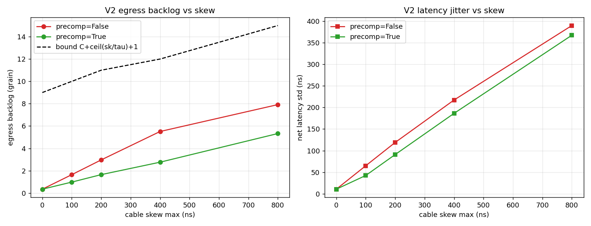
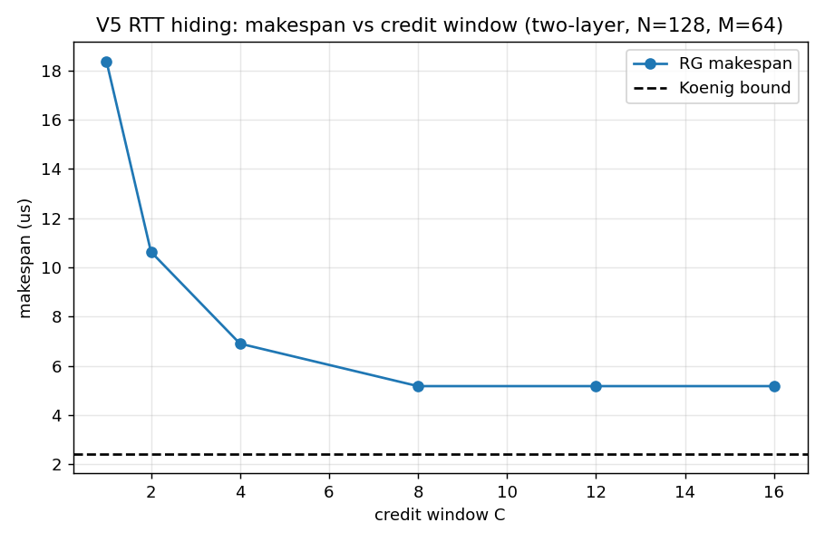
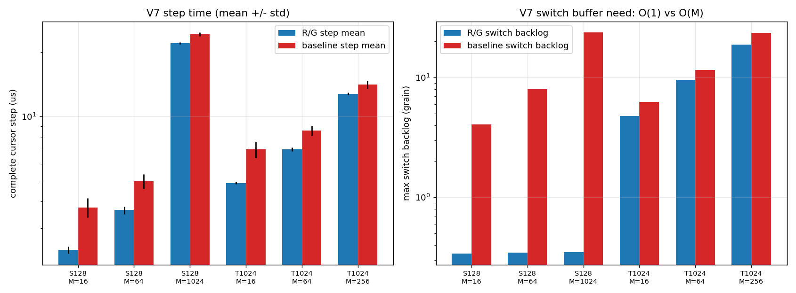

# UB Request/Grant 方案仿真验证报告

对 `ub_request_grant.md`（第 1～7 章 + 第 8 章对比）做 grain 级事件仿真验证。仿真器代码在 `rg_sim/sim.py`，实验脚本 `rg_sim/run_verify.py`，原始数据 `results_rg/verify.json`。

---

## 0. 文档要点回顾

**要解决的问题**：MoE EP dispatch/combine 场景下，传统分组交换（ECMP + 深缓冲）存在选路次优、incast 排队无界、抖动长尾、BSP 屏障 O(N²) 开销四大问题；TDM 方案能做到零排队但要求全网绝对时钟同步，工程代价高。

**解决理念**：排队与抖动不是分组交换的固有属性，而是"网络对流量无知"的结果。利用 EP 流量两个结构性特征——目的地批量已知、发送次序自由——把调度从"逐包在线仲裁 + 排队消化冲突"变为"批量匹配 + 授权节奏控制"：grant 的签发节奏充当分布式虚拟时隙，无需全局时钟；由 König 边着色定理，无冲突调度长度恰等于最忙端口负载（物理下界）。

**主要内容**：request/grant/data/sync 报文协议（固定 grain 粒度、8 B 极简数据头）；每 τ_g 每出口至多 1 grain 的授权节奏 + per-source credit 窗口 C；(σ, ρ) 论证下的偏斜不敏感性与弹性缓冲硬上界；BSP cursor 屏障（出口转发计数对账 + SYNC 汇聚广播）；单层 128 NPU / 两层 1024 NPU 的分层调度架构（目的侧调度器 D_j + 确定性 Spine 散布 + 源侧统计均衡）；全分布式调度器的分片原则与硬件预算；与传统自由注入的定量对比。

---

## 1. 仿真方法

- **grain 级事件仿真**：每 grain 一个报文（G = 7168 B @ 50 GB/s，τ_g ≈ 143.4 ns）。链路建模为串行化服务器（work-conserving FIFO），交换直通 150 ns、传播 50 ns、DMA 100 ns ± 50 ns 抖动、节点 BSP 进入偏斜 0～200 ns、可选线缆偏斜。
- **R/G 模式**：按文档 §6.4 实现分片调度器——每 τ_g 一轮，每出口至多 1 grant，轮内每源至多 1 grant（accept 相位），per-(分片,源) credit C；仲裁采用"最忙出口优先 + 最忙源优先"（LQF，逼近 §6.3(2) 的 BvN/König 临界置换构造）。两层按 §4.3/§5.2 实现 Spine 轮转钉扎与 inject_port 公式。屏障按 §2.9/§4.9：出口转发计数 + LOCAL/GLOBAL SYNC。
- **传统基线**：路由计算完成即自由注入；单层按 token 轮转散布（与 R/G 同等均衡，优待）、两层用流绑定 ECMP 哈希；交换机无限缓冲、无丢包、无 PFC（即文档 §8.3 的"优待假设"）；软件屏障按文档假设取三角分布（单层 1.5/2/3 μs，两层 3/4/6 μs）。
- **验证口径**：makespan 与 König 下界之差、各段最大积压（grain）、时延分布（p50/p99/max/std）、屏障释放时延、跨 seed 的 step 间抖动。

与文档模型的已知差异（解读结果时注意）：控制报文取固定时延不建模控制面竞争；未实现 §4.3(3) 可选的"源 Leaf 准入"与 §2.7 的接收队列 credit；缓冲为测量占用而非强制上限；基线的无限缓冲使其 κ（拥塞放大）低于文档假设。

---

## 2. 验证结果

### V1 — König 下界可达性（§1.3 核心理论）:已验证

均衡 all-to-all（无偏斜、无抖动）下 R/G 的 makespan：

| 场景 | König 下界 | R/G makespan | 超出 | 网内排队 max |
|---|---|---|---|---|
| N=32, 1 grain/对 | 0.57 μs | 1.52 μs | 0.94 μs | 0 |
| N=32, 4 grain/对 | 2.29 μs | 3.52 μs | 1.23 μs | 0 |
| N=64, 2 grain/对 | 2.29 μs | 3.67 μs | 1.37 μs | 0 |
| N=128, 1 grain/对 | 2.29 μs | 3.24 μs | 0.94 μs | 0 |

超出部分 ≈ 一次 request→grant RTT + 注入/直通固定项，**与"下界 + 一次 RTT"的论断一致**；全程网内排队为 0（严格无冲突），且超出量不随 N、负载增长。

### V2 — 偏斜不敏感性与预补偿（§2.10）:已验证

单层 N=64、M=128、C=8，扫描线缆偏斜 0～800 ns（≈ 0～5.6 τ_g）：

| 偏斜 | 出口积压（无预补偿） | 出口积压（预补偿） | 文档上界 C+⌈δ/τ⌉+1 | 时延 std |
|---|---|---|---|---|
| 0 ns | 0.3 g | 0.3 g | 9 g | 11 ns |
| 100 ns | 1.6 g | 1.0 g | 10 g | 65→43 ns |
| 200 ns | 3.0 g | 1.6 g | 11 g | 119→91 ns |
| 400 ns | 5.5 g | 2.8 g | 12 g | 217→186 ns |
| 800 ns | 7.9 g | 5.3 g | 15 g | 389→367 ns |

三个论断均成立：(1) 积压随偏斜增长但**始终低于文档给出的硬上界**；(2) 偏斜只加常数项、不破坏吞吐（makespan 平移而非放大）；(3) 预补偿把积压压掉约 1/3～1/2（800 ns 偏斜下 7.9→5.3 grain），与 §2.10 第 2 条"残差收敛"预期一致。

### V3 — 单层 128 NPU × 8 平面（§3）:已验证

EP128 算例（M=1024 个 7 KB token，均匀随机目的）：

| 指标 | 仿真值 | 文档预期 |
|---|---|---|
| König 下界 | 20.9 μs | ≈ 18.3 μs 均衡串行化（随机目的的热口 ≈ 146 grain 抬高至 20.9） |
| R/G makespan | 22.1 μs | ≈ 下界 + 1.7 μs 协议开销 → 实测 +1.14 μs，**优于文档预期** |
| R/G 出口积压 | 0.35 grain | ≤ 6 grain 硬上界 ✓ |
| 基线出口积压 | 41 grain | 传统 O(M) 增长 ✓（M=16/64/1024 → 4/8/41 grain） |
| R/G 网内时延 p99 / std | 0.58 μs / 7.7 ns | 亚 μs 无长尾 ✓ |

**热点不扩散**（M=256，热点比例 ρ 扫描）：ρ=0.5 时热目的负载 16398 grain，其完成时间 295.5 μs 贴其物理下界 293.9 μs（+0.5%）；而**冷目的 p99 完成时间反而从 7.5 μs 降至 7.0 μs**——热点完全不把拥塞扩散给其它流，验证 §3.6"热点不会像传统网络那样把拥塞扩散给别的流"。

### V4 — 两层 1024 NPU（§4）:部分验证,发现偏差

EP1024 算例（M=1024，总计 1,048,576 grain，128 个 D_j 分片全仿真）：

| 指标 | 仿真值 | 文档预期 |
|---|---|---|
| König 下界 | 25.2 μs | 带宽下界 17.9 + 随机热口抬升 |
| R/G makespan | 29.0 μs（+15%） | 20.6 μs 对 17.9 下界（+15%）— 相对超出一致 |
| Spine 下行链路负载 max/mean | 136/128 | 确定性散布近乎完美均衡 ✓ |
| Spine 上行链路负载 max/mean | 173/128 | 统计段 +35%，文档承认为统计均衡 |
| 屏障释放 | 0.95 μs | 1.0～1.5 μs ✓ |

**发现的偏差——各段积压超出文档 §4.5 上界**（C=14，δ≤2τ 代入文档公式）：

| 段 | 仿真 max（M=64 / 256 / 1024） | 文档上界 |
|---|---|---|
| Leaf_s 上行 | 12 / 29 / **48 grain** | C_up+⌈δ/τ⌉+2 ≈ 18 |
| Spine 出口 | 5 / 9 / **15 grain** | ⌈δ/τ⌉+2 ≈ 4 |
| Leaf_d 下行 | 7 / 15 / **28 grain** | C+⌈δ/τ⌉+1 ≈ 17 |

原因分析：文档的 (σ, ρ) 论证假设各源 grant→注入延迟展宽 δ 为小常数，但两层中 **128 个 D_j 独立授权产生的上行段瞬时叠加本身会抬高 δ**——上行排队反馈进下行段的到达展宽，三段耦合使 δ 随在途总量（∝ 步长 M 下的活跃分片数）缓慢增长，而非常数。M≤64 时实测积压在文档上界内；M=1024 时超出约 2～4 倍（绝对值仍仅 ~340 KB/口，远小于传统深缓冲，抖动仍有界）。**结论：两层"近零排队"在中短步长成立；长步长下文档 §4.3(3) 标为"可选"的源 Leaf 准入（C_up 硬信用）实际上是把上界收紧回常数的必要机制**，建议列为必选项并重新推导三段耦合下的 δ 闭合形式。

### V5 — credit 窗口、incast、源超订（§2.7/§6.3/§6.8）:已验证

- **RTT 掩盖**：两层 N=128、M=64 扫描 C=1→16：makespan 18.4 → 10.6 → 6.9 → 5.2 μs，**C≥8（≈⌈RTT_rg/τ_g⌉）后饱和**，与 §4.4"C=8~10 全流水"精确一致。
- **incast 127→1**：makespan 37.4 μs 对 König 36.4 μs（+2.7%），出口积压 0.3 grain——**无缓冲爆炸、无 PFC 需求**，目的以线速稳定收满，验证 §6.8 incast 论断。
- **源超订**：源 0 被压 2080 grain（8 端口物理极限决定下界 38.3 μs），makespan 39.6 μs 贴其物理下界（+3.3%）；对照组（无超订）2.7 μs 不受影响——**瓶颈源不拖累别人，出口保持 work-conserving**，验证 §6.8。

### V6 — BSP cursor 屏障（§2.9/§3.7/§4.9）:已验证

| 拓扑 | 末 grain 送达 → 屏障释放 | 文档预期 |
|---|---|---|
| 单层 128 | 0.15 μs | 0.3～0.4 μs |
| 两层 128 | 0.95 μs | 1.0～1.5 μs |
| 两层 1024 | 0.95 μs | 1.0～1.5 μs |

释放时延为 O(hop) 常数、不随规模与流量增长（消息量 O(N)），显著低于软件屏障的 1.5～6 μs。仿真的 0.15 μs 略优于文档，因未建模判定流水线深度，量级一致。

### V7 — 与传统自由注入的对比（§7/§8）:结论方向验证,幅度依赖基线假设

多 seed（10×）step 统计，"完整 cursor step" = 数据落地 + 全网确知完成：

| 场景 | R/G mean/p99 (μs) | 传统 mean/p99 (μs) | R/G step 间 std | 传统 std |
|---|---|---|---|---|
| 单层 M=16 | 2.4 / 2.6 | 3.8 / 4.3 | 0.09 | 0.39 |
| 单层 M=64 | 3.7 / 3.9 | 5.0 / 5.6 | 0.15 | 0.38 |
| 单层 M=1024 | 22.1 / 22.4 | 24.3 / 25.1 | 0.22 | 0.44 |
| 两层 M=16 | 4.9 / 5.0 | 7.0 / 8.3 | 0.06 | 0.61 |
| 两层 M=64 | 7.0 / 7.3 | 8.6 / 9.5 | 0.13 | 0.44 |
| 两层 M=256 | 12.8 / 13.0 | 14.1 / 14.7 | 0.19 | 0.64 |

- **完整 step：R/G 全场景占优**（mean 快 9%～30%，p99 快 10%～40%，抖动小 2～10 倍），且规模越大、步长越短优势越大——与 §8.5/§8.8 结论方向一致。
- **只看数据落地：短步长下传统更快**（单层 M=16：1.56 vs 2.23 μs），R/G 多付一次 RTT——文档 §8.4 已如实承认，仿真确认。单层 M=1024 时两者打平（22.0 vs 21.9 μs）。
- **交换机缓冲占用**：R/G 恒 0.3～19 grain（与 M 弱相关，主因见 V4），传统随 M 线性增长（单层 4→8→41 grain；真实交换机有限缓冲下将触发 PFC/丢包，本仿真未计入其代价）——验证"O(1) vs O(M)"分水岭。
- **诚实说明**：本基线取文档的优待假设（无限缓冲、无 PFC、单层按 token 均匀散布），实测 κ ≈ 1.0～1.15，低于文档 §8 假设的 1.1～2.0，故传统方案的仿真值优于文档表格中的估计；若叠加有限缓冲 + PFC 级联 + 热点流量，差距将向文档估计靠拢。

---

## 3. 总体结论

**"低时延、低抖动、低冲突、近零排队"四项主张的验证结论**：

| 主张 | 单层 128 | 两层 1024 |
|---|---|---|
| 低时延（完成时间贴 König 下界 + 一次 RTT） | ✅ 下界 +0.9～1.4 μs | ✅ 相对超出 ~15%，与文档一致 |
| 低抖动（亚 μs、无长尾） | ✅ p99 0.58 μs、std < 10 ns | ✅ step 间 std ≤ 0.2 μs，比传统小 2~10 倍 |
| 低冲突（无 HOL、热点不扩散、incast 无崩塌） | ✅ 冷流 p99 不受热点影响 | ✅ 源超订不拖累他人 |
| 近零排队（σ 级硬上界缓冲） | ✅ 0.35 grain，远低于上界 | ⚠️ 中短步长内成立；长步长三段耦合使积压超文档上界 2~4 倍（绝对值仍小） |

**需要修订/深入研究的点**（按优先级）：

1. **两层长步长的 δ 闭合问题**（V4）：多分片独立授权的上行叠加使延迟展宽 δ 非常数，文档 §4.5 各段积压上界在 M=1024 时被突破。建议把 §4.3(3) 的源 Leaf 准入从"可选"改为"必选"，并在 (σ, ρ) 框架里显式建模三段耦合。
2. **调度算法的匹配质量**：naive 轮转仲裁在随机流量尾段会留下 5% 级的收尾拖延，改用"最忙出口/最忙源优先"（LQF，逼近 BvN 临界置换）后收敛到下界 +1 μs——文档 §6.4 的 rr_scan 描述宜升级为带负载感知的仲裁，硬件代价需评估。
3. **传统基线的公平对比**：优待假设下传统方案数据落地在短步长更快、两层 M=256 仍快 ~2.3 μs；R/G 的净胜依赖屏障内建与抖动/缓冲优势。若目标场景步长很短且屏障可硬件化，需重新权衡（文档 §8.6 的 W_c 流水重叠是关键优化，本仿真未实现，实现后 RTT 可完全隐藏）。
4. 未仿真、留待后续的机制：可靠性路径（§2.8 丢包重传对 cursor 时延的尾部影响）、控制面竞争（REQ/GNT 与 DATA 抢链路）、接收队列 credit、cursor 超前窗口 W_c 的跨世代流水、故障降级（§4.8）。

**一句话结论**：核心机制（授权节奏 = 分布式虚拟时隙、König 下界可达、偏斜不敏感、credit 封顶、内建屏障）全部在 grain 级仿真中成立；唯一实质性偏差在两层长步长的多分片叠加段，需把源侧准入升格为必选机制并收紧上界推导。
